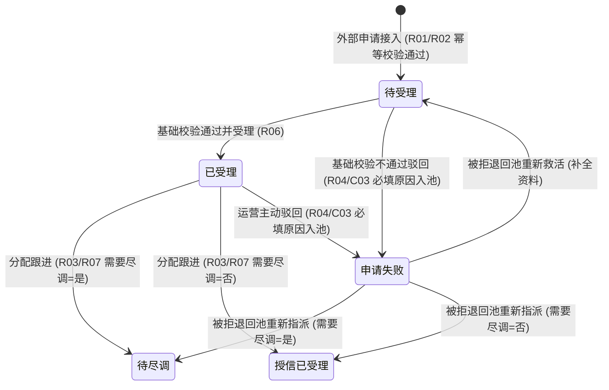

# 客户融资需求线索业务规则规格

> **文档定位**：融资监管 / 融资管理 / 客户融资需求线索模块状态机、动作约束、前置校验规则、路由分流、计算公式、权限与风控规则的**唯一定义真源**。主 PRD、字段清单及端侧原型仅引用本文件规则编号（R01~R08, C01~C03, P01~P03），不重复定义规则本体。  
> **模块类型**：融资业务前置接入单据总台账（涵盖 C 端申请接入、运营基础校验、尽调路由自动分流、驳回入池及下游状态异步回写）  
> **参考文档**：[《客户融资需求线索主PRD》](./客户融资需求线索主PRD.md)、[《客户融资需求线索字段清单》](./客户融资需求线索字段清单.md)、[《客户融资尽调办理》](../02-融资管理-客户融资尽调办理/)、[《客户融资授信办理》](../03-融资管理-客户融资授信办理/)、[《被拒退回池》](../05-融资管理-被拒退回池/)  
> **移动端对应**：`B端H5/03-业务办理/03-客户需求审批/03-客户融资需求线索`  
> **版本**：V1.2 | **更新时间**：2026-09-16 | **责任人**：森云科技（Senyun Technology）

---

## 一、对象定位与单据层级

| 项目 | 规格内容 |
| :--- | :--- |
| **单据层级** | **【第1层-计划/线索接入层】**（全系统融资监管业务的前置接入流水中枢） |
| **核心职责** | 统一承接外部客户（C 端移动门户或外部系统）提交的动产质押融资申请；固化申请主体、存货/仓单抵质押物及“需要尽调”路由快照；支持运营人员完成基础信息核验、受理、分配跟进（分流流转至尽调办理或授信办理）及异常驳回入池。 |
| **单据来源** | 外部 C 端移动门户或第三方合作系统通过标准应用程序编程接口（API）自动提交生成。 |
| **上游单据** | **C 端用户融资申请单**：通过标准接口以申请唯一标识 1:1 创建线索单据，携带申请主体资质、意向融资金额/期数、抵/质押物类型、需要尽调标识和存货/仓单快照。 |
| **下游影响** | 1. **需要尽调=是**：自动生成【客户融资尽调办理】待尽调任务，指派尽调专员； 2. **需要尽调=否**：自动生成【客户融资授信办理】授信已受理任务，锁定合作资方机构； 3. **驳回**：自动写入【被拒退回池 -> 线索被拒标签页】异常归集池。 |
| **审核流** | **【基础校验 + 受理 + 路由分配】**（运营人员先完成基础校验，置为已受理后再执行分配跟进或主动驳回）。 |

---

## 二、数量、金额与期数口径隔离表

| 口径名称 | 存在于 | 业务含义与计算公式 | 约束条件 |
| :--- | :--- | :--- | :--- |
| **意向融资金额（元）** | 线索主表 | 客户在申请时填写的期望融资金额 | 系统自动带出，`意向融资金额 > 0`，保留 4 位小数，不可手工修改 |
| **意向融资期数** | 线索主表 | 客户期望融资期限（月/期） | 系统自动带出，必须为正整数（`期数 ≥ 1`），不可手工修改 |
| **授信金额（元）** | 列表/详情回写 | 资方机构最终审批确认并授信的额度 | 本节点初始为空，下游授信成功后异步回写；`0 < 授信金额` |
| **授信期数** | 列表/详情回写 | 资方机构最终批准的授信期限 | 本节点初始为空，下游授信成功后异步回写；正整数 |
| **贷款金额（元）** | 列表/详情回写 | 线上抵质押订单实际发放的贷款金额 | 本节点初始为空，下游放款后异步回写；`贷款金额 ≤ 授信金额` |
| **贷款期数** | 列表/详情回写 | 贷款合同约定的实际还款期限 | 本节点初始为空，下游放款后异步回写；正整数 |

---

## 三、全景业务状态机与时序图

### 1. 状态定义

| 状态名称 | 状态代码 (`Enum`) | 业务含义 | 是否终态 | 进入条件 | 离开条件 |
| :--- | :--- | :--- | :---: | :--- | :--- |
| **待受理** | `PENDING_ACCEPT` | 外部申请成功接入后的初始状态，等待运营人员基础核验 | 否 | 上游接口成功推送申请并创建线索记录 | 基础校验通过（进入已受理）/ 校验不通过驳回（进入申请失败） |
| **已受理** | `ACCEPTED` | 运营基础校验通过，已固化受理信息，等待路由分配 | 否 | 运营人员点击【基础校验通过并受理】 | 点击【分配跟进】流转下游 / 运营【主动驳回】 |
| **申请失败** | `APPLY_FAILED` | 运营审核不准入或资料不合规执行驳回后的状态 | 否（入池待调度） | 运营人员执行【驳回】动作并确认成功 | 在被拒退回池执行“重新救活”或“按路由重新指派” |

### 2. 状态流转时序架构

---

## 四、状态流转表与核心规则矩阵

| 当前状态 | 触发动作 | 前置校验条件 | 结果状态 | 二次确认与交互形态 | 后置级联影响 | 失败阻断提示 (浮窗提示) |
| :--- | :--- | :--- | :--- | :--- | :--- | :--- |
| **未入库** | 接入融资申请 | 【申请要素必填与格式合规校验规则】(R01) 【接口幂等与防重复接入规则】(R02) | 待受理 | 无（接口自动处理） | ① 保存申请主体及存货/仓单快照 ② 继承产品配置带入“需要尽调”快照 (R03) ③ 记录生成时间戳与唯一线索编号 | 接口返回错误响应：“重复申请或数据不完整” (C01) |
| **待受理** | 基础校验通过并受理 | 申请资料完整合规 (R06) | 已受理 | 列表行操作 / 详情页操作按钮 | 固化受理人、受理时间，开放【分配跟进】路由权限 | 浮窗提示：“受理失败：请检查申请资料” |
| **待受理** | 驳回 | 【异常驳回留痕与被拒入池规则】(R04)（驳回原因必填 $\le 200$ 字） | 申请失败 | 弹出模态弹窗：「确认驳回该融资需求？驳回后将进入被拒记录池」 | ① 状态更新为“申请失败” ② 记录驳回原因、处理人与处理时间 ③ 可靠写入【被拒退回池 -> 线索被拒标签页】 | 浮窗提示：“驳回失败：请填写驳回原因” (C03) |
| **已受理** | 分配跟进（路由流转） | 【尽调路由判定与快照锁定规则】(R03) 需要尽调=是已选尽调专员，或需要尽调=否已选有效资方机构 | 下游流转态 | 弹出模态表单：「选择跟进人员/资方机构」 | ① 需要尽调=是：向【客户融资尽调办理】写入待尽调任务 ② 需要尽调=否：向【客户融资授信办理】写入授信已受理任务 ③ 回写线索最近处理人与处理时间 | 浮窗提示：“分配失败：缺少有效路由配置或指派目标为空” (C02) |
| **已受理** | 运营主动驳回 | 【异常驳回留痕与被拒入池规则】(R04)（驳回原因必填 $\le 200$ 字） | 申请失败 | 弹出模态弹窗：「确认驳回该融资需求？驳回后将进入被拒记录池」 | ① 状态更新为“申请失败” ② 记录驳回原因、处理人与处理时间 ③ 可靠写入【被拒退回池 -> 线索被拒标签页】 | 浮窗提示：“驳回失败：请填写驳回原因” (C03) |

---

## 五、动作能力矩阵

| 操作动作 | 待受理 (`PENDING_ACCEPT`) | 已受理 (`ACCEPTED`) | 申请失败 (`APPLY_FAILED`) |
| :--- | :---: | :---: | :---: |
| **查看详情** | ✅ | ✅ | ✅ |
| **基础校验通过并受理** | ✅ | ❌ | ❌ |
| **分配跟进（路由流转）** | ❌ | ✅（按需要尽调分流） | ❌（在被拒退回池操作重新指派） |
| **驳回并填写原因** | ✅ | ✅ | ❌ |
| **列表组合筛选与导出** | ✅ | ✅ | ✅ |

---

## 六、核心业务规则清单 (R01 ~ R08)

### 1. 准入与幂等接入规则

### 【申请要素必填与格式合规校验规则】(R01)
* **企业货主**：企业名称、统一社会信用代码、经办人姓名、经办人手机号（11 位合规格式）必填；
* **个人货主**：申请人姓名、申请人身份证号（18 位合规校验）、联系电话必填；
* **融资意向**：意向融资金额 $>0$；意向融资期数 $\ge 1$ 且必须为正整数；抵/质押物类型必须属于 `['存货', '仓单']`；要素不全阻断生成并返回错误响应。

### 【接口幂等与防重复接入规则】(R02)
* 上游推送请求必须携带全局唯一的外部申请流水号 `apply_request_no`；
* 5 分钟内同一 `apply_request_no` 或相同申请主体在同产品的未终结申请重复提交，系统直接阻断并返回既有线索编号，严禁重复生成多笔单据 (C01)。

### 2. 路由分流与执行规则

### 【尽调路由判定与快照锁定规则】(R03)
* 线索单据生成时，系统读取对应融资产品的“需要尽调”配置（`YES` / `NO`）并永久固化至线索单据快照；
* 后续流转严格依赖该快照执行分流，不受产品后续规则变更影响：
  * **快照为 `YES`**：分配弹窗仅允许选择尽调专员下拉列表，禁止选择资方机构；
  * **快照为 `NO`**：分配弹窗仅允许选择已启用的合作资方机构下拉列表，禁止指派尽调人员。

### 【异常驳回留痕与被拒入池规则】(R04)
* 运营人员执行驳回必须在模态弹窗中录入结构化驳回原因及详细说明（$\le 200$ 字），禁止空值提交 (C03)；
* 驳回提交成功后，主单据状态更新为“申请失败”，并通过事务消息（Outbox）可靠投递写入【被拒退回池 -> 线索被拒标签页】；入池记录永久不可物理删除。

### 【融资金额与期数口径隔离规则】(R05)
* 严格执行数量/金额/期数口径隔离规范：意向融资金额与意向融资期数由 C 端输入带入，落库后不可手工修改；
* 授信金额、授信期数、贷款金额、贷款期数在线索阶段初始为空，由下游授信与放款流程完成后异步回写更新。

### 【受理与路由分配先决条件校验规则】(R06)
* 待受理单据必须经运营人员完成资料审核后点击【基础校验通过并受理】转为“已受理”；未受理单据严禁直接进入路由分配；
* 分配跟进时强校验路由目标有效性，未选定有效专员或资方机构禁止提交流转 (C02)。

### 【下游流转单据自动创建与回写规则】(R07)
* 分配跟进成功后，系统自动在下游对应模块创建流转任务：
  * 需要尽调=是：向【客户融资尽调办理】写入待尽调任务，通知尽调专员；
  * 需要尽调=否：向【客户融资授信办理】写入授信已受理任务，通知资方机构；
* 同步回写线索主单据的最近处理人、处理时间戳及最新流转状态。

### 【分布式防并发加锁与状态防护规则】(R08)
* 运营在列表或详情点击【基础校验通过并受理】、【分配跟进】或【驳回】时，后端对线索唯一主键 `clue_id` 加 Redis 分布式乐观锁（超时时间 5s）；
* 若已被其他运营人员并发处理，即时返回提示：“*单据已被更新，请刷新列表*”，杜绝重复派单或并发状态覆盖。

---

## 七、异常阻断规则 (C01 ~ C03)

### 【重复申请接入阻断】(C01)
* 命中重复流水号或同一主体存在未办结相同产品线索时，接口拒绝并返回统一错误码。

### 【路由目标配置缺失阻断】(C02)
* 分配跟进时若系统检测到对应机构无有效尽调专员账号，或无可用合作资方，阻断提交并浮窗提示：“*缺少有效路由配置或指派目标为空*”。

### 【驳回必填原因缺失阻断】(C03)
* 驳回模态弹窗中未填写驳回原因或字符数超过 200 字时，前端即时红字校验拦截，服务端拒绝提交。

---

## 八、权限、风控与安全控制 (P01 ~ P03)

### 【基于角色的权限控制与操作鉴权】(P01)
* `[线索·查看]`：拥有融资管理模块权限的内部账号可查看所属机构管辖线索；
* `[线索·受理与分配]`：仅限平台运营专员、风控主管角色可执行；
* `[线索·驳回]`：仅限平台运营专员、风控主管角色可执行。

### 【平台运营与资方机构数据范围隔离】(P02)
* **平台运营与风控主管**：可查看全网所有接入线索记录；
* **合作资方机构账号**：在线索接入节点不可见未分配至本机构的线索流水，仅在下游授信节点可见已正式分配至本机构的任务单据。

### 【全路径操作审计日志留痕】(P03)
* 全路径记录分配人、分配目标（人员 ID / 机构 ID）、分配时间、原状态与目标状态；
* 记录驳回人、驳回原因、时间戳及客户端 IP 地址，支持司法审计不可变追溯。

---

## 九、修订记录

| 日期 | 版本 | 变更内容 | 影响范围 |
| :--- | :--- | :--- | :--- |
| 2026-09-16 | V1.2 | 全量规范化重构：建立 R01~R08、C01~C03、P01~P03 自解释业务规则体系，全面汉化交互术语（模态弹窗、单行文本输入框、下拉单选框、浮窗提示），细化口径隔离与异步回写 | 全文档 |
| 2026-09-02 | V1.1 | 归入最新基准版 PC 端融资监管模块，规范跨文档引用 | 规范对齐 |
| 2026-08-14 | V1.0 | 初始定义客户融资需求线索业务规则 | 全文档 |
