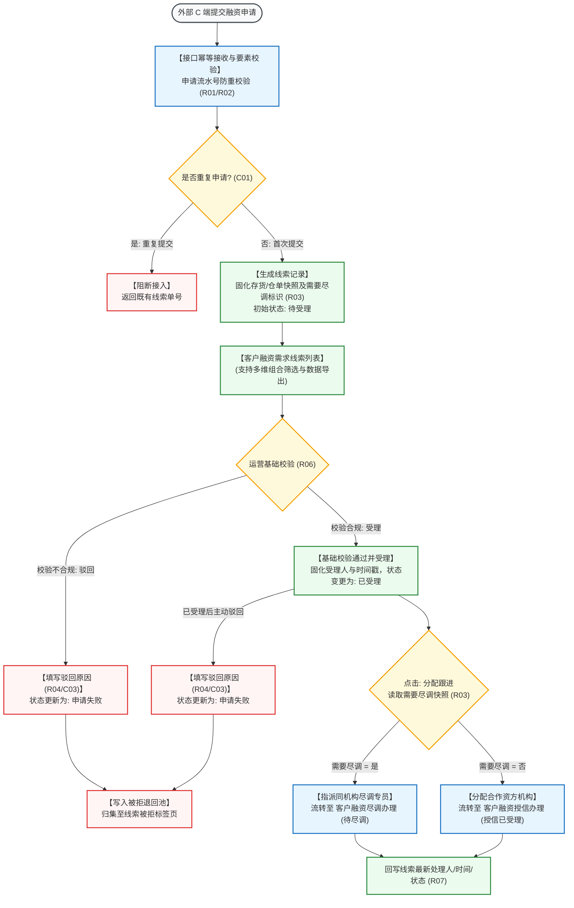

# 客户融资需求线索主PRD

> **模块定位**：融资监管 / 融资管理第 1 节点核心台账，统一接收外部 C 端客户提交的动产质押融资申请，生成线索流水记录，支持平台运营人员完成基础资料核验、受理、基于“需要尽调”规则快照执行自动路由分流派单，以及异常不准入单据的驳回入池全生命周期闭环。  
> **移动端对应**：`B端H5/03-业务办理/03-客户需求审批/03-客户融资需求线索`（`biz-approve-customer-finance-leads`）  
> **版本**：V1.4 | **更新时间**：2026-09-16 | **责任人**：森云科技（Senyun Technology）  
> **编写依据**：[《客户融资需求线索字段清单》](./客户融资需求线索字段清单.md) 是展示、筛选及明细字段的唯一基准；[《客户融资需求线索业务规则规格》](./客户融资需求线索业务规则规格.md) 是状态流转、尽调路由判定、金额口径隔离及驳回入池的唯一定义真源。

---

## 1. 业务背景与核心痛点

### 1.1 业务背景
在供应链金融动产质押融资体系中，拥有大宗商品存货（如电解铜、热轧卷板、铝锭等）或数字化仓单的货主企业或个人，急需将静态仓储资产盘活变现。客户通过 C 端移动门户或外部业务系统提交融资意向申请，是资金方与监管方介入业务的源头起点。

系统通过建设**客户融资需求线索**模块，作为全网融资业务统一的“流量入口与路由调度中心”，对多渠道汇聚的融资诉求进行合规性初审，固化抵质押物及尽调路由快照，向尽调专员或资方机构精准派单，保障融资业务开局合规、有序分流。

### 1.2 核心业务痛点
1. **多渠道申请混乱，重复接入难识别**：外部 C 端重复点击或弱网重试易产生重复单据，缺乏统一幂等防重机制；
2. **需要尽调与免尽调流程混杂**：部分标准化高信誉产品无需现场尽调，传统系统缺乏自动化路由机制导致作业链路冗长；
3. **驳回资产缺乏沉淀与挽回机制**：被驳回线索如果直接删除，将丢失客户接触历史，无法开展二次营销或风险复核。

---

## 2. 功能范围 (Scope)

| 包含功能（已纳入范围） | 不包含功能（超出范围） |
| :--- | :--- |
| - **外部申请自动接入与线索生成**：通过标准 API 接收外部 C 端融资申请，按申请唯一流水号执行接口幂等校验并自动生成待受理单据； - **线索列表与多维组合检索**：支持按产品名称、申请人名称、需要尽调、融资状态组合查询，支持列表数据导出； - **线索详情穿透调阅**：展示申请人资质、意向融资金额/期数、存货/仓单明细、附件材料及全流程时间轴； - **运营基础校验与正式受理**：运营审核申请要素完整合规后，将状态推进至“已受理”，锁定受理人与时间戳； - **基于快照的自动路由分配跟进**： &nbsp;&nbsp;* 需要尽调=是：指派尽调专员，流转至【客户融资尽调办理】生成待尽调任务； &nbsp;&nbsp;* 需要尽调=否：分配合作资方机构，流转至【客户融资授信办理】生成授信已受理任务； - **异常单据驳回与入池归集**：在待受理或已受理状态下支持驳回，强制录入驳回原因，自动沉淀至【被拒退回池 -> 线索被拒标签页】。 | - **外部 C 端客户融资申请界面与交互**：由 C 端用户端门户承载； - **现场尽调报告撰写与现场勘验逻辑**：由【客户融资尽调办理】模块承载； - **资方信贷审批模型与额度审批决策**：由【客户融资授信办理】与资方核心系统承载； - **被拒单据的重新救活与调度**：在【被拒退回池】中闭环处理。 |

---

## 3. 模块架构与系统链路

---

## 4. 业务场景与用户故事

| 场景编号 | 业务场景 | 触发角色 | 核心交互与风控约束 | 业务价值 |
| :--- | :--- | :--- | :--- | :--- |
| **场景 1【外部融资申请自动接入与幂等生成】(S01)** | 外部融资申请自动接入与幂等生成 | 外部货主企业 / 系统对接接口 | 某铜业货主在移动端发起 500 万元纯铜仓单质押融资。系统接口接收申请报文，校验流水号唯一性，自动落库生成“待受理”线索，固化仓单快照与“需要尽调=是”。遵循【申请要素必填与格式合规校验规则】(R01) 与【接口幂等与防重复接入规则】(R02)。 | 确保融资申请全量数字化接入，杜绝网络抖动导致重复派单。 |
| **场景 2【运营基础校验通过与线索正式受理】(S02)** | 运营基础校验通过与线索正式受理 | 平台初审运营专员 | 运营专员打开待办，核验货主营业执照与仓单存续有效性。点击操作列【基础校验通过并受理】，系统提示受理成功，状态流转为“已受理”，固化受理人与受理时间戳。遵循【受理与路由分配先决条件校验规则】(R06)。 | 建立标准化前置准入初审卡口，防止虚假资质流入下游机构。 |
| **场景 3【尽调路由自动分流与下游任务派发】(S03)** | 尽调路由自动分流与下游任务派发 | 平台运营调度专员 | 针对“需要尽调=是”的线索，专员点击【分配跟进】，弹窗中尽调专员下拉框自动高亮，选择专员“李巡检”后确认。系统在【客户融资尽调办理】模块自动生成待尽调工单。若为免尽调产品，则弹窗仅允许选择合作资方银行。遵循【尽调路由判定与快照锁定规则】(R03) 与【下游流转单据自动创建与回写规则】(R07)。 | 依据产品规则自动分流派工，大幅缩短融资审批周转时效。 |
| **场景 4【申请资料不符运营驳回入被拒池】(S04)** | 申请资料不符运营驳回入被拒池 | 平台风控审查员 | 审查发现某货主意向融资金额远超仓单市场公允价值且无法补保。专员在操作列点击【驳回】，在模态弹窗中录入驳回原因“*押品估值不足，货主拒绝下调融资金额*”，确认后单据状态更新为“申请失败”，自动归入被拒退回池。遵循【异常驳回留痕与被拒入池规则】(R04)。 | 驳回理由留痕备查，不合格线索统一归集沉淀，支持二次复核。 |

---

## 5. 页面功能与交互说明

### 5.1 客户融资需求线索主列表页（`P-RZ-001`）
* **页面路径**：`工作台 → 融资监管 → 融资管理 → 客户融资需求线索`
* **筛选查询区排布（横向排列）**：
  1. **综合搜索输入框**（单行文本输入框，占位提示“请输入产品名称/申请人”，支持模糊搜索产品名称或申请人名称）；
  2. **需要尽调**（下拉单选框，默认全部，选项：`是`、`否`）；
  3. **融资状态**（下拉单选框，默认全部，选项：`待受理`、`已受理`、`申请失败`）；
  - 右侧配置橙黄色实心【查询】按钮、白底【重置】按钮及【导出】操作链接。
* **数据表格呈现（13 列）**：
  1. **序号**（数字递增，翻页重新计算）；
  2. **产品名称**（融资产品名称，如“大宗商品数字仓单质押贷”）；
  3. **需要尽调**（彩色标签展示：`是` 为蓝底，`否` 为灰底）；
  4. **申请人名称**（企业公司全称或个人货主姓名）；
  5. **意向融资金额（元）**（金额数值展示，千分位，保留 4 位小数）；
  6. **意向融资期数**（如 `6期`、`12期`）；
  7. **抵/质押物**（标签展示：`存货` 或 `仓单`，仓单支持点击跳转调阅仓单详情）；
  8. **申请时间**（时间戳，格式 `YYYY-MM-DD HH:mm:ss`）；
  9. **授信金额（元）**（下游授信成功后异步回写，未授信为空展示“--”）；
  10. **授信期数**（下游回写，未授信为空展示“--”）；
  11. **贷款金额（元）**（下游放款后异步回写，未放款为空展示“--”）；
  12. **贷款期数**（下游回写，未放款为空展示“--”）；
  13. **融资状态**（状态徽章展示：`待受理` 为橙色、`已受理` 为蓝色、`申请失败` 为红底灰色）；
  14. **操作列**（根据状态动态展示动作）：
      - `待受理`：【查看】、【基础校验通过并受理】、【驳回】；
      - `已受理`：【查看】、【分配跟进】、【主动驳回】；
      - `申请失败`：【查看】（支持在被拒退回池执行后续操作）。

### 5.2 详情交互抽屉/页面
* **基本信息区**：产品名称、融资状态、申请时间、受理人、受理时间、最新处理人、处理时间；
* **申请主体资质卡片**：企业名称、信用代码、营业执照图片预览、经办人姓名及脱敏手机号（个人货主展示姓名、身份证号、脱敏手机号）；
* **融资意向与口径隔离区**：意向融资金额、意向期数、下游回写的授信额度/期数及放款额度/期数；
* **抵质押资产清单**：存货明细（大类/品类/规格/数量）或仓单明细（仓单编号、货值、开单仓库）；
* **附件材料清单**：融资申请相关材料列表，支持点击预览与授权下载；
* **全流程流转时间轴**：垂直展示“外部提交接入 $\rightarrow$ 运营基础受理 $\rightarrow$ 路由分配派工 $\rightarrow$ 下游状态跟踪”完整履约轨迹。

### 5.3 交互模态弹窗规格
1. **基础校验受理确认**：行操作点击【基础校验通过并受理】，弹出气泡确认框，点击确定后即时完成状态推进；
2. **分配跟进模态弹窗**：
   - 依据“需要尽调”快照自适应渲染表单：
     - 若需要尽调=是：展示“尽调人员”下拉单选框（列出本机构有权限尽调人员）；
     - 若需要尽调=否：展示“资方机构”下拉单选框（列出已启用的合作资方银行/保理公司）；
   - 底部配置【取消】与实心【确定】按钮；
3. **驳回模态弹窗**：
   - 标题：“驳回融资需求”；
   - 提示文案：“*确认驳回该融资需求？驳回后将进入被拒记录池。*”；
   - 驳回原因（单行下拉选择）与驳回详细说明（多行文本输入框，必填，限制 $\le 200$ 字）；
   - 点击【确定驳回】后写入被拒退回池。

---

## 6. 核心业务规则索引与追溯

> 规则规格全文见唯一真源：[《客户融资需求线索业务规则规格》](./客户融资需求线索业务规则规格.md)

| 规则编号 | 规则业务名称 | 规则类型 | 规则核心摘要与风控边界 | 真源章节引用 |
| :--- | :--- | :---: | :--- | :--- |
| **R01** | 【申请要素必填与格式合规校验规则】 | 准入校验 | 资质主体、意向金额(>0)、期数(≥1正整数)及质押物类型必须合规齐全 | 《业务规则规格》§六.1 |
| **R02** | 【接口幂等与防重复接入规则】 | 接口防重 | 依据外部流水号与主体产品组合判定，5 分钟内重复提交返回既有单号阻断重复 | 《业务规则规格》§六.1 |
| **R03** | 【尽调路由判定与快照锁定规则】 | 路由分流 | 生成时固化“需要尽调”快照，后续流程以此快照为准分流至尽调专员或资方机构 | 《业务规则规格》§六.2 |
| **R04** | 【异常驳回留痕与被拒入池规则】 | 异常归集 | 驳回强制录入原因(≤200字)，通过事务消息可靠写入【被拒退回池】，不可物理删除 | 《业务规则规格》§六.2 |
| **R05** | 【融资金额与期数口径隔离规则】 | 口径规范 | 意向金额不可修改；授信与贷款金额/期数在线索阶段为空，下游异步回写更新 | 《业务规则规格》§二 |
| **R06** | 【受理与路由分配先决条件校验规则】 | 流程控制 | 必须先经运营基础校验置为已受理，方可执行分配跟进；未受理禁止直接派单 | 《业务规则规格》§六.2 |
| **R07** | 【下游流转单据自动创建与回写规则】 | 跨模块协同 | 分配成功后下游自动生成待尽调或授信已受理任务，主单据回写处理人与时间戳 | 《业务规则规格》§六.2 |
| **R08** | 【分布式防并发加锁与状态防护规则】 | 并发防护 | 点击受理、分配或驳回时，对线索主键加分布式锁，防止并发冲突与重复派单 | 《业务规则规格》§六.2 |
| **C01** | 【重复申请接入阻断】 | 异常拦截 | 重复流水号接入时拒绝生成新记录并返回统一错误码 | 《业务规则规格》§七 |
| **C02** | 【路由目标配置缺失阻断】 | 业务阻断 | 机构内无可用尽调专员或合作资方时，阻断分配提交并浮窗提示补充配置 | 《业务规则规格》§七 |
| **C03** | 【驳回必填原因缺失阻断】 | 交互阻断 | 驳回原因未填或超过 200 字时，前端即时红字校验拦截，服务端拒绝受理 | 《业务规则规格》§七 |
| **P01** | 【基于角色的权限控制与操作鉴权】 | 访问控制 | 严格区分线索查看、受理分配及驳回操作权限，确保专人专责 | 《业务规则规格》§八 |
| **P02** | 【平台运营与资方机构数据范围隔离】 | 数据隔离 | 运营可见全平台线索，资方机构在线索阶段不可见未分配至本机构的记录 | 《业务规则规格》§八 |
| **P03** | 【全路径操作审计日志留痕】 | 司法存证 | 记录受理人、分配人、目标人员/机构、驳回原因及 IP 地址，司法证据链完整 | 《业务规则规格》§八 |

---

## 7. 权限控制与端侧协同

### 7.1 功能与操作权限矩阵

| 权限编码 | 权限名称 | 适用角色 | 权限校验逻辑与约束 |
| :--- | :--- | :--- | :--- |
| **`P-RZ-001:VIEW`** | 线索列表与详情查看 | 平台初审运营、风控专员、业务总监 | 仅可查看当前账号所属租户/机构管辖的线索流水 |
| **`P-RZ-001:ACCEPT`** | 基础校验通过并受理 | 平台初审运营专员、风控主管 | 仅限“待受理”状态线索可执行，固化受理人与时间 |
| **`P-RZ-001:ASSIGN`** | 分配跟进（路由流转） | 平台调度专员、风控主管 | 仅限“已受理”状态线索可执行，依快照派发下游任务 |
| **`P-RZ-001:REJECT`** | 运营驳回 | 平台初审运营专员、风控审查员 | 待受理或已受理状态均可执行，强制录入原因入被拒池 |
| **`P-RZ-001:EXPORT`** | 线索数据导出 | 资方合规经理、运营总监 | 允许导出多维筛选结果为不可篡改 Excel 报表 |

### 7.2 端侧协同机制（PC 端与移动端 H5）
* **PC 端**：承担全量线索大盘管控、多维筛选检索、批量数据导出、复杂的资质与附件复核，以及路由分配调度操作；
* **移动端（H5）**：挂载于「工作中心 → 客户需求审批 → 客户融资需求线索」，面向外出尽调员或各级主管提供卡片化待办推送、轻量级详情调阅及单笔快速分配/驳回审批。

---

## 8. 非功能性需求（NFR）与审计存证

### 8.1 性能与稳定性
* **高并发接入吞吐**：标准 API 接口支持每秒 200+ 笔外部申请并发提交与幂等排重，接口平均响应耗时 $\le 300\text{ms}$；
* **列表查询低延迟**：十万级线索单据量下，多维组合筛选及分页查询 95% 请求在 $\le 600\text{ms}$ 内完成响应；
* **事务一致性保障**：主单据状态变更、下游任务创建及被拒池入池基于分布式事务消息实现最终一致性，杜绝丢单或派单不一致。

### 8.2 数据脱敏与合规审计
* **隐私脱敏规范**：货主个人身份证号、法人手机号在前端列表及详情中均按统一规则脱敏展示，无导出权限账号严禁调阅明文；
* **全生命周期审计追踪**：全路径记录受理、分配跟进、驳回入池等敏感流转操作，审计要素包含操作账号、机构标识、客户端 IP、设备指纹、操作前后数据快照与时间戳。

---

## 9. 验收标准与测试重点

| 验收编号 | 验收项与测试用例 | 预期结果与合格标准 | 对应规则 |
| :--- | :--- | :--- | :--- |
| **AC-01** | 外部申请幂等接入与防重 | 使用相同申请流水号短时间内重复调用接入接口，仅生成一笔单据并返回既有线索编号 | R01, R02, C01 |
| **AC-02** | 运营基础校验通过与受理 | 待受理线索点击【基础校验通过并受理】，状态精准变更为“已受理”，固化受理人与时间 | R06 |
| **AC-03** | 需要尽调=是 路由分流派单 | 针对需要尽调=是线索点击【分配跟进】，弹窗仅可选尽调专员，提交后【客户融资尽调办理】生成待尽调任务 | R03, R07 |
| **AC-04** | 需要尽调=否 路由分流派单 | 针对需要尽调=否线索点击【分配跟进】，弹窗仅可选资方机构，提交后【客户融资授信办理】生成授信任务 | R03, R07 |
| **AC-05** | 运营异常驳回与入池归集 | 待受理或已受理状态下点击【驳回】，录入必填原因后状态变为“申请失败”，被拒退回池精准增加记录 | R04, C03 |
| **AC-06** | 金额与期数口径隔离验证 | 检查线索详情，意向金额与期数只读不可手工修改；下游未授信放款前，授信与贷款字段展示“--” | R05 |
| **AC-07** | 并发操作加锁与冲突防护 | 两名运营人员同时打开同一条线索并分别点击受理与驳回，后提交者被拒绝并提示单据已被更新 | R08 |

---

## 修订记录

| 日期 | 版本 | 变更内容 | 影响范围 |
| :--- | :--- | :--- | :--- |
| 2026-09-16 | V1.4 | 全量规范化重构：确立与业务规则规格双向对齐的自解释规则索引表（R01~R08、C01~C03、P01~P03、S01~S04），全面汉化 UI 交互控件术语，补充 NFR 与验收标准 | 全文档 |
| 2026-09-02 | V1.3 | 归入最新基准版 PC 端融资监管模块，打通与移动端 H5 客户需求审批的协同映射 | 端侧映射 |
| 2026-08-14 | V1.2 | 完善线索接入、受理与路由分流规格 | 流程定义 |
| 2026-08-01 | V1.0 | 初始建立客户融资需求线索主需求文档 | 全文档 |
