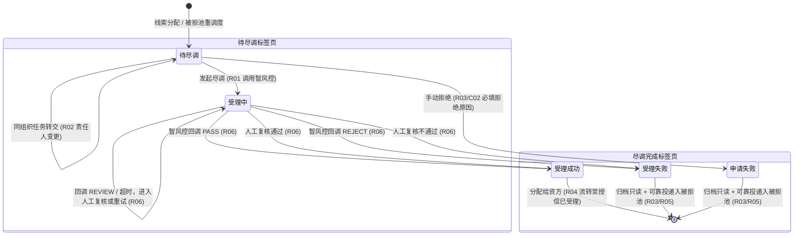

# 客户融资尽调办理业务规则规格

> **文档定位**：融资监管 / 融资管理 / 客户融资尽调办理单据状态机、动作约束、前置校验规则、计算公式、权限与风控规则的**唯一定义真源**。主 PRD、字段清单及端侧原型仅引用本文件规则编号（R01~R08, C01~C03, P01~P03），不重复定义规则本体。  
> **模块类型**：融资业务主体与资信尽调任务台账（涵盖双标签页解耦、智风控异步核验、任务同组织转交、尽调报告归档、分配资方及异常入池）  
> **参考文档**：[《客户融资尽调办理主PRD》](./客户融资尽调办理主PRD.md)、[《客户融资尽调办理字段清单》](./客户融资尽调办理字段清单.md)、[《客户融资需求线索》](../01-融资管理-客户融资需求线索/)、[《客户融资授信办理》](../03-融资管理-客户融资授信办理/)、[《被拒退回池》](../05-融资管理-被拒退回池/)  
> **移动端对应**：`B端H5/02-工作台/02-融资监管/05-客户融资尽调办理`  
> **版本**：V1.2 | **更新时间**：2026-09-16 | **责任人**：森云科技（Senyun Technology）

---

## 一、对象定位与单据层级

| 项目 | 规格内容 |
| :--- | :--- |
| **单据层级** | **【第2层-风控/执行处理层】**（融资业务主体资信、涉诉及押品实地尽调执行中枢） |
| **核心职责** | 承接上游【客户融资需求线索】分流的“需要尽调=是”任务件；由尽调专员推进智风控主体信用扫描、司法涉诉排查、线下实地核验报告归档，产出最终综合尽调结论，并分流流转至资方授信或被拒退回池。 |
| **单据来源** | 1. 客户融资需求线索（需要尽调=是）分配跟进生成； 2. 被拒退回池（尽调失败标签页）重新指派生成新批次任务。 |
| **上游单据** | **客户融资需求线索**：1:1 继承申请主体、意向融资金额/期数、抵/质押物快照；**被拒退回池重调度任务**：1:1 继承原单据编码、重新处理原因与目标路由。 |
| **下游影响** | 1. **尽调通过并分配资方**：自动生成【客户融资授信办理】授信已受理任务； 2. **尽调失败（模型不通过或手动拒绝）**：通过事务可靠投递写入【被拒退回池 -> 尽调失败标签页】。 |
| **审核流** | **【系统自动化核验 + 人工尽调复核】**（支持同组织专员任务转交与智风控 API 异步回调）。 |

---

## 二、数量、金额与口径隔离表

| 口径名称 | 存在于 | 业务含义与计算公式 | 约束条件 |
| :--- | :--- | :--- | :--- |
| **意向融资金额（元）** | 尽调单主表 | 继承自线索申请金额 | 只读展示，不可手工修改 |
| **意向融资期数** | 尽调单主表 | 继承自线索申请期数 | 只读展示，正整数 |
| **智风控评分/结果** | 接口回调 | 外部智风控平台返回的信用综合得分与结论 | 枚举：`PASS`（通过）、`REJECT`（不通过）、`REVIEW`（需复核） |
| **尽调报告附件数** | 尽调单主表 | 尽调专员上传的现场尽调报告、现场照片等附件 | 尽调通过分配资方时必须至少上传 1 份 PDF/Word 尽调报告 (C03) |

---

## 三、状态定义与双标签页解耦架构

业务界面严格解耦划分为 **【待尽调标签页】** 与 **【尽调完成标签页】**：

| 所在标签页 | 状态名称 | 状态代码 (`Enum`) | 业务含义 | 是否终态 | 离开条件 |
| :--- | :--- | :--- | :--- | :---: | :--- |
| **待尽调标签页** | **待尽调** | `PENDING_DILIGENCE` | 已分配至尽调人员，等待发起尽调或同组织转交 | 否 | 发起尽调（进入受理中） / 任务转交 / 手动拒绝（移入完成标签页） |
| **待尽调标签页** | **受理中** | `IN_PROCESSING` | 已调用智风控接口，正在等待风控模型计算、回调或人工复核 | 否 | 明确通过（进入受理成功） / 明确不通过（进入受理失败） |
| **尽调完成标签页** | **受理成功** | `DILIGENCE_SUCCESS` | 智风控核验通过且现场尽调报告已归档，等待分配资方 | 否 | 分配给资方成功（流转至客户融资授信办理） |
| **尽调完成标签页** | **受理失败** | `DILIGENCE_FAILED` | 智风控系统回调未达标或命中负面黑名单，已归档只读 | 否（入池待调度） | 在被拒退回池重新指派或变更路由 |
| **尽调完成标签页** | **申请失败** | `MANUAL_REJECTED` | 尽调专员现场排查不合规执行手动拒绝，已归档只读 | 否（入池待调度） | 在被拒退回池重新指派或变更路由 |

---

## 四、状态流转图

---

## 五、状态流转表与核心规则矩阵

| 当前状态 | 触发动作 | 前置校验条件 | 结果状态 | 二次确认与交互形态 | 后置级联影响 | 失败阻断提示 (浮窗提示) |
| :--- | :--- | :--- | :--- | :--- | :--- | :--- |
| **待尽调** | 发起尽调 | 【尽调责任人独占与主体资质核验规则】(R01)（当前登录人须为责任人本人，主体要素齐全） | 受理中 | 列表行操作 / 详情页操作按钮 | ① 异步调用智风控 OpenAPI ② 状态置为“受理中”，保留在待尽调标签页 | 浮窗提示：“发起失败：请完善主体资料或仅限责任人操作” |
| **待尽调** | 任务转交 | 【同机构任务转交与流转审计规则】(R02)（目标专员须同属于当前组织机构） | 待尽调 | 弹出模态表单：「确认转交给 {接收人姓名}？」 | ① 更新尽调专员账号与姓名 ② 写入转交审计日志，保持待尽调状态 | 浮窗提示：“转交失败：仅支持转交给同组织专员” (C01) |
| **待尽调** | 手动拒绝 | 【手动拒绝不可逆与原因入池规则】(R03)（拒绝原因必填 $\le 300$ 字） | 申请失败 | 弹出模态弹窗：「确认拒绝该尽调任务？拒绝后将移入完成页签并入被拒池」 | ① 状态更新为“申请失败” ② 移入【尽调完成标签页】 ③ 可靠投递至【被拒退回池 -> 尽调失败标签页】 | 浮窗提示：“拒绝失败：请填写拒绝原因” (C02) |
| **受理中** | 智风控回调通过 | 智风控接口返回 `PASS` (R06) | 受理成功 | 系统后台异步事件驱动 | ① 状态更新为“受理成功” ② 自动移入【尽调完成标签页】 ③ 开放“分配给资方”操作权限 | 记录系统告警日志，支持后台补偿重试 |
| **受理中** | 智风控回调不通过 | 智风控接口明确返回 `REJECT` (R06) | 受理失败 | 系统后台异步事件驱动 | ① 状态更新为“受理失败” ② 移入【尽调完成标签页】 ③ 可靠投递写入【被拒退回池 -> 尽调失败标签页】 | 记录系统告警日志，入被拒池等待人工调度 |
| **受理中** | 智风控回调需复核 | 智风控接口返回 `REVIEW` (R06) | 受理中 | 系统后台异步事件驱动 | ① 保持“受理中” ② 创建人工复核子任务并保留模型特征结论 ③ 人工复核通过转“受理成功”，不通过转“受理失败” | 浮窗提示：“已进入人工复核，请等待审查结论” |
| **受理中** | 回调超时或无响应 | 请求超时且达到最大重试上限 (R08) | 受理中 | 系统后台异步事件驱动 | ① 保持“受理中” ② 记录超时与重试次数 ③ 生成待重试/人工介入任务，严禁直接判定为受理失败 | 记录告警日志，支持后台补偿重试 |
| **受理成功** | 分配给资方 | 【尽调报告附件齐备与资方分配规则】(R04)（资方机构启用且尽调报告附件已上传） | 授信已受理 | 弹出模态表单：「选择合作资方机构」 | ① 向【客户融资授信办理】推送任务（初始状态：授信已受理） ② 回写尽调单下游关联资方信息，终结尽调阶段 | 浮窗提示：“分配失败：请上传尽调报告并选择有效资方” (C03) |

---

## 六、动作能力矩阵

| 操作动作 | 待尽调 | 受理中 | 受理成功（完成标签页） | 受理失败（完成标签页） | 申请失败（完成标签页） |
| :--- | :---: | :---: | :---: | :---: | :---: |
| **查看详情** | ✅ | ✅ | ✅ | ✅ | ✅ |
| **发起尽调** | ✅ | ❌ | ❌ | ❌ | ❌ |
| **任务转交（同组织）** | ✅ | ❌ | ❌ | ❌ | ❌ |
| **手动拒绝** | ✅ | ❌ | ❌ | ❌ | ❌ |
| **人工复核/发起重试** | ❌ | ✅（REVIEW/超时） | ❌ | ❌ | ❌ |
| **分配给资方** | ❌ | ❌ | ✅ | ❌ | ❌ |
| **查看/下载尽调报告** | ❌ | ❌ | ✅ | ✅ | ✅ |

---

## 七、核心业务规则清单 (R01 ~ R08)

### 1. 尽调准入与转交规则

### 【尽调责任人独占与主体资质核验规则】(R01)
* 只有当前单据指派的“尽调专员”本人或所属机构超级管理员账号，才具备操作【发起尽调】与【手动拒绝】的执行权限；
* 发起尽调前强校验主体要素：
  * **企业货主**：企业工商名称、统一社会信用代码、法定代表人姓名与证件号一致；
  * **个人货主**：姓名、身份证号（18 位合规校验）、联系电话一致；
* 要素未填齐或格式有误时，阻断发起尽调并提示补齐。

### 【同机构任务转交与流转审计规则】(R02)
* 尽调专员因外出、调休等原因无法履职时，支持执行【任务转交】；
* **同机构硬性限制**：接收人员下拉选择器仅加载当前登录用户所属同一组织机构下的在职人员列表；严禁跨机构、跨法人实体转交 (C01)；
* 转交成功后记录转交前后操作人与时间戳，单据保持“待尽调”状态。

### 2. 异常拒绝与流转规则

### 【手动拒绝不可逆与原因入池规则】(R03)
* 尽调专员在现场勘验或资信核实中发现严重异常（如企业停产停业、无实物押品、涉诉高危等），可执行【手动拒绝】；
* 手动拒绝为**终态不可逆操作**，强制录入结构化拒绝原因分类及详细说明（$\le 300$ 字）(C02)；
* 拒绝后任务立即移出【待尽调标签页】，进入【尽调完成标签页】（状态标记为“申请失败”），并通过事务机制可靠投递至【被拒退回池 -> 尽调失败标签页】。

### 【尽调报告附件齐备与资方分配规则】(R04)
* 智风控审核通过进入“受理成功”后，尽调专员必须上传正式的线下尽调报告盖章扫描件（PDF/Word 格式，$\ge 1$ 份）(C03)；
* 点击【分配给资方】弹窗仅加载与当前平台建立有效准入合作关系的资方机构字典；分配确认后向【客户融资授信办理】推送任务，当前尽调单据终结。

### 【尽调完成标签页只读归档保护规则】(R05)
* 【尽调完成标签页】属于防篡改归档数据池，涵盖受理成功、受理失败及申请失败；
* 该标签页内所有单据**严禁直接提供“重新尽调”按钮**；所有不合格件必须通过【被拒退回池】进行权责清晰的重新指派调度。

### 3. 风控对接与技术保障规则

### 【智风控异步回调与复核状态收敛规则】(R06)
* 发起尽调后状态置为“受理中”，系统异步调用智风控 OpenAPI；
* 回调结果收敛逻辑：
  * `PASS`：自动收敛为“受理成功”，移入尽调完成标签页；
  * `REJECT`：自动收敛为“受理失败”，移入尽调完成标签页并入被拒池；
  * `REVIEW`：保持“受理中”，生成人工复核任务，复核结论明确后收敛状态。

### 【金额与期数口径隔离与透传规则】(R07)
* 尽调阶段严格继承上游线索的意向融资金额与意向融资期数，只读展示，不可由尽调专员修改；
* 尽调报告中建议的授信额度仅作为附件参考，不改变系统内单据口径字段。

### 【接口超时重试与回调幂等防重规则】(R08)
* 智风控平台请求设置 15 秒超时重试（最多重试 2 次）；
* 收到第三方风控回调报文时，严格按尽调单号与请求流水号执行幂等落库，防止网络重放攻击。

---

## 八、异常阻断规则 (C01 ~ C03)

### 【跨机构任务转交阻断】(C01)
* 转交表单提交时，若目标接收人员不属于当前专员所属机构，服务端校验拦截并浮窗提示：“*转交失败：仅支持转交给同组织专员*”。

### 【拒绝必填原因缺失阻断】(C02)
* 手动拒绝弹窗中未选择拒绝分类或详细说明为空、字数超过 300 字时，前端即时红字校验拦截，服务端拒绝提交。

### 【缺少尽调报告分配资方阻断】(C03)
* 针对“受理成功”单据执行分配给资方时，若附件列表中无有效尽调报告文件，系统阻断提交并浮窗提示：“*分配失败：请先上传尽调报告附件*”。

---

## 九、权限、风控与安全控制 (P01 ~ P03)

### 【尽调机构与仓库数据权限隔离】(P01)
* 尽调人员仅可查看与办理所属尽调机构管辖的尽调任务；
* 平台风控主管具备跨机构全网尽调监控与强制重新调度权限。

### 【智风控单点登录安全签名与报告防泄露】(P02)
* 尽调详情中嵌入智风控报告时，通过后端生成 15 分钟临时单点登录（SSO）访问令牌，前端严禁明文暴露 API Key 与私有对象存储（OSS）文件地址。

### 【全链路尽调操作审计日志存证】(P03)
* 全路径记录转交前后责任人、智风控请求/响应快照、手动拒绝原因、尽调报告上传时间及分配资方操作人，支持司法存证。

---

## 十、修订记录

| 日期 | 版本 | 变更内容 | 影响范围 |
| :--- | :--- | :--- | :--- |
| 2026-09-16 | V1.2 | 全量规范化重构：确立 R01~R08、C01~C03、P01~P03 自解释业务规则体系，全面汉化交互术语（标签页、模态弹窗、单行文本输入框、下拉单选框、浮窗提示），规范双标签页流转与入池机制 | 全文档 |
| 2026-09-02 | V1.1 | 归入最新基准版 PC 端融资监管模块，规范跨文档引用 | 规范对齐 |
| 2026-08-14 | V1.0 | 初始定义客户融资尽调办理业务规则 | 全文档 |
