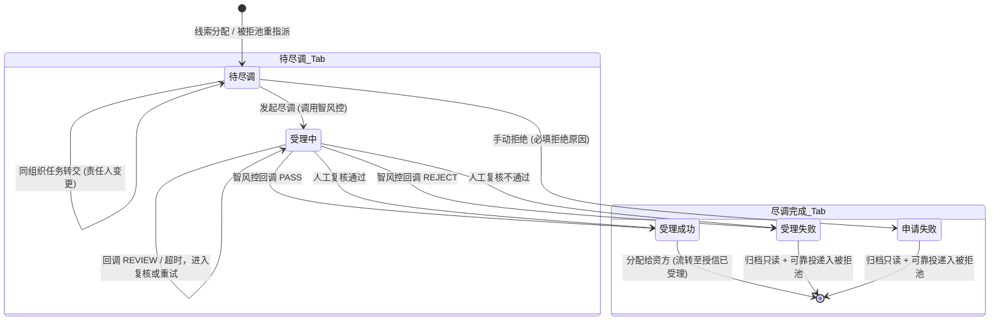
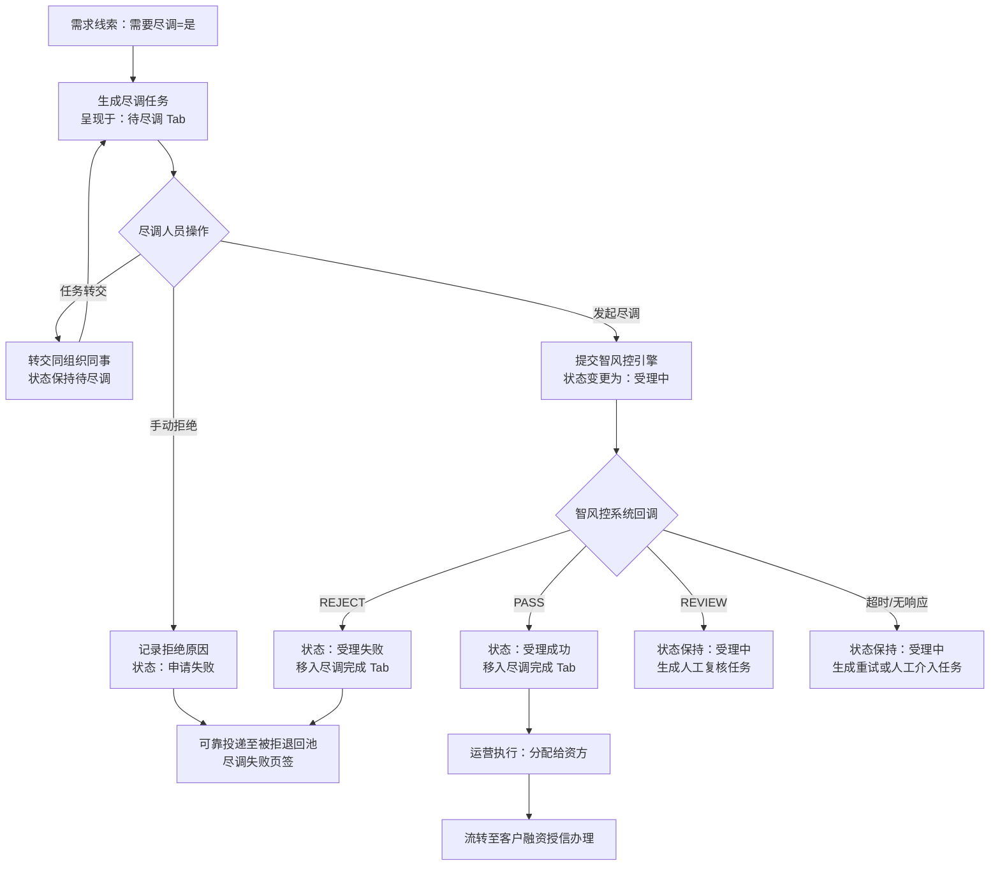

# 客户融资尽调办理 业务规则规格

> **文档定位**：客户融资尽调办理单据状态机、动作约束、前置校验规则、计算公式、权限与风控规则的唯一定义来源。
> **参考文档**：[客户融资尽调办理主PRD.md](./客户融资尽调办理主PRD.md)、[客户融资尽调办理字段清单.md](./客户融资尽调办理字段清单.md)、[01-融资管理-客户融资需求线索](../01-融资管理-客户融资需求线索/)、[03-融资管理-客户融资授信办理](../03-融资管理-客户融资授信办理/)、[05-融资管理-被拒退回池](../05-融资管理-被拒退回池/)
> **移动端对应**：[B端H5/02-工作台/02-融资监管/05-客户融资尽调办理](../../../../B端H5/02-工作台/02-融资监管/05-客户融资尽调办理/README.md)
> **版本**：V1.1 | **更新时间**：2026-09-02 | **责任人**：森云科技（Senyun Technology）

---

## 一、单据定位

| 项目 | 内容 |
| :--- | :--- |
| **单据层级** | **【第2层-风控/执行处理层】**（融资业务主体与资信尽调单据） |
| **核心职责** | 承接上游需求线索分流的“需要尽调”件，由尽调专员推进智风控主体信用核验、司法诉讼排查、线下核查报告归档，产出最终尽调结论并分流至资方授信或被拒池。 |
| **单据来源** | 1. 客户融资需求线索（需要尽调=是）分配生成； 2. 被拒退回池（尽调失败页签）重新指派生成新批次。 |
| **上游单据** | **客户融资需求线索**：1:1 提供申请主体、融资金额/期数、抵/质押物和“需要尽调”路由快照；**被拒记录重调度任务**：1:1 提供原单据 ID、重处理动作、原因和目标路由。 |
| **下游影响** | 1. 尽调成功并分配资方：生成【客户融资授信办理】授信已受理任务； 2. 尽调失败（明确不通过或手动拒绝）：通过可靠投递写入【被拒退回池 -> 尽调失败页签】。 |
| **审核流** | **【系统自动化核验 + 人工复核】**（支持同组织人员任务转交与智风控 API 异步回调）。 |

### 数量/金额/口径隔离表

| 口径名称 | 存在于 | 业务含义与公式 | 约束条件 |
| :--- | :--- | :--- | :--- |
| **意向融资金额（元）** | 尽调单主表 | 继承自线索申请金额 | 只读展示，不可修改 |
| **意向融资期数** | 尽调单主表 | 继承自线索申请期数 | 只读展示，正整数 |
| **智风控评分/结果** | 接口回调 | 外部智风控平台返回的信用综合得分与结论 | 枚举：`PASS`（通过）、`REJECT`（不通过）、`REVIEW`（需复核） |
| **尽调报告附件数** | 尽调单主表 | 尽调人员上传的实地尽调报告、征信授权书等附件 | 尽调通过必须至少上传 1 份 PDF/Word 尽调报告 |

---

## 二、状态定义与双 Tab 划分

页面解耦划分为 **【待尽调 Tab】** 与 **【尽调完成 Tab】**：

| 所在 Tab | 状态名称 | 枚举值 (`Enum`) | 业务含义 | 是否终态 | 离开条件 |
| :--- | :--- | :--- | :--- | :--- | :--- |
| **待尽调 Tab** | **待尽调** | `PENDING_DILIGENCE` | 已分配至尽调人员，等待发起尽调或转交 | 否 | 发起尽调（进入受理中） / 任务转交 / 手动拒绝（入完成Tab） |
| **待尽调 Tab** | **受理中** | `IN_PROCESSING` | 已调用智风控接口，正在等待风控模型计算、回调或人工复核 | 否 | 明确通过（进入受理成功） / 明确不通过（进入受理失败） |
| **尽调完成 Tab** | **受理成功** | `DILIGENCE_SUCCESS` | 智风控核验通过且尽调报告已归档，等待分配资方 | 否 | 分配给资方成功（流转至客户融资授信办理） |
| **尽调完成 Tab** | **受理失败** | `DILIGENCE_FAILED` | 智风控系统回调未达标/命中黑名单，已归档只读 | 否（入池待调度） | 在被拒退回池重新指派或变更路由 |
| **尽调完成 Tab** | **申请失败** | `MANUAL_REJECTED` | 尽调专员人工排查不合规执行手动拒绝，已归档只读 | 否（入池待调度） | 在被拒退回池重新指派或变更路由 |

---

## 三、状态流转图

---

## 四、状态流转表（核心规则矩阵）

| 当前状态 | 触发动作 | 前置校验条件 | 结果状态 | 二次确认弹窗 | 后置级联影响 | 失败阻断提示 (Toast) |
| :--- | :--- | :--- | :--- | :--- | :--- | :--- |
| 待尽调 | 发起尽调 | R01: 当前登录人必须为任务责任人；按申请人类型完成主体要素校验 | 受理中 | 无 | ① 调用智风控平台 OpenAPI ② 状态置为“受理中”，保留在待尽调 Tab | Toast: 「发起失败：{请完善主体资料 / 仅限任务责任人操作}」 |
| 待尽调 | 任务转交 | R02: 目标转交人必须属于同一尽调机构/组织 | 待尽调 | 「确认转交给 {接收人姓名}？」 | ① 更新尽调专员 ID 与姓名 ② 写入转交审计记录，保持待尽调状态 | Toast: 「转交失败：仅支持转交给同组织同事」 |
| 待尽调 | 手动拒绝 | R03: 拒绝原因必填（≤300字） | 申请失败（入池） | 「确认拒绝该尽调任务？拒绝后将移入完成页签并入被拒池」 | ① 状态更新为“申请失败” ② 移入【尽调完成 Tab】 ③ 通过事务内 Outbox 可靠投递至【被拒退回池 -> 尽调失败页签】 | Toast: 「拒绝失败：请填写拒绝原因」 |
| 受理中 | 智风控回调通过 | 智风控接口返回 `PASS` 且报告附件齐备 | 受理成功 | 无 | ① 状态更新为“受理成功” ② 自动移入【尽调完成 Tab】 ③ 开放“分配给资方”按钮 | 记录系统告警日志，支持后台补偿重试 |
| 受理中 | 智风控回调不通过 | 智风控接口明确返回 `REJECT` | 受理失败（入池） | 无 | ① 状态更新为“受理失败” ② 移入【尽调完成 Tab】 ③ 通过可靠投递写入【被拒退回池 -> 尽调失败页签】 | 记录系统告警日志，入被拒池等待人工重调度 |
| 受理中 | 智风控回调需复核 | 智风控接口返回 `REVIEW` | 受理中 | 无 | ① 保持“受理中” ② 创建人工复核任务并保留模型结论 ③ 复核通过转“受理成功”，不通过转“受理失败” | Toast：`「已进入人工复核，请等待处理」` |
| 受理中 | 回调超时或无响应 | 请求重试仍未收到最终结果 | 受理中 | 无 | ① 保持“受理中” ② 记录超时与重试次数 ③ 生成待重试/人工介入任务，不得直接判定为“受理失败” | 记录系统告警日志，支持后台补偿重试 |
| 受理成功 | 分配给资方 | R04: 目标资方机构处于启用状态；尽调报告附件已齐备 | 授信已受理 | 无 | ① 向【客户融资授信办理】推送任务（初始状态：授信已受理） ② 回写尽调单下游关联资方信息 | Toast: 「分配失败：请选择有效资方机构」 |

---

## 五、动作能力矩阵

| 操作动作 | 待尽调 | 受理中 | 受理成功（完成Tab） | 受理失败（完成Tab） | 申请失败（完成Tab） |
| :--- | :---: | :---: | :---: | :---: | :---: |
| **查看详情** | ✅ | ✅ | ✅ | ✅ | ✅ |
| **发起尽调** | ✅ | ❌ | ❌ | ❌ | ❌ |
| **任务转交（同组织）** | ✅ | ❌ | ❌ | ❌ | ❌ |
| **手动拒绝** | ✅ | ❌ | ❌ | ❌ | ❌ |
| **人工复核/发起重试** | ❌ | ✅（REVIEW/超时） | ❌ | ❌ | ❌ |
| **分配给资方** | ❌ | ❌ | ✅ | ❌ | ❌ |
| **查看/下载尽调报告** | ❌ | ❌ | ✅ | ✅ | ✅ |

---

## 六、前置业务校验规则（R01~R05）

### R01：尽调责任人独占与主体要素核对
- 只有当前单据的“尽调人员”本人或机构超级管理员可执行“发起尽调”与“手动拒绝”；
- 发起尽调前按申请人类型校验主体要素：
  - 企业货主：企业名称、统一社会信用代码、法定代表人姓名与身份证号一致；
  - 个人货主：姓名、身份证号、联系电话一致。

### R02：任务转交同组织强约束
- 转交人员选择器仅加载当前登录用户所在组织机构下的启用人员列表；禁止跨机构转交。

### R03：手动拒绝与原因留痕
- 手动拒绝为不可逆动作，必须录入结构化拒绝分类（如：司法涉诉严重、现场无实物、经营异常等）及文本说明；拒绝后任务立即移出待尽调 Tab。

### R04：尽调成功向资方流转
- 分配资方时，可选资方机构来自系统配置中与当前监管/平台建立有效合作关系的资方字典；分配成功后尽调阶段即告终结。

### R05：尽调完成 Tab 只读保护
- 【尽调完成 Tab】严格定义为只读归档池，禁止在此 Tab 内直接点击“重新尽调”；所有失败件必须通过【被拒退回池】进行权责清晰的重新调度。

---

## 七、权限、风控与安全控制（P01~P03 / W01~W02）

### P01：尽调组织权限隔离
- 尽调人员仅可查看和处理分配至本机构的尽调任务；
- 平台超管具备跨机构尽调监控与强制指派权限。

### P02：风控平台联登与报告防泄露
- 尽调详情中嵌入智风控报告时，通过后端生成 15 分钟临时单点签名 Token，禁止在前端明文暴露 API Key 与私有地址。

### P03：审计留痕
- 完整记录转交前后操作人、智风控请求/响应报文快照、手动拒绝原因及分配资方操作人。

### W01：接口重试与幂等
- 智风控平台请求设置 15s 超时重试（最多 2 次）；收到风控结果回调时根据尽调单号执行幂等更新。

---

## 八、业务流程与联动

---

## 九、修订记录

| 日期 | 版本 | 变更说明 | 责任人 |
| :--- | :---: | :--- | :--- |
| 2026-08-14 | V1.0 | 初始定义客户融资尽调办理业务规则 | 森云科技 |
| 2026-09-02 | V1.1 | 归入最新基准版 PC 端融资监管模块，规范跨文档引用 | 森云科技 |
