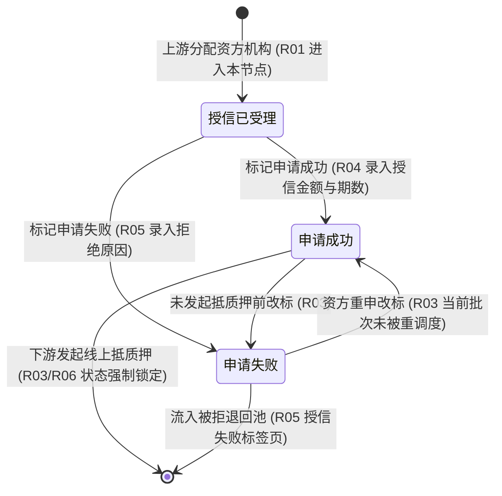

# 客户融资授信办理业务规则规格

> **文档定位**：融资监管 / 融资管理 / 客户融资授信办理节点状态机、动作约束、前置校验规则、权限与风控规则的**唯一定义真源**。主 PRD、字段清单及端侧原型仅引用本文件规则编号（R01~R06, C01~C03, P01~P02），不重复定义规则本体。  
> **模块类型**：核心资方授信审核单据台账（涵盖资方机构全员共享、授信额度核准、双向改标锁定、标记失败入池及激活线上抵质押）  
> **参考文档**：[《客户融资授信办理主PRD》](./客户融资授信办理主PRD.md)、[《客户融资授信办理字段清单》](./客户融资授信办理字段清单.md)、[《客户融资需求线索》](../01-融资管理-客户融资需求线索/)、[《客户融资尽调办理》](../02-融资管理-客户融资尽调办理/)、[《被拒退回池》](../05-融资管理-被拒退回池/)  
> **版本**：V1.2 | **更新时间**：2026-09-16 | **责任人**：森云科技（Senyun Technology）

---

## 一、对象定位与单据层级

| 项目 | 规格内容 |
| :--- | :--- |
| **单据层级** | **【第1层-核心业务驱动层】**（资方信贷授信决策与放款额度核准单据） |
| **核心职责** | 承接上游（需求线索免尽调件、尽调办理成功件、被拒退回池重分配件）已锁定资方机构的融资申请；由对应资方机构授权审核专员进行全员共享审核，核准授信金额与授信期数，激活下游抵质押办理，或标记申请失败入池归集。 |
| **单据来源** | 1. 客户融资需求线索（需要尽调=否）直接分配资方生成； 2. 客户融资尽调办理（受理成功）分配资方流转生成； 3. 被拒退回池（重新分配资方 / 变更路由分配资方）调度生成。 |
| **下游影响** | 1. **标记申请成功**：激活【线上抵质押办理】发起入口，回写借款资质快照； 2. **标记申请失败**：单据可靠写入【被拒退回池 -> 授信失败标签页】。 |
| **审核流** | 资方机构内全体授权审核专员共享任务池，单人标记即刻生效；在下游抵质押未发起前支持自由双向改标。 |

---

## 二、状态定义与流转架构

### 1. 状态定义

| 状态名称 | 状态代码 (`Enum`) | 业务含义 | 是否终态 | 进入条件 | 离开条件 |
| :--- | :--- | :--- | :---: | :--- | :--- |
| **授信已受理** | `CREDIT_ACCEPTED` | 上游成功分配合作资方后的初始状态，等待资方机构审核 | 否 | 上游节点指派分配资方机构确认成功 | 标记申请成功 / 标记申请失败 |
| **申请成功** | `APPLY_SUCCESS` | 资方核准通过并录入授信金额与期数，等待发起抵质押 | 否 | 资方审核人员录入合规授信额度与期数确认成功 | 下游发起线上抵质押（锁定） / 资方改标申请失败 |
| **申请失败** | `APPLY_FAILED` | 资方信贷审批未通过执行拒绝的状态 | 否（入池待调度） | 资方审核人员录入拒绝原因确认成功 | 在被拒退回池重新调度 / 资方重申改标为申请成功 |

### 2. 状态流转时序图

---

## 三、状态流转表与核心规则矩阵

| 当前状态 | 触发动作 | 前置校验条件 | 结果状态 | 二次确认与交互形态 | 后置级联影响 | 失败阻断提示 (浮窗提示) |
| :--- | :--- | :--- | :--- | :--- | :--- | :--- |
| **授信已受理** | 标记申请成功 | 【授信核准金额与期数合规校验规则】(R04)（授信金额 $>0$，授信期数 $\ge 1$ 正整数） | 申请成功 | 弹出模态表单：「录入授信金额与期数」 | ① 状态更新为“申请成功” ② 固化授信处理人、时间戳与额度 ③ 激活下游【线上抵质押办理】发起入口 | 浮窗提示：“请填写合规的授信金额与期数” (C02) |
| **授信已受理** | 标记申请失败 | 【资方拒绝原因必填与入池投递规则】(R05)（拒绝原因必填 $\le 300$ 字） | 申请失败 | 弹出模态弹窗：「确认拒绝授信？拒绝后将移入被拒池」 | ① 状态更新为“申请失败” ② 记录拒绝原因与处理人 ③ 可靠写入【被拒退回池 -> 授信失败标签页】 | 浮窗提示：“请填写失败拒绝原因” (C03) |
| **申请成功** | 改标为申请失败 | 【未发起抵质押前双向改标规则】(R03)（下游尚未提交抵质押信息确认） | 申请失败 | 弹出模态弹窗：「确认改标为申请失败？」 | ① 状态更新为“申请失败” ② 撤回下游抵质押发起许可 ③ 可靠写入【被拒退回池 -> 授信失败标签页】 | 浮窗提示：“改标失败：下游已发起线上抵质押，状态已锁定” (C01) |
| **申请失败** | 改标为申请成功 | 【未发起抵质押前双向改标规则】(R03)（本批次尚未被被拒退回池重新调度） | 申请成功 | 弹出模态表单：「重新录入授信金额与期数」 | ① 状态回正为“申请成功” ② 从被拒池移除或标记作废 ③ 重新激活下游线上抵质押办理入口 | 浮窗提示：“改标失败：单据已被被拒池重新调度流转” |

---

## 四、动作能力矩阵

| 操作动作 | 授信已受理 | 申请成功（未发起抵质押） | 申请失败（资方已拒入池） | 申请成功（下游已发起抵质押） |
| :--- | :---: | :---: | :---: | :---: |
| **查看详情** | ✅ | ✅ | ✅ | ✅ |
| **标记申请成功** | ✅ | ❌ | ✅（未被重调度前） | ❌ |
| **标记申请失败** | ✅ | ✅（未发起抵质押前） | ❌ | ❌ |
| **改标权限** | ❌ | ✅（支持改标为失败） | ✅（支持改标为成功） | ❌（强制锁定） |

---

## 五、核心业务规则清单 (R01 ~ R06)

### 1. 单据接入与共享审核规则

### 【上游分配直连接入与消除冗余规则】(R01)
* “分配资方机构”动作已在上游节点（需求线索免尽调件、尽调完成件、被拒池调度件）全面完成；
* 单据进入本模块时，目标资方机构已确定并锁定，状态初始化为 `CREDIT_ACCEPTED`（授信已受理）；
* **消除冗余按钮**：本页面严禁展示“分配资方机构”或“任务转交”按钮。

### 【资方机构数据强隔离与全员共享审核规则】(R02)
* 严格按照登录用户所属资方机构（商业银行、商业保理公司）执行多租户物理数据隔离；
* 属于同一资方机构内的所有具备审核权限的用户共享任务池，任一人员均可直接办理并生效，无需事先认领或专员独占；
* 严禁资方机构之间跨行查看其他同业机构名下的授信记录及审核意见 (P02)。

### 2. 状态改标与口径规范

### 【未发起抵质押前双向改标规则】(R03)
* 资方审核专员标记“申请成功”或“申请失败”后，在客户或监管员尚未针对该笔申请发起【线上抵质押信息确认】前，所属资方专员可进行自由双向改标；
* **锁定铁律**：一旦下游线上抵质押提交确认（抵质押办理进入“处理中”），本节点改标通道**即刻永久锁定**，严禁资方专员单方面推翻授信结果 (C01)。

### 【授信核准金额与期数合规校验规则】(R04)
* 资方专员标记“申请成功”时，必须在模态表单中录入资方正式审批通过的【授信金额（元）】与【授信期数】：
  * 授信金额必须大于 0，单位为元，保留小数点后 4 位小数；
  * 授信期数必须为大于等于 1 的正整数；
  * 要素缺失或格式不合规时强校验阻断提交 (C02)。

### 【资方拒绝原因必填与入池投递规则】(R05)
* 标记“申请失败”时，系统强制要求在模态弹窗中录入结构化拒绝原因及详细说明（$\le 300$ 字）(C03)；
* 提交后单据状态置为“申请失败”，并通过事务消息（Outbox）可靠投递写入【被拒退回池 -> 授信失败标签页】；记录资方机构代码、操作专员姓名及时间戳。

### 【激活线上抵质押办理与下游协同规则】(R06)
* 标记“申请成功”提交成功后，系统即刻在【线上抵质押办理】模块激活业务发起入口；
* 完整透传并快照固化申请人企业工商信息、核准授信额度、授信期数及存货/仓单质押标的清单。

---

## 六、异常阻断规则 (C01 ~ C03)

### 【下游已发起抵质押改标阻断】(C01)
* 资方专员尝试对“申请成功”单据改标为“申请失败”时，系统实时校验下游抵质押状态；若已发起确认，阻断改标并浮窗提示：“*改标失败：下游已发起线上抵质押，状态已锁定*”。

### 【标记成功授信要素缺失阻断】(C02)
* 标记申请成功表单中，未填写授信金额、授信金额 $\le 0$ 或授信期数为空时，前端即时红字提示，服务端拒绝提交。

### 【标记失败拒绝原因缺失阻断】(C03)
* 标记申请失败弹窗中，未选择拒绝原因分类或详细说明为空时，前端即时拦截，服务端拒绝受理。

---

## 七、权限、风控与安全控制 (P01 ~ P02)

### 【资方机构级访问与审核权限鉴权】(P01)
* `[授信办理·查看]`：所属资方机构全体业务人员、平台风控总监；
* `[授信办理·审核操作]`：仅限所属资方机构具备信贷审批权限的正式账号，严格鉴权。

### 【跨资方机构数据严格物理隔离】(P02)
* 服务端 SQL 查询强制注入 `funder_org_id` 机构唯一代码隔离条件，绝对禁止任何越权横向渗透。

---

## 八、修订记录

| 日期 | 版本 | 变更内容 | 影响范围 |
| :--- | :--- | :--- | :--- |
| 2026-09-16 | V1.2 | 全量规范化重构：确立 R01~R06、C01~C03、P01~P02 自解释业务规则体系，全面汉化交互术语（标签页、模态弹窗、单行文本输入框、下拉单选框、浮窗提示），细化双向改标锁定与下游激活机制 | 全文档 |
| 2026-09-02 | V1.1 | 归入最新基准版 PC 端融资监管模块，规范跨文档引用 | 规范对齐 |
| 2026-08-14 | V1.0 | 初始定义客户融资授信办理业务规则 | 全文档 |
