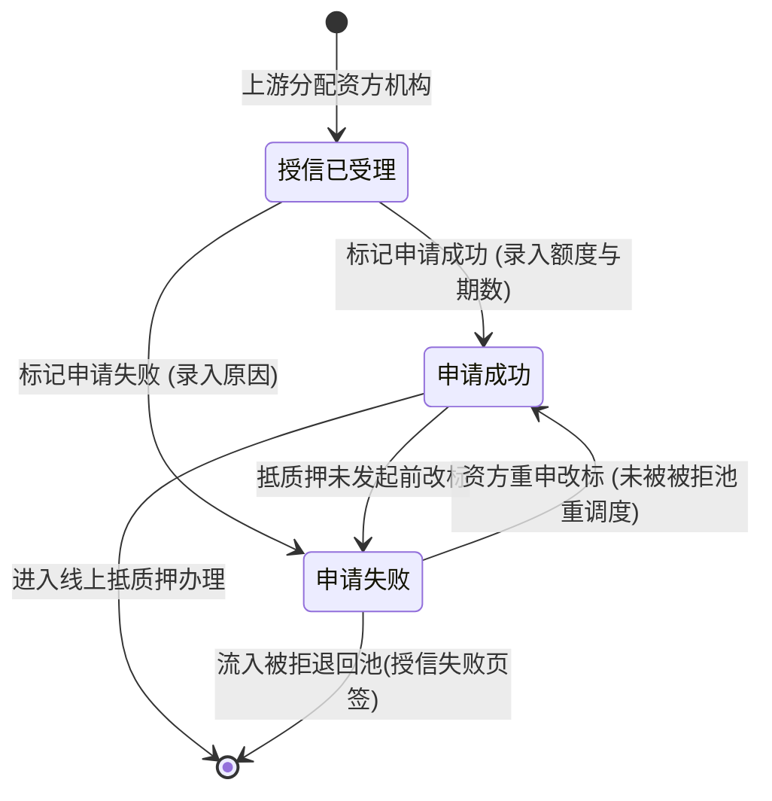

# 客户融资授信办理 业务规则规格

> **文档定位**：客户融资授信办理节点状态机、动作约束、前置校验规则、权限与风控规则的唯一定义来源。
> **参考文档**：[客户融资授信办理主PRD.md](./客户融资授信办理主PRD.md)、[客户融资授信办理字段清单.md](./客户融资授信办理字段清单.md)、[01-融资管理-客户融资需求线索](../01-融资管理-客户融资需求线索/)、[02-融资管理-客户融资尽调办理](../02-融资管理-客户融资尽调办理/)、[05-融资管理-被拒退回池](../05-融资管理-被拒退回池/)
> **版本**：V1.1 | **更新时间**：2026-09-02 | **责任人**：森云科技（Senyun Technology）

---

## 一、单据定位

| 项目 | 内容 |
| :--- | :--- |
| **单据层级** | **【第1层-核心业务驱动层】**（资方授信审核单据） |
| **核心职责** | 承接上游（需求线索、尽调办理、被拒退回池）已指定资方机构的融资申请，由该资方机构授权审核专员进行共享审核，完成授信额度与期数核准或标记申请失败入池。 |
| **单据来源** | 1. 客户融资需求线索（免尽调件分配资方）流转生成； 2. 客户融资尽调办理（尽调完成分配资方）流转生成； 3. 被拒退回池（重新分配资方 / 变更路由分配资方）流转生成。 |
| **下游影响** | 1. 标记申请成功：激活【线上抵质押办理】单据发起入口； 2. 标记申请失败：单据流入【被拒退回池 -> 授信失败页签】。 |
| **审核流** | 资方机构内全员共享审核，单人标记即生效，支持未发起抵质押前改标。 |

---

## 二、状态定义与流转图

---

## 三、前置业务校验规则（R01~R04）

### R01：上游分配接入规则
- “分配资方机构”动作在前置节点已完成，本页面无“分配资方”操作入口。
- 单据进入本页面时，状态初始化为 `授信已受理`。

### R02：资方机构数据隔离与全员共享
- 资方机构登录账号仅能查看并操作本机构名下的授信任务；
- 同一资方机构内的所有具备审核权限的用户共享任务池，任一人员均可办理，无需指派个人或转交。

### R03：改标限制与锁定规则
- 在客户或业务人员尚未针对该笔申请发起“线上抵质押信息确认”前，所属资方机构人员可自由改标（申请成功 $\leftrightarrow$ 申请失败）；
- 一旦下游线上抵质押已提交发起，授信状态强制锁定，禁止改标。

### R04：标记失败入池可靠投递
- 标记申请失败时，系统将申请单据状态置为 `申请失败`，并可靠写入【被拒退回池 -> 授信失败页签】；
- 记录当前资方机构名称、处理人、处理时间及失败原因。

---

## 四、权限与风控控制（P01~P02）

### P01：机构级 RBAC 权限控制
- `[授信办理·查看]`：所属资方机构全体业务人员、平台运营/风控专员；
- `[授信办理·审核操作]`：仅限所属资方机构具有审核权限的人员。

### P02：跨机构数据强隔离
- 严禁任何资方机构查看其他资方机构的授信申请记录及审批意见。

---

## 五、修订记录

| 日期 | 版本 | 变更说明 | 责任人 |
| :--- | :---: | :--- | :--- |
| 2026-08-14 | V1.0 | 初始定义客户融资授信办理业务规则 | 森云科技 |
| 2026-09-02 | V1.1 | 归入最新基准版 PC 端融资监管模块，规范跨文档引用 | 森云科技 |
