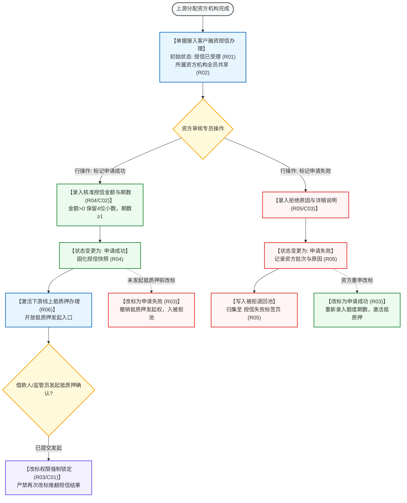

# 客户融资授信办理主PRD

> **模块定位**：融资监管 / 融资管理第 3 节点核心业务台账，承接在上游节点（需求线索免尽调件、尽调成功件或被拒退回池重分配件）中已锁定合作资方机构的融资申请单据；由目标资方机构授权审核人员进行全员共享审核，录入核准授信额度与期数并标记申请成功以激活下游线上抵质押办理，或标记申请失败入池归集，并在未发起抵质押前提供可控双向改标能力。  
> **版本**：V1.4 | **更新时间**：2026-09-16 | **责任人**：森云科技（Senyun Technology）  
> **编写依据**：[《客户融资授信办理字段清单》](./客户融资授信办理字段清单.md) 是展示、筛选及授信核准字段的唯一基准；[《客户融资授信办理业务规则规格》](./客户融资授信办理业务规则规格.md) 是状态流转、资方共享、未发起抵质押改标及激活下游的唯一定义真源。

---

## 1. 业务背景与核心痛点

### 1.1 业务背景
在供应链金融业务流中，商业银行、信托公司及商业保理公司等资金方是最终提供信贷资金的法定主体。前置的需求线索初筛与实地尽调均是为资金方的信贷决策提供前置风控依据。一旦上游确认将借款申请指派至某特定资方机构，该资方拥有最终的授信额度审批权与一票否决权。

系统通过建设**客户融资授信办理**模块，作为资金方信贷决策的操作阵地，为资方机构内部审核人员提供全员共享的待办台账，支持一键调阅尽调报告与押品明细，录入审批通过的授信额度与期数，顺畅驱动下游抵质押担保合同签署与放款流程。

### 1.2 核心业务痛点
1. **多资方数据交叉混淆**：若数据权限划分不清，不同银行之间易看到竞品同业的融资单据，引发重大商业机密泄露；
2. **任务死锁至离岗专员**：传统流程若绑定特定专员，专员休假时授信将无限期停滞，缺乏机构内全员共享审核机制；
3. **已录入错误无法撤回修正**：资方录错额度或误判拒绝后，若系统完全锁死，将导致合规借款被强行阻断；
4. **线下授信与系统抵质押脱节**：线下发完授信批复后系统未能即时联动激活抵质押流程，导致放款周期被动拉长。

---

## 2. 功能范围 (Scope)

| 包含功能（已纳入范围） | 不包含功能（超出范围） |
| :--- | :--- |
| - **资方任务直连接入与初始化**：承接上游分配的融资申请，单据状态初始化为“授信已受理”，无多余接入审批； - **机构全员共享任务池**：所属资方机构内所有具备审批权限的审核专员均可查看并直接操作办理，免去认领与个人转交； - **标记申请成功与额度录入**：填报核准的授信金额（元）与授信期数（期），提交后状态转为“申请成功”，并即时激活下游【线上抵质押办理】； - **标记申请失败与入池归集**：录入拒绝原因分类及详细说明，单据状态转为“申请失败”，通过事务消息可靠写入【被拒退回池 -> 授信失败标签页】； - **抵质押未发起前双向改标机制**：在借款人或监管员尚未发起“线上抵质押信息确认”前，资方审核人员可自由改标修正（成功 $\leftrightarrow$ 失败）；一旦发起抵质押则强制锁定。 | - **分配资方机构功能**：该动作已在前置节点完成，本页面无需且严禁展示“分配资方机构”操作； - **资方信贷核心系统内部记账逻辑**：资方行内信贷系统的额度占用、风控打分等由外部核心实现； - **线上抵质押合同文本生成与在线签章**：由【线上抵质押办理】及合同管理模块承载； - **被拒单据跨资方重新调度**：在【被拒退回池】中统一调度。 |

---

## 3. 模块架构与系统链路

---

## 4. 业务场景与用户故事

| 场景编号 | 业务场景 | 触发角色 | 核心交互与风控约束 | 业务价值 |
| :--- | :--- | :--- | :--- | :--- |
| **场景 1【资方机构接入共享审核任务池】(S01)** | 资方机构接入共享审核任务池 | 商业银行授信审核专员 | 某铝锭质押融资申请在上游分配至“华夏银行”。银行审核人员登录系统打开【客户融资授信办理】，该单据直接以“授信已受理”状态呈现于机构任务池中。无需派单分配，银行内部任何审核员均可直接点开详情查阅尽调报告与仓单档案。遵循【上游分配直连接入与消除冗余规则】(R01) 与【资方机构数据强隔离与全员共享审核规则】(R02)。 | 破除岗位人员绑定的流程瓶颈，实现银行团队无缝协同接力审核。 |
| **场景 2【资方核准授信额度与标记申请成功】(S02)** | 资方核准授信额度与标记申请成功 | 银行信贷审批主管 | 银行贷审会通过借款人申请，核准额度为 400 万元，授信期数 6 期。专员在操作列点击【标记申请成功】，弹出模态表单，录入“4000000.0000”与“6”，点击确认。系统即刻将状态更新为“申请成功”，并通知借款企业与监管方前往【线上抵质押办理】发起确认。遵循【授信核准金额与期数合规校验规则】(R04) 与【激活线上抵质押办理与下游协同规则】(R06)。 | 授信额度与期数精准固化并回写全链路，实时驱动下游质押签约。 |
| **场景 3【未达资方信贷门槛标记失败入池】(S03)** | 未达资方信贷门槛标记失败入池 | 银行信贷审批员 | 银行审查发现借款人资产负债率超出银行准入上限，专员点击【标记申请失败】，在模态弹窗中录入拒绝原因“*资产负债率超标（达85%），未达本行风控门槛*”。确认后单据状态更新为“申请失败”，自动归入被拒退回池【授信失败标签页】。遵循【资方拒绝原因必填与入池投递规则】(R05)。 | 银行审批拒绝意见严密存证，为后续更换资方重新授信提供基准参考。 |
| **场景 4【未发起抵质押前误操作改标修正】(S04)** | 未发起抵质押前误操作改标修正 | 银行审核专员本人 | 专员误将另一家客户的授信单据点击了“标记申请失败”。由于该批次尚未被被拒退回池重新指派，专员在列表中点击【改标为申请成功】，重新核准录入额度 300 万元。系统校验合规后成功修正状态并激活下游抵质押。若下游已经提交了抵质押确认，系统则弹窗拦截阻断。遵循【未发起抵质押前双向改标规则】(R03) 与【下游已发起抵质押改标阻断】(C01)。 | 提供可控的容错自纠偏通道，避免误触引发全链条推倒重来。 |

---

## 5. 页面功能与交互说明

### 5.1 客户融资授信办理主列表页（`P-RZ-003`）
* **页面路径**：`工作台 → 融资监管 → 融资管理 → 客户融资授信办理`
* **筛选查询区排布（横向排列）**：
  1. **综合搜索输入框**（单行文本输入框，占位提示“请输入产品名称/申请人”，支持产品与申请人模糊匹配）；
  2. **融资状态**（下拉单选框，默认全部，选项：`全部`、`授信已受理`、`申请成功`、`申请失败`）；
  3. **申请人类型**（下拉单选框，默认全部，选项：`企业货主`、`个人货主`）；
  4. **需要尽调**（下拉单选框，默认全部，选项：`是`、`否`）；
  - 右侧配置橙黄色实心【查询】按钮与白底【重置】按钮。
* **数据表格呈现（12 列）**：
  1. **序号**（数字递增，翻页重新计算）；
  2. **产品名称**（融资产品名称）；
  3. **需要尽调**（彩色标签展示：`是` 蓝底、`否` 灰底）；
  4. **申请人类型**（标签展示：`企业货主` 或 `个人货主`）；
  5. **申请人名称**（企业工商名称或个人姓名）；
  6. **抵/质押物**（`存货` 或 `仓单`，仓单支持点击穿透仓单档案）；
  7. **意向融资金额（元）**（数值展示，千分位，保留 4 位小数）；
  8. **意向融资期数**（如 `12期`）；
  9. **授信金额（元）**（资方核准额度，未授信展示“--”）；
  10. **授信期数**（资方核准期数，未授信展示“--”）；
  11. **融资状态**（彩色徽章展示：`授信已受理` 蓝底、`申请成功` 绿底、`申请失败` 红底灰字）；
  12. **操作列**（动作随单据状态动态呈现）：
      - `授信已受理`：【查看】、【标记申请成功】、【标记申请失败】；
      - `申请成功`：【查看】、若下游未发起抵质押展示【改标为失败】；若下游已发起则仅展示【查看】；
      - `申请失败`：【查看】、若未被被拒池重调度展示【改标为成功】。

### 5.2 授信详情抽屉/页面
* **申请主体基本资质**：企业统一社会信用代码、营业执照图片预览、经办人脱敏联系方式；
* **前置尽调与风控专区**：免尽调产品展示“免尽调直接授信”；需要尽调产品提供【尽调报告】下载链接及智风控评分摘要；
* **抵质押物标的清单**：存货明细（规格/数量/库位）或仓单编码及评估货值；
* **审批轨迹与改标历史**：完整记录上游指派时间、资方标记人、历次改标记录及拒绝原因快照。

### 5.3 交互模态弹窗规格
1. **标记申请成功模态表单**：
   - 标题：“核准授信额度”；
   - 意向融资金额与期数回显只读参考；
   - 授信金额（单行文本输入框，必填，限制 $>0$，数字精度 4 位小数，缺失阻断 C02）；
   - 授信期数（单行文本输入框，必填，限制 $\ge 1$ 正整数，缺失阻断 C02）；
   - 授信说明（多行文本输入框，选填）；
   - 点击【确认授信】后更新状态并激活抵质押。
2. **标记申请失败模态弹窗**：
   - 标题：“标记授信申请失败”；
   - 警示文案：“*确认拒绝该笔授信申请？拒绝后将写入被拒记录池。*”；
   - 拒绝原因分类（下拉单选框，选项：`综合负债率过高`、`质押率不达标`、`经营风险未通过`、`其他原因`）；
   - 详细失败说明（多行文本输入框，必填，限制 $\le 300$ 字，缺失阻断 C03）；
   - 点击【确认拒绝】后单据状态更新并入池。

---

## 6. 核心业务规则索引与追溯

> 规则规格全文见唯一真源：[《客户融资授信办理业务规则规格》](./客户融资授信办理业务规则规格.md)

| 规则编号 | 规则业务名称 | 规则类型 | 规则核心摘要与风控边界 | 真源章节引用 |
| :--- | :--- | :---: | :--- | :--- |
| **R01** | 【上游分配直连接入与消除冗余规则】 | 流程接续 | 分配资方在上游完成，本页面无分配资方按钮，进入直接为“授信已受理” | 《业务规则规格》§五.1 |
| **R02** | 【资方机构数据强隔离与全员共享审核规则】 | 访问隔离 | 严格按所属资方机构物理隔离数据，机构内所有审核专员共享任务池，任一人员均可办理 | 《业务规则规格》§五.1 |
| **R03** | 【未发起抵质押前双向改标规则】 | 容错纠偏 | 未发起抵质押前允许成功/失败互改；一旦下游提交抵质押信息确认，授信结果永久锁定 | 《业务规则规格》§五.2 |
| **R04** | 【授信核准金额与期数合规校验规则】 | 要素核准 | 标记成功必须录入授信金额(>0)与期数(≥1正整数)，作为下游抵质押放款硬基准 | 《业务规则规格》§五.2 |
| **R05** | 【资方拒绝原因必填与入池投递规则】 | 异常归集 | 标记失败必须录入原因说明(≤300字)，可靠写入【被拒退回池 -> 授信失败标签页】 | 《业务规则规格》§五.2 |
| **R06** | 【激活线上抵质押办理与下游协同规则】 | 下游驱动 | 标记成功后即时在【线上抵质押办理】激活业务发起入口，透传借款主体及额度快照 | 《业务规则规格》§五.2 |
| **C01** | 【下游已发起抵质押改标阻断】 | 业务阻断 | 下游已发起线上抵质押确认时，强校验阻断改标操作并浮窗提示状态已锁定 | 《业务规则规格》§六 |
| **C02** | 【标记成功授信要素缺失阻断】 | 输入拦截 | 授信金额未填、≤0 或期数非正整数时，前端即时红字提示，服务端拒绝提交 | 《业务规则规格》§六 |
| **C03** | 【标记失败拒绝原因缺失阻断】 | 交互阻断 | 拒绝原因分类未选或详细说明为空时，前端拦截提示，服务端拒绝受理 | 《业务规则规格》§六 |
| **P01** | 【资方机构级访问与审核权限鉴权】 | 访问控制 | 严格校验登录账号所属机构及授信审批专属权限，杜绝越权审批 | 《业务规则规格》§七 |
| **P02** | 【跨资方机构数据严格物理隔离】 | 数据合规 | 服务端强制注入机构编码隔离过滤，严禁不同金融机构间数据横向越权查阅 | 《业务规则规格》§七 |

---

## 7. 权限控制与安全合规

### 7.1 功能与操作权限矩阵

| 权限编码 | 权限名称 | 适用角色 | 权限校验逻辑与约束 |
| :--- | :--- | :--- | :--- |
| **`P-RZ-003:VIEW`** | 授信任务查看 | 所属资方机构业务员、信贷审批专员 | 严格校验当前账号所属资方机构标识，仅展示本机构任务 |
| **`P-RZ-003:CREDIT_APPROVE`** | 标记申请成功与额度核准 | 资方机构授权信贷审批主管 | 允许录入授信金额与期数并标记成功；激活下游抵质押流程 |
| **`P-RZ-003:CREDIT_REJECT`** | 标记申请失败与驳回入池 | 资方机构授权信贷审批专员 | 允许录入拒绝原因并标记失败入池 |
| **`P-RZ-003:MODIFY_DECISION`**| 双向改标修正权限 | 资方机构风控总监、高级审批官 | 在下游未发起抵质押前，允许对成功/失败结论执行改标修正 |

---

## 8. 非功能性需求（NFR）与审计存证

### 8.1 性能与稳定性
* **高并发审核防冲突**：两名资方专员同时操作同一单据时，依托分布式乐观锁，后提交者明确提示“*单据已被更新，请刷新*”；
* **下游激活低延迟**：标记成功提交后，下游【线上抵质押办理】节点在 $\le 500\text{ms}$ 内完成任务生成与状态同步。

### 8.2 司法存证与审计追溯
* **多租户物理安全**：数据库强制建立基于 `funder_org_id` 的租户物理行级安全（RLS）隔离策略；
* **全生命周期审计追踪**：全路径记录资方核准人、审批时间、授信额度快照、历次改标记录及拒绝原因，支持金融监管稽核。

---

## 9. 验收标准与测试重点

| 验收编号 | 验收项与测试用例 | 预期结果与合格标准 | 对应规则 |
| :--- | :--- | :--- | :--- |
| **AC-01** | 资方任务接入与机构隔离 | 上游分配资方后单据自动出现在对应资方台账；其他资方机构登录不可见该单据 | R01, R02, P02 |
| **AC-02** | 标记申请成功与额度校验 | 录入授信金额 500 万、期数 12 期，校验通过后状态变为“申请成功”，下游抵质押激活 | R04, R06, C02 |
| **AC-03** | 标记申请失败与入池归集 | 录入拒绝原因后状态更新为“申请失败”，被拒退回池【授信失败标签页】精准生成流水 | R05, C03 |
| **AC-04** | 未发起抵质押前改标功能 | 对申请成功件改标为失败，或对失败件改标为成功，操作均顺利完成并留存改标审计 | R03 |
| **AC-05** | 下游发起抵质押改标锁定 | 下游提交线上抵质押确认后，尝试改标申请失败，系统即刻弹窗拦截并提示状态已锁定 | R03, C01 |
| **AC-06** | 机构全员共享协同验证 | 同一资方机构专员 A 打开单据核准授信，专员 B 刷新页面后即时展示最新处理结果与处理人 A | R02 |

---

## 修订记录

| 日期 | 版本 | 变更内容 | 影响范围 |
| :--- | :--- | :--- | :--- |
| 2026-09-16 | V1.4 | 全量规范化重构：确立与业务规则规格双向对齐的自解释规则索引表（R01~R06、C01~C03、P01~P02、S01~S04），全面汉化 UI 交互控件术语，补充 NFR 与验收标准 | 全文档 |
| 2026-09-02 | V1.3 | 归入最新基准版，明确资方机构全员共享与消除冗余按钮原则 | 业务规范 |
| 2026-08-14 | V1.2 | 明确双向改标锁定条件与入池投递机制 | 状态机流转 |
| 2026-08-01 | V1.0 | 初始建立客户融资授信办理主需求文档 | 全文档 |
