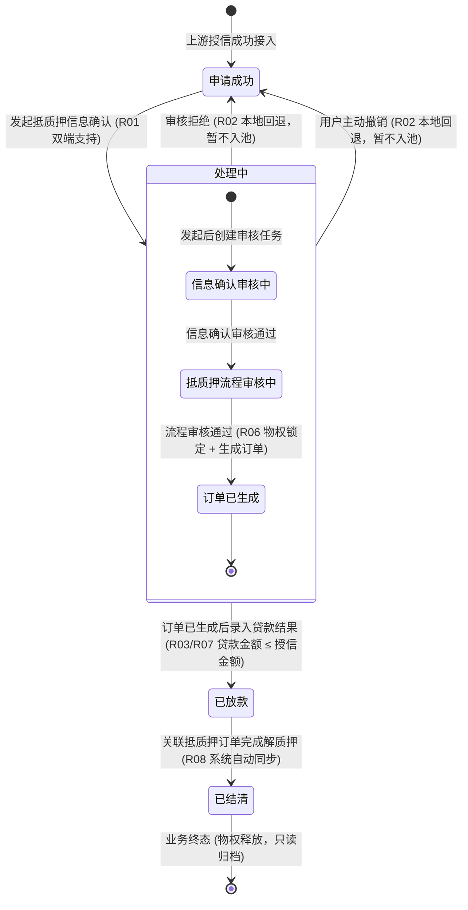

# 线上抵质押办理业务规则规格

> **文档定位**：融资监管 / 融资管理 / 线上抵质押办理单据状态机、动作约束、前置校验规则、计算公式、权限与风控规则的**唯一定义真源**。主 PRD、字段清单及端侧原型仅引用本文件规则编号（R01~R08, C01~C03, P01~P02），不重复定义规则本体。  
> **模块类型**：核心物权质押与贷款结果落地台账（涵盖 PC 与移动端双端发起、标的物权锁定、电子抵质押订单生成、本地回退机制、放款结果回写及解押自动结清）  
> **参考文档**：[《线上抵质押办理主PRD》](./线上抵质押办理主PRD.md)、[《线上抵质押办理字段清单》](./线上抵质押办理字段清单.md)、[《客户融资授信办理》](../03-融资管理-客户融资授信办理/)、[《抵质押业务管理》](../07-抵质押业务-抵质押业务管理/)  
> **移动端对应**：`B端H5/02-工作台/02-融资监管/04-线上抵质押办理`（`ws-online-pledge-process`）  
> **版本**：V1.2 | **更新时间**：2026-09-16 | **责任人**：森云科技（Senyun Technology）

---

## 一、对象定位与单据层级

| 项目 | 规格内容 |
| :--- | :--- |
| **单据层级** | **【第3层-物权锁定/执行放款层】**（全系统物权质押确权、贷款结果录入与订单闭环的执行单据） |
| **核心职责** | 承接资方授信成功的融资申请，支持在 PC 端或移动端发起抵质押信息确认；校验并锁定底层存货或数字仓单，生成不可变正式抵质押订单；录入实际贷款发放结果并回写全链路，在客户还款解质押完成后自动同步单据为结清终态。 |
| **单据来源** | 客户融资授信办理（标记申请成功）流转接入。 |
| **上游单据** | **授信通过单据**：1:1 提供授信金额、授信期限、申请主体与资方信息；**底层可用存货/数字仓单**：1:N 提供存货明细、仓单编号、货品、数量、仓库物理位置、货权状态和可质押价值。 |
| **下游影响** | 1. **发起确认与审核通过**：锁定存货/仓单（标记“质押中”），生成【抵质押订单】； 2. **录入放款结果**：回写前序全流程各节点“贷款金额/贷款期数”，状态置为“已放款”； 3. **仓储端订单解质押**：触发融资单据状态自动同步为“已结清”（业务终态）。 |
| **审核流** | **【支持 PC 端 + 移动端双端发起与审核】**（支持本地回退机制，暂不流入被拒退回池）。 |

---

## 二、数量、金额与期数口径隔离表

| 口径名称 | 存在于 | 业务含义与计算公式 | 约束条件 |
| :--- | :--- | :--- | :--- |
| **授信金额（元）** | 授信基准 | 上游资方正式核准通过的最高授信额度 | 只读基准；贷款金额的绝对上限 |
| **授信期数** | 授信基准 | 上游资方正式核准通过的最长授信期限 | 只读基准；贷款期数的上限参考 |
| **贷款金额（元）** | 贷款结果录入 | 资方实际发放并打款到账的贷款本金 | 手工录入；`0 < 贷款金额 ≤ 授信金额`，保留 4 位小数 (R03/C02) |
| **贷款期数** | 贷款结果录入 | 借款合同正式约定的实际还款期限 | 手工录入；正整数（`1 ≤ 贷款期数 ≤ 授信期数`） (R04) |
| **综合质押率（%）** | 风险测算区 | `贷款金额 / 质押存货公允评估总货值 × 100%` | 系统自动测算；必须 $\le$ 资方预设质押率上限（如 70%） |

---

## 三、状态定义与流转架构

### 1. 状态定义

| 状态名称 | 状态代码 (`Enum`) | 业务含义 | 是否终态 | 进入条件 | 离开条件 |
| :--- | :--- | :--- | :---: | :--- | :--- |
| **申请成功** | `CREDIT_SUCCESS` | 资方授信已核准通过，处于待发起抵质押信息确认的就绪状态 | 否 | 上游授信成功接入，或本节点审核拒绝/撤销后本地回退 | 双端发起抵质押确认成功（进入处理中） |
| **处理中** | `IN_PROCESSING` | 已发起确认，正在进行信息复核、物权锁定、流程审核及订单生成 | 否 | 在 PC 端或移动端点击【发起抵质押确认】成功 | 订单生成后录入放款结果 / 审核拒绝或撤销（本地回退至申请成功） |
| **已放款** | `LOAN_DISBURSED` | 抵质押订单已成功开立，贷款资金已录入发放，存货/仓单处于强锁定中 | 否 | 录入贷款金额与贷款期数校验成功 | 关联抵质押订单全部完成解质押（进入已结清） |
| **已结清** | `SETTLED` | 借款人还款完毕，抵质押物权已全额解绑释放，融资业务完整闭环 | **是** | 关联抵质押订单完成解质押，系统自动触发同步 | — （全字段锁定，业务终态不可逆） |

### 2. 状态流转时序图

---

## 四、状态流转表与核心规则矩阵

| 当前状态 | 触发动作 | 前置校验条件 | 结果状态 | 二次确认与交互形态 | 后置级联影响 | 失败阻断提示 (浮窗提示) |
| :--- | :--- | :--- | :--- | :--- | :--- | :--- |
| **申请成功** | 发起抵质押信息确认 | 【质押标的存续与可用性强校验规则】(R01)（押品存货在库可用，仓单有效未质押） | 处理中 | 弹出模态表单：「确认发起抵质押信息确认？发起后将锁定质押存货」 | ① 状态更新为“处理中” ② 临时锁定底层存货或数字仓单 ③ 创建抵质押业务审核任务 (PC/移动端同步) | 浮窗提示：“发起失败：质押货物已被占用或状态异常” (C01) |
| **处理中** | 用户主动撤销 | 【抵质押异常本地回退机制规则】(R02)（尚未生成正式抵质押订单；撤销原因必填） | 申请成功（本地回退） | 弹出模态弹窗：「确认撤销该确认任务？撤销后将释放质押物锁定」 | ① 状态本地回退为“申请成功” ② 调用库存/仓单引擎解除临时物权锁定 ③ 记录撤销审计日志，暂不流入被拒退回池，允许重新发起 | 浮窗提示：“撤销失败：订单已开立，无法撤销” (C03) |
| **处理中** | 流程审核拒绝 | 【抵质押异常本地回退机制规则】(R02)（审核人员具备权限；拒绝原因必填 $\le 300$ 字） | 申请成功（本地回退） | 弹出模态弹窗：「确认拒绝该任务？拒绝后将回退并释放锁定」 | ① 状态本地回退为“申请成功” ② 释放质押物临时锁定 ③ 记录审核意见，暂不入被拒池，允许修改后再次发起 | 浮窗提示：“拒绝失败：请填写审核拒绝原因” |
| **处理中** | 订单生成超时或失败 | 流程审核通过；抵质押订单服务超时或网络异常 | 处理中 | 系统后台异步重试机制 | ① 保持“处理中”状态并记录失败日志 ② 释放未落单的临时锁定 ③ 生成可重试任务，严格幂等排重，禁止重复开立订单 | 浮窗提示：“订单生成失败：请稍后重试” |
| **处理中** | 录入贷款结果 | 【贷款金额与授信额度强约束规则】(R03/C02) 【贷款期数与还款周期合规规则】(R04) 抵质押订单已成功开立 | 已放款 | 弹出模态表单：「录入实际贷款发放结果」 | ① 状态更新为“已放款” ② 存货状态正式锁定为“质押中” ③ 异步回写全流程各节点贷款金额与期数 (R07) | 浮窗提示：“录入失败：贷款金额不可大于授信金额或期数不合规” |
| **已放款** | 订单解质押同步 | 【解质押结清同步与终态锁定规则】(R08)（关联抵质押订单在仓储端全额解质押） | 已结清 | 无（系统跨模块事件自动驱动） | ① 状态自动更新为“已结清” ② 固化结清时间戳 ③ 锁定全字段，归档只读，业务终态 | 记录异步同步日志，支持定时任务补偿对齐 |

---

## 五、动作能力矩阵

| 操作动作 | 申请成功（待发起） | 处理中（办理/审核中） | 已放款 | 已结清（终态） |
| :--- | :--- :---: | :---: | :---: | :---: |
| **查看详情（双端）** | ✅ | ✅ | ✅ | ✅ |
| **发起抵质押确认（双端）** | ✅ | ❌ | ❌ | ❌ |
| **审核抵质押任务（双端）** | ❌ | ✅ | ❌ | ❌ |
| **用户主动撤销（双端）** | ❌ | ✅（未生成订单前） | ❌ | ❌ |
| **录入贷款结果（双端）** | ❌ | ✅（订单生成后） | ❌ | ❌ |
| **导出台账与打印单据** | ✅ | ✅ | ✅ | ✅ |

---

## 六、核心业务规则清单 (R01 ~ R08)

### 1. 标的核验与回退规则

### 【质押标的存续与可用性强校验规则】(R01)
* 发起抵质押信息确认时，系统对关联的质押标的执行穿透核验：
  * **存货形态**：必须处于“存货中”，可用库存数量必须 $\ge$ 申请质押数量，且库房未处于盘点封锁状态；
  * **仓单形态**：必须处于“有效未质押”状态，严禁对已冻结、在途或已被其他质押单绑定的仓单进行重复质押 (C01)；
* 标的状态异常或货权冲突时，系统即刻阻断发起。

### 【抵质押异常本地回退机制规则】(R02)
* 本期对于处于“处理中”阶段的异常单据（用户主动撤销、流程审核人员拒绝）：
  * **暂不流向【被拒退回池】**；
  * 系统自动在本地回退至“申请成功”状态；
  * 自动触发库存/仓单引擎释放本次临时物权锁定，恢复标的可用性；
  * 允许业务人员在修正资料后，在 PC 端或移动端快速再次发起确认。

### 2. 贷款要素与防并发规则

### 【贷款金额与授信额度强约束规则】(R03)
* 录入贷款发放结果时，系统实施刚性强校验：
  $$0 < \text{贷款金额} \le \text{授信金额}$$
* 最终放款金额严禁突破资方核准的授信额度上限；若录入金额超出授信额度，前端即时红字校验拦截，服务端拒绝提交 (C02)。

### 【贷款期数与还款周期合规规则】(R04)
* 贷款期数必须为正整数（单位：期/月），且必须满足：
  $$1 \le \text{贷款期数} \le \text{授信期数}$$
* 合同还款周期不得超过资方核准的最长授信期限。

### 【PC端与移动端双端防并发版本锁规则】(R05)
* 线上抵质押全流程支持 PC 端与移动端（H5）交叉操作；
* 后端基于单据 `version` 版本号进行分布式乐观锁校验（CAS）：
  * 先到达服务端的有效请求执行状态变迁；
  * 后到达的并发请求拦截并返回浮窗提示：“*单据状态已被更新，请刷新重试*”，杜绝双端并发冲突。

### 3. 物权锁定与终态协同规则

### 【质押物权强锁定与抵质押订单生成规则】(R06)
* 抵质押流程审核通过时，系统事务保障执行以下操作：
  1. 调用底层库存系统与仓单系统，将标的资产状态正式打标为“质押中”，施加出库/移库冻结锁；
  2. 生成系统全局唯一的不可变电子【抵质押订单】，关联监管仓库与质权人。

### 【放款结果异步全链路回写规则】(R07)
* 录入贷款结果成功后，单据状态变更为“已放款”；
* 系统通过事件总线，异步回写前序【客户融资需求线索】及【客户融资尽调办理】对应记录的【贷款金额（元）】与【贷款期数】字段，实现端到端数据闭环。

### 【解质押结清同步与终态锁定规则】(R08)
* 借款人全额还本付息并在仓储端完成货物/仓单的“解/抵质押”后，系统监听到解押完成事件，自动将本融资单据状态同步置为“已结清”；
* **单向终态锁定**：一旦单据进入“已结清”，全量业务字段永久锁定只读，严禁任何人工逆向修改或重新激活。

---

## 七、异常阻断规则 (C01 ~ C03)

### 【标的物状态异常或重复质押阻断】(C01)
* 关联存货被盘点锁定、在途移库或仓单已被质押时，发起抵质押信息确认被强行阻断并浮窗提示：“*发起失败：质押货物已被占用或状态异常*”。

### 【放款金额超授信额度阻断】(C02)
* 录入贷款金额 $\le 0$ 或贷款金额大于资方授信金额时，前端红字阻断提交，服务端拒绝入账。

### 【已生成订单撤销阻断】(C03)
* 抵质押流程审核通过且正式电子抵质押订单已生成后，阻断任何形式的用户主动撤销，浮窗提示：“*撤销失败：订单已开立，无法撤销*”。

---

## 八、权限控制与安全合规规则 (P01 ~ P02)

### 【抵质押发起、审核与放款录入权限鉴权】(P01)
* `[抵质押·发起确认]`：借款客户授权经办人、平台调度专员；
* `[抵质押·业务审核]`：具备动产质押确权审核权限的专员；
* `[抵质押·放款录入]`：资方放款专员、平台结算人员。

### 【全链路抵质押流转审计留痕】(P02)
* 全量记录双端发起人、审核人意见、撤销原因、放款录入金额、时间戳及客户端网络 IP 地址，保障司法保全与物权溯源效力。

---

## 九、修订记录

| 日期 | 版本 | 变更说明 | 责任人 |
| :--- | :---: | :--- | :--- |
| 2026-09-16 | V1.2 | 全量规范化重构：确立 R01~R08、C01~C03、P01~P02 自解释业务规则体系，全面汉化交互术语（模态弹窗、单行文本输入框、下拉单选框、浮窗提示），明确双端并发锁与本地回退规范 | 全文档 |
| 2026-09-02 | V1.1 | 归入最新基准版 PC 端融资监管模块，打通移动端 H5 映射 | 规范对齐 |
| 2026-08-14 | V1.0 | 初始定义线上抵质押办理业务规则 | 全文档 |
