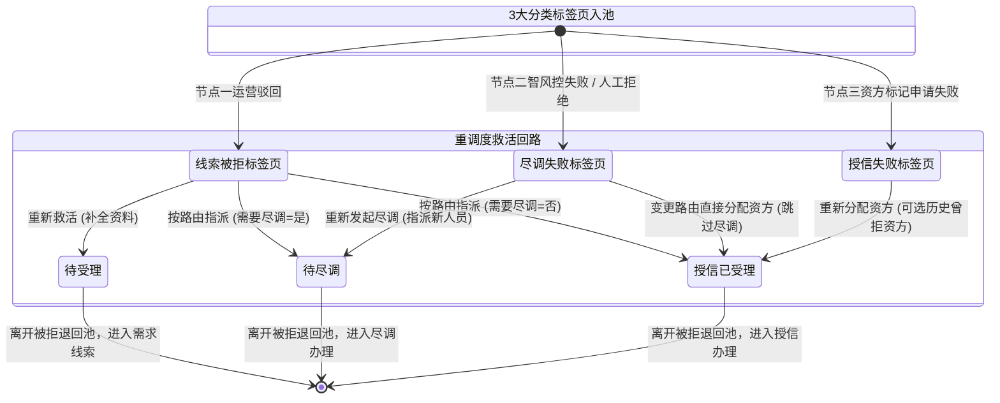
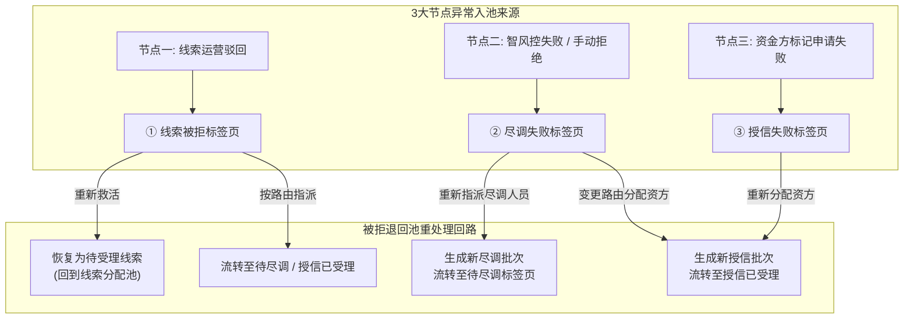

# 被拒退回池 业务规则规格

> **文档定位**：被拒退回池状态机、动作约束、前置校验规则、计算公式、权限与风控规则的唯一定义真源。
> **参考文档**：[被拒退回池主PRD.md](./被拒退回池主PRD.md)、[被拒退回池字段清单.md](./被拒退回池字段清单.md)、[被拒退回池功能清单_PC及移动端.md](./被拒退回池功能清单_PC及移动端.md)、[01-融资管理-客户融资需求线索](../01-融资管理-客户融资需求线索/)、[02-融资管理-客户融资尽调办理](../02-融资管理-客户融资尽调办理/)、[03-融资管理-客户融资授信办理](../03-融资管理-客户融资授信办理/)
> **版本**：V1.2 | **更新时间**：2026-09-16 | **责任人**：森云科技（Senyun Technology）

---

## 一、单据定位与核心职责

| 规范项目 | 业务定义与标准内容 |
| :--- | :--- |
| **单据层级** | **【第2层-异常归集/重调度控制层】**（全系统统一的异常监控与重调度单据） |
| **核心职责** | 集中收口融资管理前 3 个节点（需求线索、尽调办理、授信办理）产生的驳回、失败与拒绝件，划分为 **3 大分类标签页** 进行集中监控、追溯审计与二次重调度救活，防止业务线索流失与死锁。 |
| **单据来源** | 1. 客户融资需求线索（运营人员驳回）自动写入； 2. 客户融资尽调办理（智能风控失败 / 手动拒绝）自动写入； 3. 客户融资授信办理（资金方机构标记申请失败）自动写入。 |
| **上游单据** | **客户融资需求线索、客户融资尽调办理、客户融资授信办理**产生的驳回/失败单据，按来源单据 1:1 镜像保留原单据编号、来源节点、失败原因、原状态、主体和融资快照；重处理时只新增处理记录，不覆盖原始失败快照。 |
| **下游影响** | 根据重调度动作将申请重新激活并分流至目标模块： 1. 重新救活：恢复为“待受理”，重新进入需求线索分配池； 2. 按路由重新指派：流转至【客户融资尽调办理】或【客户融资授信办理】； 3. 重新发起尽调：生成新尽调批次，推送到【客户融资尽调办理】待尽调标签页； 4. 重新分配资金方：生成新授信批次，推送到【客户融资授信办理】授信已受理。 |
| **审核流机制** | **【平台运营专员/风控主管直接重调度】**（免审批流，直接派发新批次）。 |

### 数量/金额/期数口径隔离表

| 口径名称 | 存在于 | 业务含义与公式 | 约束条件 |
| :--- | :--- | :--- | :--- |
| **意向融资金额（元）** | 记录主表 | 继承自原始申请金额 | 只读展示，支持救活时修改资料重算 |
| **意向融资期数** | 记录主表 | 继承自原始申请期数 | 只读展示，正整数 |
| **重调度批次号 (`batch_no`)** | 系统生成 | 记录该单据在被拒退回池经历的重调度轮次（`V1`, `V2`, ...） | 系统自动递增，永久留存历史履历 |
| **历史被拒次数** | 聚合统计 | 该客户在全平台历史被驳回/拒绝的累计总次数 | 系统自动统计，辅助运营判断是否值得救活 |

---

## 二、状态定义与 3 大分类标签页划分

页面划分为 **3 大分类标签页**，各标签页独立管理对应异常来源的状态与重处理回路：

| 所在标签页 | 异常来源类型 | 初始入池状态 | 支持的重处理动作 | 调度流转结果状态 |
| :--- | :--- | :--- | :--- | :--- |
| **① 线索被拒标签页** | 需求线索运营驳回件 | `申请失败` | 1. **【重新救活】** 2. **【按路由重新指派】** | 1. 恢复为 `待受理` 线索 2. 流转至 `待尽调` / `授信已受理` |
| **② 尽调失败标签页** | 智风控不通过 / 尽调专员手动拒绝件 | `受理失败` / `申请失败` | 1. **【重新发起尽调】** 2. **【变更路由直接分配资方】** | 1. 生成新尽调批次流转至 `待尽调` 2. 生成新授信批次流转至 `授信已受理` |
| **③ 授信失败标签页** | 资金方机构标记申请失败件 | `申请失败` | **【重新分配资方】** | 生成新授信批次，流转至 `授信已受理` |

> **设计说明**：
> - 被拒退回池不设单据物理删除，所有重调度均生成新子批次流转，旧批次保留作历史追溯；
> - 本期抵质押异常件暂不入池，由抵质押模块本地回退处理。

---

## 三、状态流转图

---

## 四、状态流转表（核心规则矩阵）

| 当前标签页 | 触发动作 | 前置校验条件 | 结果状态 | 二次确认模态弹窗 | 后置级联影响 | 失败阻断提示 (浮窗提示) |
| :--- | :--- | :--- | :--- | :--- | :--- | :--- |
| **① 线索被拒** | 重新救活 | 【三大页签精准收口归集规则】(R01): 申请资料已补充/修改合规 | 待受理（主流程） | 提示：「确认救活该线索？救活后将恢复为待受理线索重新进入分配池」 | ① 移出被拒退回池 ② 原线索状态更新为“待受理” ③ 记录救活日志 | 浮窗提示: 「救活失败：资料不满足提交要求」 |
| **① 线索被拒** | 按路由重新指派 | 需要尽调=是且已选尽调人员；或需要尽调=否且已选有效资金方 | 流转下游业务模块 | 提示：「确认重新指派流转？」 | ① 移出被拒退回池 ② 按路由生成待尽调或授信已受理任务 ③ 记录指派日志 | 浮窗提示: 「指派失败：请选择有效指派对象」 |
| **② 尽调失败** | 重新发起尽调 | 目标尽调专员处于启用状态 | 待尽调（主流程） | 提示：「确认重新指派尽调人员？将生成新尽调批次」 | ① 移出被拒退回池 ② 创建第 N 轮尽调新任务，推送至尽调办理【待尽调标签页】 ③ 记录重新指派日志 | 浮窗提示: 「发起失败：请选择有效尽调专员」 |
| **② 尽调失败** | 变更路由直接分配资方 | 目标资金方处于启用状态；风控主管特批确认 | 授信已受理（主流程） | 提示：「确认跳过尽调直接分配给资金方机构？」 | ① 移出被拒退回池 ② 变更路由快照为“需要尽调=否” ③ 生成授信已受理任务推送到【客户融资授信办理】 | 浮窗提示: 「分配失败：请选择有效资金方机构」 |
| **③ 授信失败** | 重新分配资方 | 【授信失败重调度专属规则】(R02): 目标资金方有效；【历史已拒资方可选与警示规则】(R03): 历史已拒资方可选 | 授信已受理（主流程） | 提示：「确认分配给资金方：{机构名称}？将生成新授信批次」 | ① 移出被拒退回池 ② 生成新授信任务，推送至【客户融资授信办理】（原尽调结论继续生效） ③ 记录资金方调度履历 | 浮窗提示: 「分配失败：请选择有效资金方机构」 |

---

## 五、动作能力矩阵

| 交互操作动作 | ① 线索被拒标签页 | ② 尽调失败标签页 | ③ 授信失败标签页 |
| :--- | :---: | :---: | :---: |
| **查看详情与拒绝历史** | ✅ | ✅ | ✅ |
| **重新救活（恢复为待受理）** | ✅ | ❌ | ❌ |
| **按路由重新指派（转尽调/资方）**| ✅ | ❌ | ❌ |
| **重新发起尽调（指派新人员）** | ❌ | ✅ | ❌ |
| **变更路由直接分配资方** | ❌ | ✅ | ❌ |
| **重新分配资方（可选历史曾拒资方）** | ❌ | ❌ | ✅ |
| **导出异常分析台账** | ✅ | ✅ | ✅ |

---

## 六、核心前置业务规则

### 【三大页签精准收口归集规则】(R01)
- 系统依据单据触发被拒/失败时的节点类型强行分流归集：
  - 节点一（需求线索） $\to$ 【① 线索被拒标签页】；
  - 节点二（尽调办理） $\to$ 【② 尽调失败标签页】；
  - 节点三（授信办理） $\to$ 【③ 授信失败标签页】。
- 各标签页仅展示对应类型的记录，严格禁止跨标签页混合展示。

### 【授信失败重调度专属规则】(R02)
- 【授信失败标签页】严格仅提供【重新分配资方】动作；
- 资金方拒绝仅代表该特定资金方的风控偏好或额度限制，原先完成的尽调报告与信用结论继续保持有效，重新分配新资金方时无需重新走一遍尽调流程。

### 【历史已拒资方可选与警示规则】(R03)
- 在【授信失败标签页】或【尽调失败变更路由】执行“分配资方”时，资金方机构下拉选择器展示全量有效资金方；
- 历史曾经拒绝过该客户的资金方机构**不置灰、不禁止选择**，但在资金方名称旁高亮标注“*历史曾拒”提示标签，以满足客户补充资产或提升担保后向原资金方再次申请的真实业务诉求。

### 【多轮重调度批次审计与不可篡改规则】(R04)
- 每次从被拒退回池成功重调度流转后，系统自动生成新的业务流水批次号（如 `clue_id-B02`），旧批次的拒绝时间、拒绝资金方/经办人员、拒绝原因永久只读留痕，禁止任何数据覆盖或物理删除。

### 【抵质押异常暂不入池约束规则】(R05)
- 本期抵质押异常件暂不接入被拒退回池，由抵质押模块本地回退处理。

### 【防并发重复重调度互斥锁规则】(R06)
- 运营人员在点击重调度模态弹窗确认时，系统对该被拒记录加互斥分布式锁，避免多人并发同时对同一笔异常件分派给不同人员或资金方。

---

## 七、计算公式与统计指标

### 【被拒停滞超期警示计算口径】(C01)
- **停滞时长公式**：
  $$\text{停滞时长} = \text{当前时间} - \text{入池时间戳}$$
- 停滞时长超过 72 小时未处理时，列表展示红色“超期未调度”警示徽章。

### 【异常挽回率与拒单统计指标】(C02)
- **异常挽回率计算公式**：
  $$\text{挽回率} = \frac{\text{从被拒退回池重调度后最终放款成功的单据数}}{\text{被拒退回池历史累计入池总单据数}} \times 100\%$$

---

## 八、权限、风控与安全控制

### 【重调度专职审批权限控制】(P01)
- `[被拒退回池·查看]`（R-FIN-VIEW）：平台运营人员、风控专员；
- `[被拒退回池·重调度操作]`（R-FIN-DISPATCH）：仅限平台运营主管、首席风控官角色拥有执行权限。

### 【跨资方商业机密与拒绝原因脱敏规则】(P02)
- 在向新资金方重新分配时，旧资金方的内部审核评语与批注仅限平台运营内部可见，禁止向新资金方机构泄露旧资金方的内部商业审批备注。

### 【单据级分布式操作锁防护】(W01)
- 重调度请求执行时锁定 `clue_id`，防止网络抖动导致的重复生成下游任务。

### 【五次被拒熔断保护机制】(W02)
- 单笔线索累计进入被拒退回池超过 5 次时，系统自动触发熔断机制，锁定该线索禁止再次救活，需线下发起特批工单解除锁定。

---

## 九、业务流程与全链路联动

### 9.1 业务流程说明
1. 融资管理前 3 个节点（需求线索、尽调办理、授信办理）产生的失败、驳回及拒绝件，根据退回节点自动路由归集至【被拒退回池】对应的 **3 大分类标签页**。
2. 运营人员进入被拒退回池，按 3 大标签页分类进行重处理：
   - **① 线索被拒标签页**：支持执行【重新救活】（修改/补全申请资料后恢复为“待受理”重新进入分配池），或【按路由重新指派】（需要尽调=是：转尽调；需要尽调=否：直接分配资方）；
   - **② 尽调失败标签页**：执行【重新发起尽调】（重新指派尽调人员生成新批次流转至待尽调标签页），或执行【变更路由直接分配资方】（流转至授信已受理）；
   - **③ 授信失败标签页**：专门进行【重新分配资方】（选择新资方或历史曾拒资方，生成新授信批次流转至授信已受理，原尽调结论继续生效）。

### 9.2 业务全景流向图

---

## 十、修订记录

| 日期 | 版本 | 变更说明 | 责任人 |
| :--- | :---: | :--- | :--- |
| 2026-08-14 | V1.0 | 初始定义被拒退回池业务规则与状态流转矩阵 | 森云科技 |
| 2026-09-02 | V1.1 | 归入最新基准版 PC 端融资监管模块，规范跨文档引用 | 森云科技 |
| 2026-09-16 | V1.2 | 全面重构为规则语义自解释编码、汉化交互控件术语并补齐计算口径与风控规则真源 | 森云科技 |
