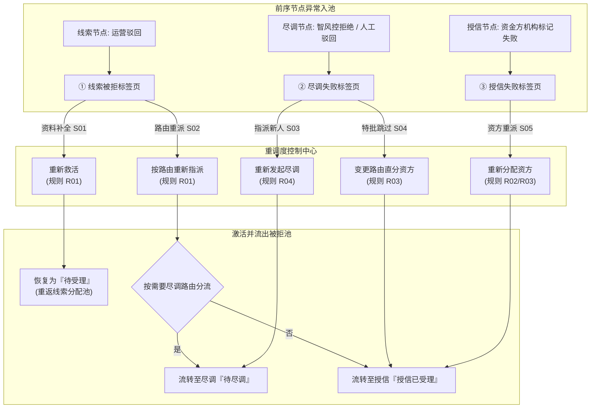

# 被拒退回池 主PRD

> **模块定位**：融资管理第 5 节点核心管理功能，作为全系统统一的融资异常监控与重调度指挥中心，集中管控前 3 个业务节点流转失败的异常单据，划分为 **3 大分类标签页**（线索被拒、尽调失败、授信失败），防止优质商机死锁流失并实现全链路审计闭环。
> **范围说明**：本期抵质押单据发起失败及审核拒绝件暂不纳入被拒退回池（列入二期统一规划），由线上抵质押办理模块在本地执行回退处理。
> **版本**：V1.6 | **更新时间**：2026-09-16 | **责任人**：森云科技（Senyun Technology）

---

## 1. 业务流程与架构概览

### 1.1 异常归集与重调度回路架构图

### 1.2 核心业务流程
1. **统一异常归集**：需求线索驳回件、尽调风控失败件、授信资方拒绝件自动写入被拒退回池，并按来源精准收归于 3 大独立分类标签页（R01），快照留存原业务数据及被拒原因；
2. **线索被拒重新救活与指派**：运营人员核对客户补充资料后，可点击【重新救活】将单据恢复为“待受理”进入线索池；亦可点击【按路由重新指派】直接派发至尽调专员或资方机构；
3. **尽调失败重调与路由变更**：对尽调未通过单据，可指派其他尽调专员【重新发起尽调】；或经风控特批通过【变更路由直接分配资方】跳过现场尽调；
4. **授信失败极简快速重派**：资方拒绝件原尽调报告及信用结论依然生效，运营人员通过【重新分配资方】直接选定新资方机构（或历史曾拒资方 R03）生成新授信批次流转；
5. **熔断保护与不可变存证**：单据进入被拒池超过 5 次自动触发熔断保护（W02）；历次调度生成递增批次号（R04），原始被拒记录与原因永久留痕不可篡改。

---

## 2. 状态机与标签页流转规范

### 2.1 状态流转矩阵

| 当前所在标签页 | 执行操作动作 | 前置约束条件 | 流转目标状态 | 二次确认机制 | 后置级联业务影响 | 失败阻断提示 (浮窗提示) |
| :--- | :--- | :--- | :--- | :--- | :--- | :--- |
| **① 线索被拒** | 重新救活 | 资料修改/补全合规，符合准入基础标准 | 待受理 | 模态弹窗确认提示 | 移出被拒池，原线索恢复为“待受理”进入线索分配池 | 浮窗提示：“救活失败：资料不符合准入规范” |
| **① 线索被拒** | 按路由重新指派 | 确认路由分流，选定有效尽调专员或资方 | 待尽调 / 授信已受理 | 模态弹窗确认指派对象 | 移出被拒池，按路由直接生成下游尽调或授信任务 | 浮窗提示：“请选择有效的指派对象” |
| **② 尽调失败** | 重新发起尽调 | 重新选定在职尽调专员（不同于前序人员） | 待尽调 | 模态弹窗选择人员并确认 | 移出被拒池，生成新一轮尽调批次，推至尽调办理待尽调列表 | 浮窗提示：“发起失败：请选择有效尽调人员” |
| **② 尽调失败** | 变更路由直接分配资方 | 经风控主管确认特批，选定合作资方机构 | 授信已受理 | 需二次确认（强制录入特批理由） | 移出被拒池，路由快照变更为无需尽调，直推授信已受理 | 浮窗提示：“分配失败：请选择有效合作资方” |
| **③ 授信失败** | 重新分配资方 | 选定有效资方机构（历史曾拒资方可选） | 授信已受理 | 模态弹窗确认资方机构 | 移出被拒池，生成新授信批次推至授信已受理，尽调结论有效 | 浮窗提示：“分配失败：请选择有效资金方机构” |

### 2.2 动作能力矩阵

| 交互操作动作 | ① 线索被拒标签页 | ② 尽调失败标签页 | ③ 授信失败标签页 |
| :--- | :---: | :---: | :---: |
| **查看详情与历次被拒原因** | ✅ | ✅ | ✅ |
| **重新救活（修改资料重新校验）** | ✅ | ❌ | ❌ |
| **按路由重新指派（分流尽调/资方）**| ✅ | ❌ | ❌ |
| **重新发起尽调（指派新尽调专员）** | ❌ | ✅ | ❌ |
| **变更路由直接分配资方（跳过尽调）**| ❌ | ✅ | ❌ |
| **重新分配资方（可选历史曾拒资方）** | ❌ | ❌ | ✅ |
| **导出异常台账与统计分析报表** | ✅ | ✅ | ✅ |

---

## 3. 页面布局与交互规范

### 3.1 PC 端主页面结构
1. **顶部卡片式 3 大标签页（Tabs）**：
   - 【线索被拒】（Badge 显示待处理笔数与超期告警数）；
   - 【尽调失败】（Badge 显示待重审笔数）；
   - 【授信失败】（Badge 显示待重派资方笔数）。
2. **筛选与搜索区域**：
   - 申请单号（单行文本输入框）、借款企业名称（单行文本输入框）、被拒节点（下拉单选框）、被拒时间范围（日期范围选择器）、停滞状态（下拉单选框：全部/正常/超期未调度）；
   - 操作按钮：【查询】、【重置】、【导出台账】。
3. **数据表格列定义**：
   - 包含：申请单号、企业名称、原所属产品、申请金额（元）、申请期数、被拒节点、最后被拒时间、最后被拒原因、历史被拒次数、当前停滞时长、操作列。
   - 停滞时长超 72 小时显示红色“超期未调度”警示徽章（C01）。
4. **操作列按钮配置**：
   - **线索被拒行**：展示【重新救活】、【按路由指派】、【详情】；
   - **尽调失败行**：展示【重新发起尽调】、【变更路由直分资方】、【详情】；
   - **授信失败行**：展示【重新分配资方】、【详情】。

### 3.2 交互模态弹窗规格
1. **重新救活编辑模态弹窗**：
   - 允许编辑企业工商、意向金额、期限及抵质押物，保存后调用准入校验规则重新提交；
2. **重新指派/分配资方模态弹窗**：
   - 下拉单选框选择目标资方机构，若该资方历史曾拒，选项右侧标红提示“*历史曾拒”（R03），点击确定后弹出二次确认；
3. **详情抽屉（含被拒履历时间轴）**：
   - 右侧滑出抽屉，以时间轴（Timeline）清晰展现该笔申请从线索发起、初审、尽调、授信历次被拒的时间、经办人、被拒节点及原始审核批语。

---

## 4. 业务场景定义

### 场景 1【需求线索驳回件重新救活】(S01)
- **触发入口**：运营人员在线索被拒标签页点击【重新救活】；
- **业务操作**：客户补充提供了上游贸易合同或修正了企业征信信息后，运营人员在弹窗中更新附件并核对申请金额；
- **系统校验**：触发【三大页签精准收口归集规则】(R01)，核对数据字段完整性；
- **流转结果**：单据移出被拒池，恢复为“待受理”状态并重新进入线索分配公海池。

### 场景 2【线索驳回件按路由重新指派】(S02)
- **触发入口**：运营人员在线索被拒标签页点击【按路由重新指派】；
- **业务操作**：系统依据线索原始配置的“需要尽调”字段弹出指派弹窗。若需要尽调，选择尽调专员；若无需尽调，选择合作资金方机构；
- **系统校验**：校验目标对象状态为已启用；
- **流转结果**：单据直接分流至下游【客户融资尽调办理】或【客户融资授信办理】模块。

### 场景 3【尽调失败件指派新人员重审】(S03)
- **触发入口**：风控主管在尽调失败标签页点击【重新发起尽调】；
- **业务操作**：原尽调人员由于现场调研不充分导致尽调未通过，主管重新选派经验更资深的尽调专员进行二次核查；
- **系统校验**：触发【多轮重调度批次审计与不可篡改规则】(R04)，自动生成新轮次尽调批次号；
- **流转结果**：任务推送至尽调办理模块的【待尽调标签页】，旧批次尽调底稿自动归档留存。

### 场景 4【尽调失败件变更路由直分资方】(S04)
- **触发入口**：风控主管在尽调失败标签页点击【变更路由直接分配资方】；
- **业务操作**：对于资质良好且提供全额银行承兑汇票或优质国企担保的借款人，经主管特批跳过线下尽调，直接选择资方；
- **系统校验**：强制录入不少于 20 字的特批理由，触发【单据级分布式操作锁防护】(W01)；
- **流转结果**：修改路由为无需尽调，生成授信任务直接推至【客户融资授信办理】模块。

### 场景 5【授信失败件重新分派资方机构】(S05)
- **触发入口**：运营人员在授信失败标签页点击【重新分配资方】；
- **业务操作**：A 银行因行内涉房额度受限拒绝贷款申请，运营人员选择更偏好大宗存货质押的 B 商业银行；
- **系统校验**：触发【授信失败重调度专属规则】(R02) 与【历史已拒资方可选与警示规则】(R03)；
- **流转结果**：复用既有合规尽调报告，直接生成新授信批次流转至【客户融资授信办理】。

---

## 5. 核心业务规则追溯索引表

| 规则类型 | 规则编码与业务名称 | 规则核心逻辑摘要 | 关联场景 | 交互表现与异常反馈 |
| :--- | :--- | :--- | :--- | :--- |
| **业务规则** | 【三大页签精准收口归集规则】(R01) | 线索驳回、尽调失败、授信失败按来源严格分流归集至 3 大独立标签页，禁止跨页签混合展示 | S01, S02 | 切换标签页独立请求分页数据，各标签页列定义按需适配 |
| **业务规则** | 【授信失败重调度专属规则】(R02) | 授信失败页签仅提供重新分配资方动作，原尽调结论直接继承，无需退回重新尽调 | S05 | 操作列仅展示【重新分配资方】与【详情】，无冗余按钮 |
| **业务规则** | 【历史已拒资方可选与警示规则】(R03) | 资方选择下拉单选框不屏蔽历史曾拒资方，但在选项右侧标红提示“*历史曾拒” | S04, S05 | 下拉单选框提供语义警示标签，允许业务人员自主决策 |
| **业务规则** | 【多轮重调度批次审计与不可篡改规则】(R04) | 每次重调度流转均递增生成新流水批次号，原始被拒时间、经办人、原因永久不可篡改 | S03, S05 | 详情抽屉时间轴以卡片多轮次堆叠展示历史审计记录 |
| **业务规则** | 【抵质押异常暂不入池约束规则】(R05) | 线上抵质押异常件本期在抵质押模块本地回退处理，被拒池暂不接收抵质押退回件 | — | 系统后台路由守卫过滤抵质押异常来源单据 |
| **业务规则** | 【防并发重复重调度互斥锁规则】(R06) | 点击确认重调度时加互斥分布式锁，防止多人同时将同一笔单据分派给不同资方/专员 | S01~S05 | 后发请求弹出浮窗提示“该单据正在被其他管理员调度中” |
| **计算指标** | 【被拒停滞超期警示计算口径】(C01) | 停滞时长 = 当前时间 - 入池时间；超过 72 小时标记为超期未调度 | S01~S05 | 列表停滞时长列显示红色 Badge 警示标签与置顶排序权重 |
| **计算指标** | 【异常挽回率与拒单统计指标】(C02) | 挽回率 = 成功放款单据数 / 累计入池总单据数 * 100% | — | 顶部看板或导出报表中统计挽回成效与资方通过率 |
| **权限控制** | 【重调度专职审批权限控制】(P01) | 重调度执行权限仅开放给运营主管与首席风控官（R-FIN-DISPATCH） | S01~S05 | 普通业务员仅具备查看权限，重调度按钮置灰或隐藏 |
| **风控安全** | 【跨资方商业机密与拒绝原因脱敏规则】(P02) | 向新资方重新分配时，原资方内部审批批注系统自动脱敏，禁止跨行泄露商业秘密 | S05 | 资方端 API 接口隐藏前序资方的敏感内部审核评语 |
| **系统安全** | 【单据级分布式操作锁防护】(W01) | 基于 Redis 分布式锁锁定 `clue_id`，保证重调度与批次生成的幂等性 | S01~S05 | 拦截网络抖动产生的重复提交动作 |
| **风控安全** | 【五次被拒熔断保护机制】(W02) | 单笔申请累计入池达到 5 次，系统自动熔断锁定，禁止再次线上救活重调度 | S01~S05 | 按钮置灰并提示“已触发风控熔断，需线下特批解除” |

---

## 6. 非功能性需求（NFR）

1. **响应时延**：3 大标签页切换与检索响应时间 $\le 400\text{ms}$；重调度派发并回写任务完成时间 $\le 800\text{ms}$；
2. **幂等性保障**：重调度提交接口具备严格 Token 幂等机制，防止双击或弱网重试造成重复派单；
3. **数据一致性**：移出被拒池与写入下游任务表在同一数据库事务（Transaction）内完成，确保单据状态强一致；
4. **全审计追溯**：记录重调度操作人、客户端 IP 地址、调配前后资方与工号镜像，永久保存在冷热分离审计库中。

---

## 7. 验收标准与交付清单

1. **标签页分流验收**：验证需求线索驳回件进入【线索被拒】、尽调不通过进入【尽调失败】、授信资方拒绝进入【授信失败】，分类准确率 100%；
2. **重调度回路验收**：
   - 验证【线索被拒】重新救活后能正确回到需求线索“待受理”列表；
   - 验证【尽调失败】重新指派后在尽调办理“待尽调”生成新批次；
   - 验证【授信失败】重新选择资方后在授信办理“授信已受理”正确展示；
3. **曾拒资方标注验收**：验证重新分配资方下拉列表中，历史拒绝过该客户的资方正确展示“*历史曾拒”红字标识；
4. **并发与熔断验收**：验证并发点击时互斥锁生效，且被拒 5 次后成功阻断线上救活操作。

---

## 8. 修订记录

| 日期 | 版本 | 变更说明 | 责任人 |
| :--- | :---: | :--- | :--- |
| 2026-08-14 | V1.4 | 初始完成 3 大标签页及业务流转规格设计 | 森云科技 |
| 2026-09-02 | V1.5 | 归入最新基准版 PC 端融资监管模块（05-融资管理-被拒退回池） | 森云科技 |
| 2026-09-16 | V1.6 | 全面升级业务场景自解释命名、建立核心业务规则追溯表、汉化所有交互控件并完善熔断与验收体系 | 森云科技 |
