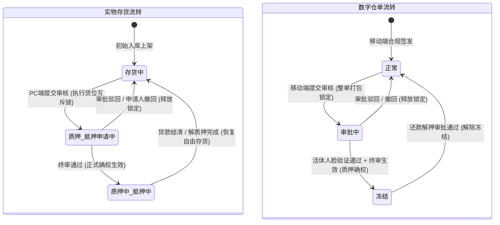

# 抵质押业务-抵质押业务办理 业务规则规格

> **文档定位**：融资监管 / 抵质押业务 / 抵质押业务办理模块（`P-RZ-004` / `P-RZ-006`）业务定位、主体准入、表单自适应联动、货值安全线试算模型、两级货品圈选、存货与仓单互斥锁定、移动端活体人脸识别及司法存证的**唯一定义来源**。主 PRD、字段清单及端侧 ASCII 线框只引用本文件规则编号（`R-PLG-01 ~ R-PLG-12`），不重复定义规则本体。
>
> **模块类型**：业务单据与金融确权类（涵盖主体资质匹配、质押标的圈选、风控阈值设定、审批流转与底账锁定）
>
> **参考文档**：[《抵质押业务办理主PRD》](./抵质押业务办理主PRD.md)、[《抵质押业务办理字段清单》](./抵质押业务办理字段清单.md)、[《抵质押业务办理_ASCII_办理与选货页》](./抵质押业务办理_ASCII_办理与选货页.md)、[《02-仓储/05-仓单管理》](../../02-仓储/05-仓单管理/仓单管理业务规则规格.md)、[《08-配置管理/14-货品规格管理-货品管理》](../../08-配置管理/14-货品规格管理-货品管理/货品管理业务规则规格.md)
>
> **版本**：V1.0 | **更新时间**：2026-09-10 | **责任人**：森云科技（Senyun Technology）

---

## 一、单据与能力定位

| 项目 | 内容 |
| :--- | :--- |
| **单据层级** | **【第1层-金融业务发起与资产确权层】**（供应链金融动产质押与仓储监管订单发起中枢 —— 相当于信贷系统中的担保品确权开立控制中心） |
| **核心职责** | 承接资方与借款主体信贷需求，规范动产抵质押担保物的录入与锁定。支持针对在库合格实物【存货】（PC 端主道）及数字【仓单】（移动端专道）开具质押单与抵押单。建立从主体资格核验、担保模式自适应、货值安全线监控、两级货位级联圈选到审批中心流转的全链路风控闭环。 |
| **风控边界红线 (核心)** | **双轨发起机制与移动端人脸强核验**： 1. **PC 端业务主道（仅限在库实物存货）**：在 PC 端仅允许选择状态为【存货中】且入库合格的物理货位进行圈选，支持两级树形分配，严禁在 PC 端脱离活体人脸直接发起数字仓单质押； 2. **移动端仓单专道（整单质押与保管人同一性）**：数字仓单具有法定物权凭证效力，必须在移动端操作，遵循**整单打包不可拆分**原则；多张仓单合并质押时强校验**保管人必须为同一主体**，防范印章冲突与虚假质押； 3. **司法证据链强闭环（活体人脸强核验）**：以仓单为标的的抵质押审批，法定代表人必须在移动端完成公安底库活体人脸识别，形成防篡改司法存证链； 4. **全系统互斥锁定**：提交后物理货位即刻切为【质押/抵押申请中】，仓单切为【审批中】，严禁在途中发起出库、移库、加工或异动调账。 |
| **单据来源** | **主动发起机制**：由客户经理、业务经办人或企业法人员工在 PC 端或移动端直接发起办理。 |
| **上游依赖** | **客户/货主档案**：提供企业统一信用代码、营业执照 OCR 解析库及自然人身份信息； **库存明细 (P-CKG-003)**：提供【存货中】且在库可用数量 $>0$ 的实物货位源头； **仓单管理 (P-CKG-005)**：提供状态为【正常】的数字仓单卡片源头； **货品管理 (P-PZ-014)**：只读继承 SKU 基准参考单价。 |
| **下游影响** | **仓储底账互斥锁定**：提交即刻冻结货位与仓单动碰权限； **工作中心审批流**：推入审批中心进行资方风控审核与合同签署； **金融台账与监管大屏**：终审通过后生成有效抵质押监管订单，动态纳入货值安全线与跌价预警监控池。 |

---

## 二、业务要素与核算口径隔离表

| 口径名称 | 存在位置 | 业务含义与计算公式 | 约束与边界条件 |
| :--- | :--- | :--- | :--- |
| **可用数量** | 选货弹窗 / 仓储底账 | 该物理货位当前未被任何业务占用、可用于抵质押的最大实物存量 $Q_{\text{available}}$ | 数值 $> 0$；作为抵质押数量分配的绝对上限阈值 |
| **抵押/质押数量** | 选货弹窗 / 明细表 | 本次业务申请实际被锁定的实物数量 $Q_{\text{pledge}}$ | **强校验项**：必填，数值型，必须满足 $0 < Q_{\text{pledge}} \le Q_{\text{available}}$，严禁超额输入 |
| **SKU 基准单价** | 明细表格单价列 | 货品规格管理主档配置的基准参考单价 $P_{\text{base}}$（元） | 系统只读继承，表单禁止手动改写；若货品档案未维护则显示 `--` |
| **货位总价** | 明细表格总价列 | 单个货位的参考质押总市值： $$\text{总价} = Q_{\text{pledge}} \times P_{\text{base}}$$ | 动态试算；若单价未维护则总价显示 `--`，不计入汇总总值 |
| **货品总数量** | 底部汇总栏 | 本表单内所有被勾选子货位数量之算术累加：$$\sum Q_{\text{pledge}}$$ | 动态累加；不同计量单位时分单位并列统计 |
| **货品总价值** | 底部汇总栏 | 所有已维护单价货位的市值累加并转换为万元： $$\text{总价值 (万元)} = \frac{\sum (Q_{\text{pledge}} \times P_{\text{base}})}{10000}$$ | 动态试算，保留 6 位小数；末尾标注部分未维护单价货品除外 |
| **货值安全线** | 基础信息表单项 | 流动/浮动模式下约定的担保物市值底线阈值 $V_{\text{safe}}$ | 数值 $> 0$；开启开关后必填；低于该值触发补仓预警 |

---

## 三、业务状态机与资产联动

### 3.1 标的物状态定义与生命周期

| 资产类型 | 状态名称 | 状态编码 | 业务含义 | 资产可用性与动碰限制 |
| :--- | :--- | :--- | :--- | :--- |
| **实物存货** | **存货中** | `IN_STOCK` | 自由存货态，未用于任何在途业务或抵质押 | 允许发起出库、移库、加工、异动或抵质押圈选 |
| **实物存货** | **质押/抵押申请中** | `PLEDGE_APPLYING` | 抵质押已提交审核，处于审批保护期 | **互斥锁定**：严禁出库、移库、加工、异动调账及重复质押 |
| **实物存货** | **质押中/抵押中** | `PLEDGED` | 抵质押审批通过生效，进入金融在押监管期 | **法定义务锁定**：除经资方审批的解押或置换外，严禁任何擅自动碰 |
| **数字仓单** | **正常** | `NORMAL` | 仓单合法成立，权属清晰，无金融占用 | 允许在移动端发起出库、移库、补货、移除、注销或质押 |
| **数字仓单** | **审批中** | `PENDING_APPROVAL` | 仓单已被抵质押业务圈选并提交审核 | **单流程互斥锁**：仅允许【详情】与【下载】，禁止一切动碰操作 |
| **数字仓单** | **冻结** | `FROZEN` | 抵质押人脸签署完成并终审通过生效 | **物权质押管控**：严禁出库、移库、补货、移除与注销 |

### 3.2 资产锁定与闭环流转时序

---

## 四、动作能力与流转控制矩阵

| 触发动作 | 操作入口 | 适用角色 | 前置业务校验条件 | 结果状态 / 跳转目标 | 联动后置影响 | 失败阻断提示 (Toast / Alert) |
| :--- | :--- | :--- | :--- | :--- | :--- | :--- |
| **货主 OCR 识别** | 货主名称右侧相机图标 | 业务经办人 | 货主类型为【企业】；上传合规营业执照图片 | 自动填充货主名称并回显信用代码与电话 | 减少人工录入笔误 | 「识别失败：图片模糊或非标准执照，请重新上传」 |
| **唤起选货弹窗** | 明细区右上角【+ 添加货物】| 业务经办人 | 表单处于新增开立态 | 居中呼出选择货物弹窗 (`P-RZ-004-SELECT`) | 强过滤仅展示状态为【存货中】有效货位 | - |
| **跳转快捷入库** | 明细区【去发起入库】链接 | 业务经办人 | 在库库存不足需补库 | 新标签页跳转 `仓储 → 入库记录 → 发起入库` | 完成入库上架后可返回刷新勾选 | - |
| **快速全量填充** | 选货弹窗行操作【全部】 | 业务经办人 | 货位可用量 $>0$ | 自动将可用数量填满该行输入框 | 父级自动求和联动 | - |
| **货位数量录入** | 选货弹窗数量输入框 | 业务经办人 | 输入数值型且大于 0 | 校验 $0 < Q_{\text{录入}} \le Q_{\text{可用}}$ | 父级实时更新；超额输入框标红阻断 | 「录入失败：抵质押数量不能超过货位可用数量」 |
| **确认添加货物** | 选货弹窗底部【确定】按钮 | 业务经办人 | 至少勾选分配 1 项数量 $>0$ 货位 | 关闭弹窗并将货品明细填充至主表两级表格 | 触发 SKU 基准单价匹配与总价值试算 | 「添加失败：请至少选择一个货品并分配数量」 |
| **移除货品明细** | 主表操作列【移除】链接 | 业务经办人 | 表单处于编辑态 | 弹出确认弹窗，确认后从表格中剔除该项 | 重新计算底部品类数、总数量与总价值 | - |
| **提交业务审核** | 页面右上角【提交审核】按钮 | 业务经办人 | ① 货主及权人信息完备； ② 质押货品总数 $>0$； ③ 贷款金额 $\le$ 授信金额； ④ 若为流动/浮动模式且开安全线，阈值必须 $>0$。 | 底层存货锁定为【质押/抵押申请中】；生成 19 位单据号推入审批中心 | 全系统锁定对应货位动碰权限，启动防并发锁 | 「提交失败：贷款金额不能高于授信金额」 「提交失败：流动抵质押必须输入货值安全线」 |
| **移动端人脸签章** | 移动端审批流待办卡片 | 法定代表人 / 权属人 | 标的物为数字仓单；处于移动端审批流 | 唤起手机摄像头活体检测与 CA 电子印章合成 | 比对分数记录入防伪存证链，审批通过后仓单置为【冻结】 | 「认证失败：人脸活体检测未通过，请调整光线重试」 |

---

## 五、业务规则明细 (Rule 01 ~ Rule 12)

### 5.1 主体与模式准入规则 (R01 ~ R03)

#### R-PLG-01：主体类型与要素动态映射规则
- **规则逻辑**：
  - 切换【货主类型】时，动态调整第一行表单要素与校验规则：
  - **`企业` 模式**：
    - `货主名称`：支持搜索企业库，右侧提供 OCR 识别图标；
    - `货主标识`：系统只读回显 18 位统一社会信用代码；
    - 证件列展示为 **`联系电话`**，系统只读回显经办人脱敏手机号。
  - **`个人` 模式**：
    - `货主名称`：支持输入自然人姓名，右侧不展示 OCR 图标；
    - `货主标识`：系统只读回显自然人脱敏手机号；
    - 证件列展示为 **`身份证号`**，系统只读回显 18 位脱敏二代居民身份证号。
- **界面初始态**：未选货主类型前，仅渲染前置字段，不占位展示标识与证件列。

#### R-PLG-02：单据类型与担保方式自适应切换规则
- **规则逻辑**：
  - 以【请选择开立单据类型】为驱动核心：
    - 选 `质押单`：担保方式切换为 `质押方式`（枚举：`流动质押` / `静态质押`），权人显示为 `质押权人*`，明细表头显示为 `质押数量`；
    - 选 `抵押单`：担保方式切换为 `抵押方式`（枚举：`浮动抵押` / `固定抵押`），权人显示为 `抵押权人*`，明细表头显示为 `抵押数量`。
  - 切换单据类型时不丢失已添加的货品数据。

#### R-PLG-03：货值安全线浮动/流动条件触发机制
- **规则逻辑**：
  - 仅当担保方式为 `流动质押` 或 `浮动抵押` 时，界面展示【货值安全线开关】及输入框；
  - 开关默认开启（ON），开启时【货值安全线】必填且必须 $>0$；
  - 当担保方式切换为 `静态质押` 或 `固定抵押` 时，系统**自动彻底隐藏整行安全线控件**，提交时参数置空。

---

### 5.2 资产圈选与价格试算规则 (R04 ~ R05)

#### R-PLG-04：货品两级级联选货与数量防超额硬拦截
- **规则逻辑**：
  - 选货弹窗支持在父级或子级录入数量，点击【全部】一键全额填报，点击【清空】一键置零；
  - 父级录入框实时求和等于下属子级货位数量之和：
    $$Q_{\text{父级}} = \sum_{k=1}^{N} Q_{\text{子级}, k}$$
  - **强阻断校验**：任何子货位的分配数量严禁超过其实时可用数量：
    $$0 < Q_{\text{抵质押}} \le Q_{\text{可用}}$$
  - 超额输入时输入框高亮标红并拦截确定按钮，杜绝超额提交。

#### R-PLG-05：SKU 基准单价获取与动态货值核算引擎
- **规则逻辑**：
  - 单价严格只读继承自【货品规格管理-货品管理】SKU 主档配置的基准参考单价（元）；
  - 若主档未配置单价，单价列与总价列展示 `--`，不阻断业务提交；
  - 若已配置单价，系统动态计算货位总价与底部汇总总价值：
    $$\text{货品总价值 (万元)} = \frac{\sum (Q_{\text{货位}} \times P_{\text{SKU}})}{10000}$$

---

### 5.3 仓单抵质押与移动端人脸存证规则 (R06 ~ R10)

#### R-PLG-06：底层物理存货互斥锁定与防动碰机制
- **规则逻辑**：
  - 提交审核后，底层所选货位状态即刻变更为 **`质押申请中`**（或 **`抵押申请中`**）；
  - 仓储端出库、移库、加工、异动申报凡触碰该货位均被强拦截阻断；
  - 终审通过后状态变更为 **`质押中`**（或 **`抵押中`**）；驳回/撤回后毫秒级恢复 **`存货中`**。

#### R-PLG-07：仓单整单打包质押与不可拆分规则
- **规则逻辑**：
  - 移动端选择数字仓单抵质押时，以整张仓单（CD 编号）为最小单位；
  - 勾选仓单即默认将其项下包含的所有物料种类与数量**全量打包锁定**，严禁部分拆分。

#### R-PLG-08：多仓单保管人强一致性防签章冲突校验
- **规则逻辑**：
  - 移动端顶部常驻黄底红字警示横幅：*“重要提示：选择的所有电子仓单保管人必须为同一企业或个人，否则将会导致流程中保管人签章错误！！！”*；
  - 提交强校验：所有被勾选仓单的 `custodian_id` 必须严格一致，若存在不同保管人，系统即刻弹窗拦截并阻断提交。

#### R-PLG-09：仓单抵质押强绑定移动端活体人脸核验机制
- **规则逻辑**：
  - 仓单抵质押审批流程中，法定代表人/权属人必须在移动端调用公安权威底库活体人脸检测；
  - 核验通过后加盖 CA 电子印章，活体置信度与签名哈希固化为不可变司法证据链。

#### R-PLG-10：仓单全生命周期状态机双向闭环机制
- **规则逻辑**：
  - 提交审核置为 **`审批中`**（严格仅允许详情与下载）；
  - 审批通过置为 **`冻结`**；审批驳回/撤销恢复 **`正常`**；还款解押通过解除冻结恢复 **`正常`**。

---

### 5.4 表单校验与系统防护规则 (R11 ~ R12)

#### R-PLG-11：实际贷款金额与授信额度合规校验
- **规则逻辑**：
  - 校验规则：$\text{贷款金额} \le \text{授信金额}$ 且 $\text{贷款期数} \le \text{授信期数}$；
  - 违反时失焦报错：`“贷款金额不能高于资金方核准的授信金额！”`。

#### R-PLG-12：业务提审防抖与强一致性防并发乐观锁
- **规则逻辑**：
  - 客户端防抖：点击提交后按钮立即置灰 Loading；
  - 服务端乐观锁：基于货位与仓单版本号检测并发占用，若已被其他在途业务锁定，事务回滚并提示刷新。
