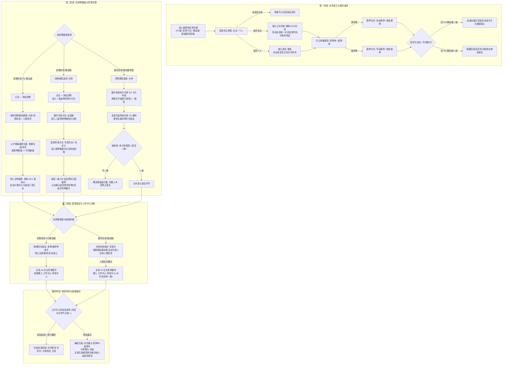

# 抵质押业务-抵质押业务办理 主PRD

> **模块定位**：供应链金融核心资产抵质押办理、确权开立与风控准入中枢。作为连接资金方（商业银行、保理公司、资方机构）与借款货权方（核心企业、借款企业、个体商户）的业务发起中枢，支持针对仓储在库实物【存货】（个人电脑端与移动端均支持）以及数字【仓单】（移动端专道）开具规范化质押单与抵押单。通过主体授信资质动态反显、权人恒定企业准入、货值安全线动态监控、PC两级树形/移动端三级选货与先进先出智能扣减、多仓单同保管人强一致性约束以及仓单提审法定活体人脸识别强核验，构筑“货权清晰、资产可溯、互斥隔离、司法存证”的金融级存货监管防线。  
> **版本**：V1.3 | **更新时间**：2026-09-16 | **责任人**：森云科技（Senyun Technology）  
> **编写依据**：[抵质押业务办理字段清单.md](./抵质押业务办理字段清单.md) 是本模块所有字段定义、枚举与页面展示的唯一定义来源；[抵质押业务办理业务规则规格.md](./抵质押业务办理业务规则规格.md) 是主体动态映射、安全线模型、存货/仓单互斥锁定与人脸司法存证的唯一业务真源；[抵质押业务办理_ASCII_办理与选货页.md](./抵质押业务办理_ASCII_办理与选货页.md) 是界面交互与布局的基准来源。  
> **关联模块**：只读继承 [02-仓储/05-仓单管理](../../02-仓储/05-仓单管理/仓单管理主PRD.md) 之仓单状态机与流转约束；继承 [08-配置管理/14-货品规格管理-货品管理](../../08-配置管理/14-货品规格管理-货品管理/货品管理字段清单.md) 之 SKU 基准单价口径；业务审批对接 [01-工作中心/01-审批中心](../../01-工作中心/01-审批中心/审批中心总索引.md)。

---

## 1. 业务背景与痛点剖析

### 1.1 业务背景
在供应链金融动产质押与仓储监管业务中，借款企业通常以其在指定监管仓库中的大宗原材料（如电解铜、卷板、铝锭）、冻品或农产品作为质押物或抵押物，向商业银行或保理资金方申请流动资金贷款。  
传统模式下，抵质押业务办理依赖线下纸质合同、人工核实库存台账与现场巡视，存在严重的信息不对称与道德风险。为打通“货-仓-金”数据链，森云科技打造一站式数字【抵质押业务办理】平台：
- 在 PC 端为风控与业务人员提供高效的大宗在库【实物存货】两级级联圈选与授信放款参数录入（暂不支持仓单）；
- 在移动端提供【存货】与【仓单】双标的发起专道：存货支持三级选货与先进先出智能扣减，仓单支持多张电子仓单整单打包与移动端权威活体人脸识别强存证；
- 实现从意向发起、押品锁定、风控试算到审批归档的全生命周期强一致性管控，存货与仓单在工作中心统一流转审批。

### 1.2 核心业务痛点
1. **一货多押与质押状态脱节**：传统仓储系统中，货物在申请质押期间无系统级互斥锁定，极易发生“边质押边出库”、“多头重复质押”等恶性金融欺诈；
2. **流动质押货值监控缺失**：流动质押或浮动抵押业务中，缺乏动态货值安全线、警戒线与平仓线的预置，导致市场价格下跌或货物被调换时资金方担保物价值跌破敞口；
3. **主体信息录入繁琐易错**：货主统一社会信用代码、法人证件与联系方式手工录入容易发生笔误，缺乏光学字符识别（OCR）快速识别与企业档案实时反显机制；
4. **数字仓单质押拆分引发物权瑕疵**：传统系统常允许任意拆分仓单部分货物进行质押，破坏了数字仓单完整不可分的证券化物权凭据效力；
5. **冒名质押与司法存证效力弱**：缺乏权威合规的现场法定代表人实名活体人脸识别，事后产生纠纷时借款人常主张“非本人真实意愿质押”，导致资金方败诉。

---

## 2. 功能范围 (Scope)

| 包含功能 (In Scope) | 不包含功能 (Out of Scope) |
| :--- | :--- |
| - **双模式主体动态映射与反显**：支持 `企业` 与 `个人` 两种货主类型。未选择货主前不渲染反显列；企业类型支持模糊检索与营业执照 OCR，选中后自动反显统一社会信用代码与联系电话；个人类型自动反显货主标识（脱敏手机号）； - **权人主体恒定为企业**：质押权人/抵押权人类型在系统内恒定为【企业】（只读，不可切换为个人）； - **双单据类型与担保方式自适应**：支持开立 `质押单`（对应 `流动质押` / `静态质押`）与 `抵押单`（对应 `固定抵押` / `浮动抵押`），权人标签与表格表头自适应切换为“质押”或“抵押”； - **货值安全线双端风控引擎**：PC 与移动端均支持在 `流动质押` 与 `浮动抵押` 模式下自适应唤出货值安全线开关与阈值录入（带单位元/万元切换），固定/静态模式下自动隐蔽； - **PC 端存货两级级联圈选**：点击【+ 添加货物】唤出模态弹窗，按仓库/货物多维过滤及三维排序，以父级（SKU）与子级（具体货位批次）两级树形展现，支持【全部】/【清空】与防超额强校验； - **移动端存货三级选货与先进先出智能扣减**：步骤 2 点击【+ 添加货物】进入一级【选择货物】卡片页，深入二级【货物明细】支持 **`[先进先出 (FIFO)]`** 与 **`[自定义]`** 智能扣减，确认后带回四级手风琴明细展开（SKU $\rightarrow$ 仓库及现场照片 $\rightarrow$ 库房/分区 $\rightarrow$ 货位批次及条码）；底部提供【重新编辑货物】与【扫码功能（二期规划）】； - **仓单质押整单打包与保管人同一性**：支持多张数字仓单（CD 编号）复选质押；强校验**整单打包不可拆分**及**多仓单保管人强一致性**（黄底红字警示横幅拦截）； - **统一审批流与仓单移动端人脸强核验**：无论以存货还是仓单为标的，推入审批中心后审批流完全统一；唯一区别是以仓单为标的时，在移动端提交前强制唤起法定代表人**公安权威活体人脸识别**核验； - **底层货位与仓单互斥锁定**：提交审核后，物理存货即刻切为【质押申请中】/【抵押申请中】，仓单切为【审批中】，禁止出库、移库、加工与异动；终审通过后分别流转为【质押中】/【抵押中】及【冻结】。 | - **在 PC 端办理数字仓单**：PC 端当前仅支持在库实物【存货】圈选办理，暂不支持仓单办理； - **拆分单张仓单内部分货物质押**：仓单具有法定不可分证券化属性，严禁单选仓单内某一种或部分数量货物发起抵质押； - **跨不同保管人合并质押**：严禁将不同保管人（企业或个人）签发的仓单合并在同一笔抵质押单据中提交； - **存货标的强制调用人脸识别**：在库实物存货抵质押提审无需进行公安人脸识别，直接进入工作中心审批流； - **抵质押生效后直接手工改单**：终审生效后形成不可变金融质押凭证，严禁手工修改数量、金额或担保物，变更必须走解质押或质押置换流程； - **本模块直接出具银行批复**：本模块为质押信息录入与申请确权端，信贷审批与放款结果由金融核心系统回写。 |

---

## 3. 业务全景与系统流向图

---

## 4. 业务场景定义

### 场景 1【大宗钢贸企业办理流动质押贷款】(S01)
- **触发入口**：客户经理在 PC 端为“亮点信息科技有限公司”办理流动质押；
- **业务操作**：选择【企业】，输入名称下拉选中，系统自动带出统一社会信用代码 `914414...` 与脱敏电话。单据类型选【质押单】，质押方式选【流动质押】，开启【货值安全线开关】并录入安全线 `10万元`。点击【+ 添加货物】勾选在库碳素钢 9264 吨，系统自动汇总品类数 1、总数量 9264 吨，点击【提交审核】；
- **系统校验**：触发【货值安全线浮动与流动条件触发规则】(R-PLG-03) 与【货品两级级联选货与数量防超额硬拦截规则】(R-PLG-04)；
- **流转结果**：底层货位锁定为【质押申请中】，单据生成 19 位流水号推入工作中心审批中心。

### 场景 2【农业商户以在库冻肉办理固定抵押】(S02)
- **触发入口**：货权经办人在 PC 端办理生鲜牛肉抵押；
- **业务操作**：选择【个人】，输入货主真实姓名，系统自动反显脱敏手机号。单据类型选【抵押单】，抵押方式选【固定抵押】，界面自动隐藏安全线。点击【+ 添加货物】添加生鲜库 1 号冷库特定货位上的牛肉丸 461.7 公斤，系统带出基准单价并试算总价；
- **系统校验**：触发【单据类型担保方式自适应与权人企业恒定规则】(R-PLG-02) 与【SKU基准单价继承与动态货值核算引擎规则】(R-PLG-05)；
- **流转结果**：提交后进入抵押审批流程，该特定货位即刻被物理锁定，禁止出库与移库。

### 场景 3【移动端多张数字仓单合并质押】(S03)
- **触发入口**：借款企业法人员工在移动端操作抵押单填写；
- **业务操作**：货物类型切换为【仓单】，系统展示该企业名下处于【正常】状态的仓单卡片。用户同时勾选两张仓单，两张仓单保管人均为“海霸王仓库”，系统校验通过；
- **系统校验**：触发【仓单整单打包质押与不可拆分规则】(R-PLG-07) 与【多仓单保管人强一致性防签章冲突校验规则】(R-PLG-08)；若保管人不一致则弹出【多仓单不同保管人签署冲突异常阻断】(C-PLG-02) 强行拦截；
- **流转结果**：两张仓单项下包含的所有货物整单全量打包锁定，进入人脸核验准备阶段。

### 场景 4【仓单质押电子签章强验公安活体人脸】(S04)
- **触发入口**：资金方对包含数字仓单的质押单推入意愿确权阶段；
- **业务操作**：系统向借款企业法定代表人实名账号推送移动端签署待办，法定代表人调用手机前置摄像头进行权威公安底库活体检测（动作比对与静默活体）；
- **系统校验**：触发【标的物审批流统一与移动端人脸识别专道隔离规则】(R-PLG-09) 与【仓单抵质押法定代表人活体人脸签署权限】(P-PLG-02)；
- **流转结果**：比对通过后加盖数字证书（CA）电子印章，记录活体比对分数与时间戳固化至证据链，审批通过后仓单自动切换为【冻结】（R-PLG-10）。

### 场景 5【在库普通存货不足引导快捷入库】(S05)
- **触发入口**：操作员在 PC 端抵质押选货模态弹窗中未找到最新运抵的大宗存货；
- **业务操作**：点击右上角橙色超链接【没有我想选的? 去发起入库】，系统新标签页打开【仓储 $\rightarrow$ 入库记录 $\rightarrow$ 发起入库】；
- **系统校验**：入库完成并验收上架后，存货状态变迁为“存货中”；
- **流转结果**：返回抵质押办理页面点击刷新，即可直接勾选该批全新存货完成抵质押开立。

---

## 5. 核心业务规则追溯索引表

| 规则类型 | 规则编码与业务名称 | 规则核心逻辑摘要 | 关联场景 | 交互表现与异常反馈 |
| :--- | :--- | :--- | :--- | :--- |
| **业务规则** | 【主体类型与要素动态映射规则】(R-PLG-01) | 未选货主前不渲染反显列；企业模式支持 OCR 识别并反显信用代码与电话；个人模式反显脱敏手机号 | S01, S02 | 纯文本只读反显，杜绝手工输错社会信用代码与手机号 |
| **业务规则** | 【单据类型担保方式自适应与权人企业恒定规则】(R-PLG-02) | 选质押单驱动质押方式与质押数量；选抵押单驱动抵押方式与抵押数量；权人主体类型恒定为企业（只读） | S01, S02 | 表头、权人与担保方式自适应切换，权人不可选个人 |
| **业务规则** | 【货值安全线浮动与流动条件触发规则】(R-PLG-03) | 仅在流动质押或浮动抵押时展示货值安全线开关及阈值输入（默认开启必填）；固定/静态模式彻底隐藏 | S01, S02 | 自适应隐藏/展示整行表单控件，流动模式强校验数值 $>0$ |
| **业务规则** | 【货品两级级联选货与数量防超额硬拦截规则】(R-PLG-04) | PC 选货弹窗父子级联，子级自动累加至父级；强校验质押数量必须满足 $0 < Q_{\text{抵质押}} \le Q_{\text{可用}}$ | S01, S02 | 超额录入时输入框即刻标红，拦截确定按钮并报错 |
| **业务规则** | 【SKU基准单价继承与动态货值核算引擎规则】(R-PLG-05) | 单价只读继承自货品管理基准参考单价；动态试算货位总价与底部品类数、总数量、总价值（万元） | S01, S02 | 未维护单价显示 `--`，已维护单价保留 6 位小数高精度求和 |
| **业务规则** | 【底层物理存货互斥锁定与防动碰机制规则】(R-PLG-06) | 提审后底层货位锁定为“质押/抵押申请中”，仓储端出库、移库、加工强拦截；终审后转“质押中/抵押中” | S01, S02 | 仓储底账互斥加锁，出库页面置灰阻断动碰 |
| **业务规则** | 【仓单整单打包质押与不可拆分规则】(R-PLG-07) | 移动端以整张仓单为最小质押标的，打包名下所有货品物料，严禁部分拆分勾选 | S03 | 勾选仓单卡片即全选整单明细，不可拆分子项 |
| **业务规则** | 【多仓单保管人强一致性防签章冲突校验规则】(R-PLG-08) | 移动端常驻黄底红字提示横幅；强校验多张仓单保管人必须严格一致，防止签章主体冲突 | S03 | 勾选不同保管人仓单时，弹出警告弹窗强行阻断提交 |
| **业务规则** | 【标的物审批流统一与移动端人脸识别专道隔离规则】(R-PLG-09) | 存货与仓单在工作中心审批流完全统一；仓单标的提审前必须由法定代表人完成公安活体人脸检测 | S04 | 移动端调用活体检测摄像头；存货标的直接提审无需人脸 |
| **业务规则** | 【仓单全生命周期状态机双向闭环机制规则】(R-PLG-10) | 提审置为“审批中”，通过置为“冻结”，驳回恢复“正常”，还款解押通过恢复“正常” | S03, S04 | 仓单管理状态实时回写，冻结期仅允许详情与下载 |
| **业务规则** | 【实际贷款金额与授信额度合规校验规则】(R-PLG-11) | 贷款金额 $\le$ 授信金额且贷款期数 $\le$ 授信期数 | S01 | 越界时失去焦点即时红字提示并拦截提交按钮 |
| **业务规则** | 【业务提审防抖与强一致性防并发乐观锁规则】(R-PLG-12) | 客户端提交即刻置灰 Loading 防抖；服务端基于版本号检测并发占用 | S01~S04 | 拦截网络重试与多人并发冲突，保障账实一致 |
| **业务规则** | 【移动端存货三级选货与先入先出智能扣减规则】(R-PLG-13) | 移动端三级递进选货，支持先进先出（FIFO）与自定义扣减，四级手风琴明细展开 | S01 | 顶部录入总数后系统自前向后自动扣除并填满货位 |
| **异常阻断** | 【超额抵质押数量异常阻断】(C-PLG-01) | 任何货位分配数量超过可用库存，立即阻断 | S01, S02 | 警告弹窗：「抵质押数量不能超过货位可用数量」 |
| **异常阻断** | 【多仓单不同保管人签署冲突异常阻断】(C-PLG-02) | 勾选多张仓单但保管人不相同时，立即阻断 | S03 | 模态弹窗提示：「保管人冲突，无法完成统一电子签章」 |
| **异常阻断** | 【放款金额超过授信额度异常阻断】(C-PLG-03) | 放款金额大于授信额度时，阻断提审 | S01 | 浮窗提示：「贷款金额不能高于授信额度」 |
| **权限控制** | 【抵质押业务经办开立权限】(P-PLG-01) | 具备抵质押业务开立、圈选与提审权限（R-PLG-OP） | S01~S03 | 无权限用户隐藏或禁用新增办理入口 |
| **权限控制** | 【仓单抵质押法定代表人活体人脸签署权限】(P-PLG-02) | 仓单活体检测与电子签章仅限法定代表人本人实名账号（R-LEGAL-AUTH） | S04 | 校验当前登录用户身份证号与企业法定代表人一致性 |

---

## 6. 非功能性需求（NFR）

1. **响应性能**：选货模态弹窗加载与树形货位渲染耗时 $\le 400\text{ms}$；多货位基准价汇总试算延迟 $\le 50\text{ms}$；
2. **移动端活体人脸识别**：活体人脸识别响应时间 $\le 2\text{s}$，真人人脸比对置信度阈值要求 $\ge 98.5\%$；
3. **高并发与防击穿**：大宗商品集中提审时，货位与仓单状态更新基于分布式互斥锁，支持单秒 1000+ 笔并发状态安全锁定；
4. **存证合规与防篡改**：质押凭证、人脸识别底图与比对分数值生成哈希摘要并写入区块链司法存证平台，支持一键司法鉴定出证。

---

## 7. 验收标准与交付清单

1. **主体与模式联动验收**：
   - 验证企业模式下 OCR 自动回显统一信用代码与电话；
   - 验证单据类型切换为质押单/抵押单时，表头与权人标签自适应切换，且权人恒定为企业；
   - 验证静态/固定模式下货值安全线控件彻底隐藏，流动/浮动模式下展示且强校验 $>0$；
2. **资产圈选与试算验收**：
   - 验证 PC 端两级树形选货数量防超额硬拦截，一键【全部】与【清空】功能正常；
   - 验证自动匹配 SKU 基准价并高精度试算总价与底部汇总三项；
3. **移动端仓单与人脸验收**：
   - 验证移动端多张不同保管人仓单勾选时准确弹窗拦截；
   - 验证仓单标的提审时成功唤起法定代表人活体人脸检测，存货标的直接提审；
4. **资产互斥锁定验收**：
   - 验证提审后在仓储端对该货位发起出库、移库时被系统强拦截阻断。

---

## 8. 修订记录

| 日期 | 版本 | 变更说明 | 责任人 |
| :--- | :---: | :--- | :--- |
| 2026-09-10 | V1.0 | 正式建立 PC 端抵质押业务办理三件套主 PRD；确立企业/个人双模、单据类型自适应、货值安全线机制、两级选货规范及移动端仓单人脸双端协同边界 | 森云科技（Senyun Technology） |
| 2026-09-11 | V1.1 | 对齐 PC 与移动端真实原型交互：收录移动端货物类型（存货/仓单）；确立 PC 仅支持存货、移动端双轨支持；确立存货与仓单审批流完全统一；明确权人类型恒定企业、未选货主前不反显；收录移动端存货三级选货与先进先出智能扣减及四级明细展开规范 | 森云科技（Senyun Technology） |
| 2026-09-16 | V1.3 | 全面升级业务场景自解释命名、建立核心业务规则追溯索引表、汉化所有交互控件术语并完善非功能性与验收标准 | 森云科技（Senyun Technology） |
