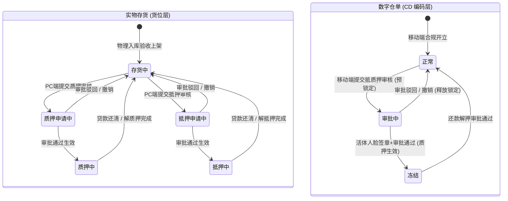

# 抵质押业务-抵质押业务办理主PRD

> **模块定位**：供应链金融核心资产抵质押办理、确权开立与风控准入中枢。作为连接资金方（商业银行、保理公司、资方）与货权方（核心企业、借款企业、个体商户）的业务发起中枢，支持针对仓储在库实物【存货】（PC 端与移动端均支持）以及数字【仓单】（移动端专道）开具规范化质押单与抵押单。通过主体授信资质动态反显、权人恒定企业准入、货值安全线动态监控、PC两级树形/移动端三级选货与先入先出智能扣减、多仓单同保管人强一致性约束以及仓单提审法定活体人脸识别强核验，构筑“货权清晰、资产可溯、互斥隔离、司法存证”的金融级存货监管防线。  
> **版本**：V1.1 | **更新时间**：2026-09-11 | **责任人**：森云科技（Senyun Technology）  
> **编写依据**：[抵质押业务办理字段清单.md](./抵质押业务办理字段清单.md) 是本模块所有字段定义、枚举与页面展示的唯一定义来源；[抵质押业务办理业务规则规格.md](./抵质押业务办理业务规则规格.md) 是主体动态映射、安全线模型、存货/仓单互斥锁定与人脸司法存证的唯一业务基准；[抵质押业务办理_ASCII_办理与选货页.md](./抵质押业务办理_ASCII_办理与选货页.md) 是界面交互与布局的基准来源。  
> **关联模块**：只读继承 [02-仓储/05-仓单管理](../../02-仓储/05-仓单管理/仓单管理主PRD.md) 之仓单状态机与流转约束；继承 [08-配置管理/14-货品规格管理-货品管理](../../08-配置管理/14-货品规格管理-货品管理/货品管理字段清单.md) 之 SKU 基准单价口径；业务审批对接 [01-工作中心/01-审批中心](../../01-工作中心/01-审批中心/审批中心总索引.md)。

---

## 1. 业务背景与业务痛点

### 1.1 业务背景
在供应链金融动产质押与仓储监管业务中，借款企业通常以其在指定监管仓库中的大宗原材料（如铜、钢材、煤炭）、冻品或农产品作为质押物或抵押物，向商业银行或保理资金方申请流动资金贷款。  
传统模式下，抵质押业务办理依赖线下纸质合同、人工核实库存台账与现场巡视，存在严重的信息不对称与道德风险。为打通“货-仓-金”数据链，森云科技打造一站式数字【抵质押业务办理】平台：
- 在 PC 端为风控与业务人员提供高效的大宗在库【实物存货】两级级联圈选与授信放款参数录入（暂不支持仓单）；
- 在移动端 H5 提供【存货】与【仓单】双标的发起专道：存货支持三级选货与先入先出智能扣减，仓单支持多张电子仓单整单打包与移动端权威活体人脸识别强存证；
- 实现从意向发起、押品锁定、风控试算到审批归档的全生命周期强一致性管控，存货与仓单在工作中心统一流转审批。

### 1.2 核心业务痛点
1. **一货多押与质押状态脱节**：传统仓储系统中，货物在申请质押期间无系统级互斥锁定，极易发生“边质押边出库”、“多头重复质押”等恶性金融欺诈；
2. **流动质押货值监控缺失**：流动质押或浮动抵押业务中，缺乏动态货值安全线、警戒线与平仓线的预置，导致市场价格下跌或货物被调换时资金方担保物价值跌破敞口；
3. **主体信息录入繁琐易错**：货主信用代码、法人证件与联系方式手工录入容易发生笔误，缺乏 OCR 快速识别与企业档案实时反显机制；
4. **数字仓单质押拆分引发物权瑕疵**：传统系统常允许任意拆分仓单部分货物进行质押，破坏了数字仓单完整不可分的物权凭据效力；
5. **冒名质押与司法存证效力弱**：缺乏权威合规的现场法定代表人实名活体人脸识别，事后产生纠纷时借款人常主张“非本人真实意愿质押”，导致资方败诉。

---

## 2. 功能范围 (Scope)

| 包含功能 (In Scope) | 不包含功能 (Out of Scope) |
| :--- | :--- |
| - **双模式主体动态映射与反显**：支持 `企业` 与 `个人` 两种货主类型。未选择货主前不渲染反显列；企业类型支持模糊检索与营业执照 OCR，选中后自动反显统一社会信用代码与联系电话；个人类型自动反显货主标识（脱敏手机号）；<br/>- **权人主体恒定为企业**：质押权人/抵押权人类型在系统内恒定为【企业】（只读，不可切换为个人）；<br/>- **双单据类型与担保方式自适应**：支持开立 `质押单`（对应 `流动质押` / `静态质押`）与 `抵押单`（对应 `固定抵押` / `浮动抵押`），权人标签与表格表头自适应切换为“质押”或“抵押”；<br/>- **货值安全线双端风控引擎**：PC 与 H5 均支持在 `流动质押` 与 `浮动抵押` 模式下自适应唤出货值安全线开关与阈值录入（带单位元/万元切换），固定/静态模式下自动隐蔽；<br/>- **PC 端存货两级级联圈选**：点击【+ 添加货物】唤出弹窗，按仓库/货物多维过滤及三维排序，以父级（SKU）与子级（具体货位批次）两级树形展现，支持【全部】/【清空】与防超额强校验；<br/>- **H5 端存货三级选货与先入先出智能扣减**：Step 2 点击【+ 添加货物】进入一级【选择货物】卡片页，深入二级【货物明细】支持 **`[先入先出]`** 与 **`[自定义]`** 智能扣减，确认后带回四级手风琴明细展开（SKU → 仓库及现场照片 → 库房/分区 → 货位批次及条码）；底部提供【重新编辑货物】与【扫码功能（待定）】；<br/>- **仓单质押整单打包与保管人同一性**：支持多张数字仓单（CD 编号）复选质押；强校验**整单打包不可拆分**及**多仓单保管人强一致性**（黄底红字警示横幅拦截）；<br/>- **统一审批流与仓单移动端人脸强核验**：无论以存货还是仓单为标的，推入审批中心后审批流完全统一；唯一区别是以仓单为标的时，在移动端提交前强制唤起法定代表人**公安权威活体人脸识别**核验；<br/>- **底层货位与仓单互斥锁定**：提交审核后，物理存货即刻切为【质押申请中】/【抵押申请中】，仓单切为【审批中】，禁止出库、移库、加工与异动；终审通过后分别流转为【质押中】/【抵押中】及【冻结】。 | - **在 PC 端办理数字仓单**：PC 端当前仅支持在库实物【存货】圈选办理，暂不支持仓单办理；<br/>- **拆分单张仓单内部分货物质押**：仓单具有法定不可分证券化属性，严禁单选仓单内某一种或部分数量货物发起抵质押；<br/>- **跨不同保管人合并质押**：严禁将不同保管人（企业或个人）签发的仓单合并在同一笔抵质押单据中提交；<br/>- **存货标的强制调用人脸识别**：在库实物存货抵质押提审无需进行公安人脸识别，直接进入工作中心审批流；<br/>- **抵质押生效后直接手工改单**：终审生效后形成不可变金融质押凭证，严禁手工修改数量、金额或担保物，变更必须走解质押或质押置换流程；<br/>- **本模块直接出具银行批复**：本模块为质押信息录入与申请确权端，信贷审批与放款结果由金融核心系统回写。 |

---

## 3. 模块定位与系统链路

```mermaid
flowchart TD
    subgraph S1[业务准入与模式选择]
        A1[进入抵质押业务办理<br/>PC端: 表单下拉 / H5端: ActionSheet二选一] --> B1[选择货主类型: 企业 / 个人]
        B1 -->|未选货主前| C0[界面不占位渲染反显列]
        B1 -->|选中企业| C1[输入公司全称 搜索/OCR<br/>自动反显统一社会信用代码与联系电话]
        B1 -->|选中个人| C2[输入姓名 搜索<br/>自动反显货主标识手机号]
        C1 & C2 --> D1[开立单据类型: 质押单 / 抵押单]
        D1 -->|质押单| E1[质押方式: 流动质押 / 静态质押]
        D1 -->|抵押单| E2[抵押方式: 浮动抵押 / 固定抵押]
        E1 & E2 --> F1{是否为流动 / 浮动模式?}
        F1 -->|是 PC/H5一致| G1[展示货值安全线开关与阈值输入]
        F1 -->|否 PC/H5一致| G2[隐藏货值安全线 仅按批次静态锁定]
    end

    subgraph S2[标的物圈选与风控试算]
        H1{标的物类型选择}
        H1 -->|实物存货 PC 端主道| I1[点击: + 添加货物]
        I1 --> I2[选择货物弹窗: 仓库/货物多选 + 三维排序]
        I2 --> I3[父子两级级联勾选: 快捷全部/清空<br/>抵质押数量 <= 可用数量]
        I3 --> I4[带入主明细表: 获取 SKU 基准价<br/>自动计算总价与底部三项汇总]
        
        H1 -->|实物存货 H5 端| J0[货物类型选择: 存货]
        J0 --> J1[点击: + 添加货物<br/>进入一级选择货物卡片页]
        J1 --> J2[展开仓库点击: 去选取<br/>进入二级货物明细批次分配]
        J2 --> J3[选择扣减方式: 先入先出 / 自定义<br/>录入抵押数量并点击添加货物]
        J3 --> J4[返回一级卡片反显黄色已选徽标<br/>点击确认选货带回Step 2四级手风琴展开]
        
        H1 -->|数字仓单 H5 端专道| K0[货物类型选择: 仓单]
        K0 --> K1[展示有效电子仓单 CD 卡片列表<br/>黄底红字强提示保管人一致性]
        K1 --> K2[复选勾选有效仓单 CD 编号<br/>整单全量货物打包锁定]
        K2 --> K3{强校验: 多仓单保管人是否一致?}
        K3 -->|不一致| K4[弹窗强拦截: 保管人冲突禁止提交]
        K3 -->|一致| K5[允许进入提交环节]
    end

    subgraph S3[提审锁定与工作中心流转]
        I4 & J4 & K5 --> L1{标的物类型与端侧判断}
        L1 -->|实物存货 PC/H5| M1[物理货位锁定: 质押/抵押申请中<br/>禁止出库/移库/异动/加工]
        M1 --> N1[生成 19 位业务单据号<br/>直接推入 工作中心-审批中心]
        
        L1 -->|数字仓单 H5| M2[仓单状态锁定: 审批中<br/>强制唤起移动端 法定人脸活体检测]
        M2 -->|人脸比对通过| N2[生成 19 位业务单据号<br/>推入 工作中心-审批中心 (与存货流转一致)]
    end

    subgraph S4[审批终审与底账确权]
        N1 & N2 --> O1{工作中心审批流终审 (存货与仓单节点统一)}
        O1 -->|审批驳回 / 用户撤回| P1[状态自动回退: 存货恢复 存货中 / 仓单恢复 正常]
        O1 -->|审批通过| Q1[确权生效: 存货置为 质押中/抵押中<br/>仓单置为 冻结<br/>生成生效抵质押台账并纳入动态风控池]
    end
```

---

## 4. 业务场景与用户故事

| 场景编号 | 业务场景 | 触发角色 | 核心交互与风控约束 | 业务价值 |
| :--- | :--- | :--- | :--- | :--- |
| **S01** | 大宗钢贸企业办理流动质押贷款 | 客户经理 / 业务经办人 | 客户经理在 PC 端为“亮点信息科技有限公司”办理流动质押。选择【企业】，输入名称下拉选中，系统自动带出信用代码 `914414...` 与脱敏电话。单据类型选【质押单】，质押方式选【流动质押】，开启【货值安全线开关】并录入安全线 `10万元`。点击【+ 添加货物】勾选在库碳素钢 9264 吨，系统自动汇总品类数 1、总数量 9264 吨，点击【提交审核】。底层货位锁定为【质押申请中】。 | 标准化流动质押申报，设置动态货值防穿仓底线。 |
| **S02** | 农业商户以在库冻肉办理固定抵押 | 货权经办人 / 资方风控 | 某农副产品商户在 PC 端办理生鲜牛肉抵押。选择【个人】，输入货主“原惠李”，系统带出身份证号与手机号。单据类型选【抵押单】，抵押方式选【固定抵押】，界面自动隐藏安全线。点击【+ 添加货物】添加生鲜库 1 号冷库特定货位上的牛肉丸 461.7 公斤，系统带出 SKU 基准价并试算总价。提交后进入抵押审批专道，该货位禁止任何移库与出库。 | 精准锁定特定物理批次资产，满足固定资产抵押风控要求。 |
| **S03** | 移动端多张数字仓单合并质押 | 借款企业法人 / 监管员 | 借款企业在手机端操作抵押单填写，货物类型切换为【仓单】。系统展示该企业名下处于【正常】状态的仓单卡片。用户同时勾选仓单 `CD206126...` 与 `CD206135...`，两张仓单保管人均为“海霸王仓库”，系统校验通过；若用户误勾选了保管人为“生鲜仓库”的第三张仓单，系统即刻弹窗拦截并提示签章主体冲突。确认无误后两张仓单项下包含的 11 项明细全部打包质押。 | 落实物权整体性，从源头杜绝跨保管人印章法律瑕疵。 |
| **S04** | 仓单质押电子签章强验公安活体人脸 | 审批人 / 货主法定代表人 | 资方对一笔包含数字仓单的质押单进行审批时，流程要求必须由借款企业法定代表人进行意愿确权。系统推送移动端待办，法定代表人点击后调用手机前置摄像头进行权威公安底库活体检测（动作比对与静默活体），核验通过后加盖 CA 电子印章，系统记录人脸比对分数与时间戳固化至证据链，审批通过后仓单自动切换为【冻结】。 | 打造不可推翻的司法证据链，杜绝冒名质押与道德风险。 |
| **S05** | 在库普通存货不足引导快捷入库 | 仓库操作员 / 客户经理 | 操作员在 PC 端办理抵质押选货弹窗中，未找到客户最新运抵的一批电解铜。操作员点击右上角橙色文字链接【没有我想选的? 去发起入库】，系统新标签页打开【入库管理 → 入库记录 → 发起入库】。入库完成并验收上架后，返回抵质押办理页面点击刷新，即可直接勾选该批全新存货。 | 打通业务断点，提供流畅的跨业务场景闭环协同。 |

---

## 5. 状态机与动作能力矩阵

### 5.1 标的物状态机联动（存货 vs 仓单）



### 5.2 动作能力与物理动碰限制矩阵

| 动作名称 | 存货中 / 正常 | 质押/抵押申请中 (`审批中`) | 质押/抵押生效中 (`冻结`) |
| :--- | :---: | :---: | :---: |
| **在办理页面被圈选** | ✅ (允许添加) | ❌ (已在途中，强拦截) | ❌ (已在押，严禁重复质押) |
| **发起出库申报** | ✅ | ❌ (系统提示：货物处于抵质押流转中) | ❌ (资产已冻结，强阻断) |
| **发起移库申报** | ✅ | ❌ (禁止物理移库) | ❌ (禁止物理移库) |
| **发起货物异动申报** | ✅ (普通存货) | ❌ (风控红线拦截) | ❌ (风控红线拦截，引导至金融通道) |
| **发起加工申报** | ✅ | ❌ (禁止原料动碰) | ❌ (禁止原料动碰) |
| **仓单出库/补货/移除/注销** | ✅ (移动端人脸) | ❌ (单流程互斥锁拦截) | ❌ (资产管控中，仅允许详情与下载) |
| **查看底账全息详情** | ✅ | ✅ | ✅ |

---

## 6. 核心业务规则概要 (R-PLG)

1. **R-PLG-01（主体类型与动态映射）**：
   - 货主类型为 `企业` 时，货主名称支持模糊搜索与营业执照 OCR，选中后自动回显统一社会信用代码与脱敏电话；
   - 货主类型为 `个人` 时，动态切换为姓名、身份证号与手机号，字段统一置为只读带出。
2. **R-PLG-02（单据类型与表头自适应）**：
   - 选择 `质押单` 时，担保方式显示为 `质押方式`（枚举：`流动质押` / `静态质押`），权人显示为 `质押权人*`，表格列显示为 `质押数量`；
   - 选择 `抵押单` 时，担保方式显示为 `抵押方式`（枚举：`固定抵押` / `浮动抵押`），权人显示为 `抵押权人*`，表格列显示为 `抵押数量`。
3. **R-PLG-03（货值安全线生效规则）**：
   - 仅在担保方式为 `流动质押` 或 `浮动抵押` 时展示【货值安全线开关】及阈值输入框（默认开启，必填 $>0$ 数值）；
   - 担保方式为 `静态质押` 或 `固定抵押` 时，界面自动隐藏安全线整行配置，以锁定实物批次为准。
4. **R-PLG-04（两级货品圈选与数量防超额）**：
   - 货品明细以两级（父级 SKU、子级货位）展开展示；
   - 选货弹窗支持在父级或子级录入数量，子级求和汇总至父级；
   - 严苛校验：任何子货位的抵质押数量必须满足 $0 < Q_{抵质押} \le Q_{可用}$，输入超额即刻红字报错。
5. **R-PLG-05（SKU 基准价与货值试算引擎）**：
   - 单价取自【货品规格管理】中维护的 SKU 基准参考单价（元）；
   - 若未维护单价，单价与总价显示 `--`，不阻断提审；
   - 若维护单价，则动态计算 $\text{总价} = Q_{抵质押} \times \text{单价}$，底部实时汇总品类数、总数量与总价值。
6. **R-PLG-06（仓单整单打包不可拆分）**：
   - 移动端选择仓单时，以整张仓单为最小单位，系统自动打包该仓单名下所有货物（支持一单一品或一单多品），严禁勾选单张仓单项下的部分货物。
7. **R-PLG-07（多仓单保管人同一性强校验）**：
   - 复选多张仓单提交时，系统强校验所有选中仓单的【保管人】必须为同一主体；若不一致，前端即刻拦截阻断，防止 CA 电子印章签署失败。
8. **R-PLG-08（仓单审批强绑定移动端活体人脸识别）**：
   - 仓单作为标的流转至审批签署时，必须由当事人法定代表人在移动端调用合规活体人脸识别检测，比对通过后方可完成签章终审。
9. **R-PLG-09（标的物互斥锁定机制）**：
   - 点击提交审核后，底层存货或仓单即刻锁定为审批占用态，全系统拦截出库、移库、加工与异动等动碰操作；终审通过后转为正式抵质押管控态。
10. **R-PLG-10（数值合规与防重复提交）**：
    - 贷款金额严禁大于授信金额；提交按钮采用防抖与防并发锁机制，防止网络重试造成重复生成订单。
11. **R-PLG-13（移动端存货三级选货与智能扣减）**：
    - 移动端选择存货时，支持一级 SKU 列表、二级仓库明细、支持 `先入先出 (FIFO)` 与 `自定义` 智能扣减，带回四级手风琴结构展开，未选货品提交置灰，支持重新编辑。

---

## 7. 双端协同与业务边界划分

```
┌─────────────────────────────────────────────────────────────────────────┐
│                           抵质押业务双端协同矩阵                          │
├────────────────────────────────────┬────────────────────────────────────┤
│           PC 端业务主道             │           移动端业务专道           │
├────────────────────────────────────┼────────────────────────────────────┤
│ • 办理大宗在库【实物存货】抵质押开立  │ • 办理【实物存货】与【数字仓单】双标的│
│ • 表单内下拉切换抵押单/质押单       │ • 业务发起 ActionSheet 弹窗二选一  │
│ • PC 选货弹窗两级级联树形勾选分配   │ • 存货支持三级卡片选货与先入先出FIFO│
│ • 权人类型恒定企业，货主未选不反显 │ • 仓单支持整单打包与多单同保管人校验│
│ • 浮动/流动抵质押动态唤出货值安全线│ • 仓单提审强制调用权威活体人脸识别  │
│ • 提交后存货直接推入工作中心审批流 │ • 存货无需人脸识别，直接推入审批流  │
│ • 快捷跳转普通入库发起             │ • 快捷跳转入库货物或开立仓单        │
└────────────────────────────────────┴────────────────────────────────────┘
```

---

## 8. 修订记录

| 日期 | 版本 | 变更说明 | 责任人 |
| :--- | :---: | :--- | :--- |
| 2026-09-10 | V1.0 | 正式建立 PC 端抵质押业务办理三件套主 PRD；确立企业/个人双模、单据类型自适应、货值安全线机制、两级选货规范及移动端仓单人脸双端协同边界 | 森云科技（Senyun Technology） |
| 2026-09-11 | V1.1 | 对齐 PC 与 H5 真实原型交互：收录移动端 `货物类型`（存货/仓单）；确立 PC 仅支持存货、H5 双轨支持；确立存货与仓单审批流完全统一（仅仓单需移动端人脸核验）；明确权人类型恒定企业、未选货主前不反显；收录 H5 存货三级选货与先入先出智能扣减及四级明细展开规范 | 森云科技（Senyun Technology） |
