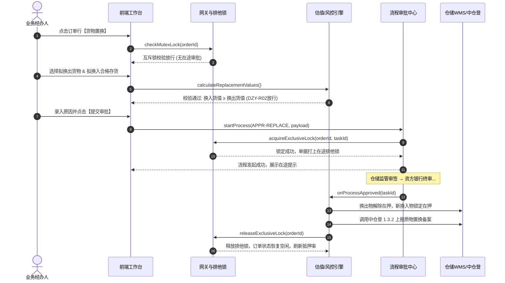
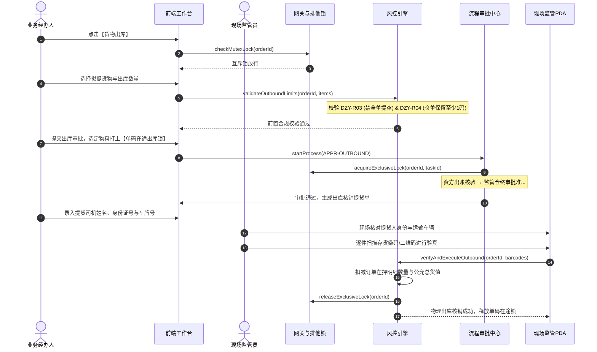
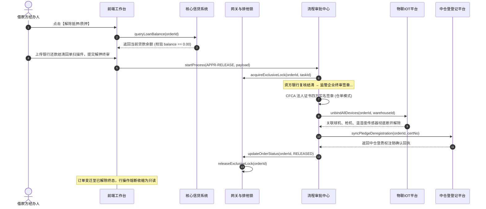
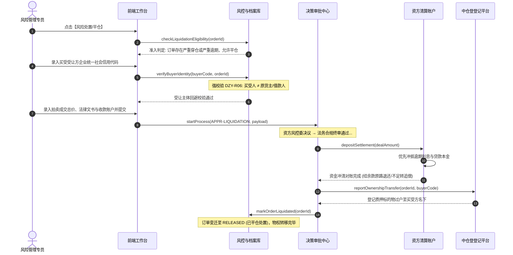
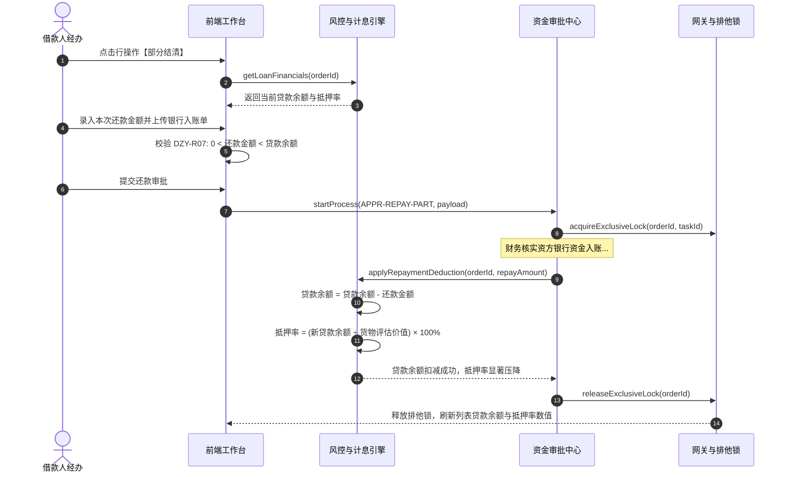

# 抵质押业务管理业务规则规格

> **文档定位**：**三件套核心**——抵质押业务管理状态机本体、单据互斥锁、流转表、R/C/P 规则规范与业务时序图的**唯一定义来源**。主 PRD、字段清单及衍生文档只引用本文件规则 ID，不重复定义规则本体。
>
> **单据层级**：订单主单、操作审批任务、资产与资金流水事件分层存储；单据级主状态不被临时操作覆盖。
>
> **上游依赖**：抵质押业务办理终审生单、仓储 WMS、货权与电子仓单、中仓登 1.3.2、资金台账、IoT 监控网关及风险服务。
>
> **下游影响**：订单列表与详情展示、行操作可用性、资产与资金台账变更、风险预警闭环、监管报告生成、外部登记及司法审计。
>
> **参考文档**：[抵质押业务管理主PRD](./抵质押业务管理主PRD.md)、[抵质押业务管理字段清单](./抵质押业务管理字段清单.md)、[操作业务全景导航](./操作业务/README.md)。
>
> **版本**：V2.2 | **更新时间**：2026-09-11
>
> **当前业务开关**：监管订单当前关闭。`REGULATORY`、监管服务状态及解除监管文案仅用于历史数据兼容和审计展示；当前不得创建、编辑、解除或发起任何监管订单业务写操作。历史监管订单按权限只读查询、审计和资料查看。

---

## 1. 状态机本体与状态定义

### 1.1 订单前台业务状态机定义 (Order Display Lifecycle State)

> **对齐真实生产采集**：当前可运营前台仅提供抵押和质押两类业务；列表与筛选区展示的业务状态仅有**两态**（随当前 Tab 动态绑定显示文案），在列表第 6 列与【业务方式】复合呈现（如 `抵押中-浮动抵押`、`解抵押-固定抵押`）。监管订单不进入当前状态机，仅保留历史兼容映射：

| 状态编码 | 前台展示名称 (抵押 / 质押) | 业务定义与准入条件 | 允许执行的业务动作 | 终态标识 |
| :--- | :--- | :--- | :--- | :---: |
| `ACTIVE` | **抵押中** / **质押中** | 业务办理终审通过生效，存续期正常履约监管态 | 允许发起置换、补仓、出库、移库、还款、安全线调整、盘点、日常监管、估值、解押等 | 否 |
| `RELEASED` | **解抵押** / **解质押** | 贷款结清解押终审通过，或依法处置平仓执行完毕过户 | **操作熔断**：全单履约终止，仅允许查看详情、操作记录及历史存证 | **是** |

历史 `REGULATORY` 订单不允许进入 `ACTIVE` 当前运营链路；如需审计展示，使用历史状态快照并禁止任何写操作。

### 1.2 单据排他并发控制与在途锁机制 (Concurrency & Mutex Lock)

审批在途与操作处理**不作为独立的前台业务状态**，而是通过系统后端的**单据排他互斥锁（Mutex Lock）**进行控制：
- **无在途锁 (`UNLOCKED`)**：前台业务状态为 `ACTIVE`，所有符合前置条件的行操作正常可用。
- **单据写锁锁定 (`OPERATION_LOCKED`)**：订单当前存在正在流转的置换、补仓、出库、移库、还款、解押或平仓等审批流任务。此时前台业务状态仍为 `ACTIVE`（第6列不变），但系统后端加设排他写锁，用户点击其他变动类行操作时直接阻断拦截并提示当前在途任务。

### 1.3 审批任务子状态机 (Task State)
单次行操作审批流独立维护任务生命周期：
- `DRAFT`（草稿暂存） $\rightarrow$ `SUBMITTED`（已提交） $\rightarrow$ `APPROVING`（多级审批中） $\rightarrow$ `APPROVED`（终审通过/落账） / `REJECTED`（已驳回） / `CANCELLED`（已撤回）。

---

## 2. 状态流转表与前置条件

| 源状态 | 触发事件 / 用户动作 | 前置条件与拦截校验 | 目标业务状态 | 在途排他锁与仓储/物联联动机制 |
| :--- | :--- | :--- | :--- | :--- |
| `ACTIVE` | 提交置换/补仓/出库/移库/还款申请 | 订单无在途锁（DZY-R01）且符合操作风控红线 | `ACTIVE` (状态不变) | **加设单据排他锁**；拟变动货物打上在途锁，仓储库存对应数量计入【冻结数量】 |
| `ACTIVE` (锁定中) | 存续期操作审批终审通过 (`APPROVED`) | 各级节点全部审批同意 | `ACTIVE` | **释放单据排他锁**；数据正式落账；扣减或更新仓储实物批次；重算货值与抵押率 |
| `ACTIVE` (锁定中) | 存续期操作审批被驳回 (`REJECTED`) | 任一审批节点驳回 | `ACTIVE` | **释放单据排他锁**；释放拟变动货物锁定，仓储冻结数量还原为【可用数量】，数据回滚 |
| `ACTIVE` (锁定中) | 发起人撤回存续期申请 (`CANCELLED`) | 仅限原发起人或 `R-ORDER-ADMIN` | `ACTIVE` | **释放单据排他锁**；操作置为已撤回，仓储冻结数量释放，还原在押资产 |
| `ACTIVE` | 提交解除抵/质押申请 | 订单无在途锁，贷款余额为 0 或附资方还本证明 | `ACTIVE` (状态不变) | **加设单据排他锁**，全单在押资产排他锁定，禁止其他变动 |
| `ACTIVE` (解押在途) | 解押终审通过 (`APPROVED`) | 资方风控终审通过，四方电子签章完成 | `RELEASED` | **释放单据排他锁**；仓储实物货品状态由“质押中/抵押中”还原为“存货中”，冻结数量清零并全部转为“可用数量”；中仓登质权注销；IoT设备解绑；行操作熔断 |
| `ACTIVE` | 提交平仓处置审批并终审执行完毕 | 订单击穿平仓线或借款实质违约，资方依法处置变现 | `RELEASED` | **释放单据排他锁**；资产权属法定过户买受人；处置款冲减借款；仓储所有人变更；中仓登过户；行操作熔断 |

---

## 3. 业务规则规格 (R / C / P 体系)

### 3.1 DZY-R 系列：业务风控规则 (Business Rules)

#### DZY-R01【单据排他互斥锁与防重复规则】
1. **单据写锁排他性**：当订单处于 `OPERATION_PENDING` 或 `RELEASE_PENDING` 时，系统严禁任何用户发起异类业务变更操作（如已有移库在途，禁止发起置换或出库），接口抛出 `ORDER_MUTEX_LOCKED_ERROR` 并弹出排他阻断提示框；
2. **同类任务防重与撤回**：若用户重复发起同类业务操作（如已有补仓在途再次点击补仓），系统弹出同类冲突对话框，展示当前审批节点，并仅允许原发起人或管理员点击【撤回申请】；
3. **资产在途锁**：被纳入在途申请的具体货物批次（二维码），加设资产在途锁，物理核销前禁止参与其他业务。

#### DZY-R02【货物置换新旧价值不倒挂规则】
1. **准入约束**：换入新质物必须为同一借款人在同一物理监管仓内的自由可用合格存货/仓单；
2. **价值倒挂强阻断**：系统实时比对：
   $$\sum \text{拟换入新货评估值} \ge \sum \text{拟换出老货评估值}$$
   若换入总值小于换出总值，前端提交按钮强制禁用并提示：`换入货物总价值不可低于换出货物总价值！`，后端接口执行一致性强校验拦截。

#### DZY-R03【货物出库严禁全额全提规则】
1. **部分提货底线**：【货物出库】仅支持部分提货，系统强校验出库后订单剩余有效在押数量必须 $> 0$；
2. **全提阻断引导**：若勾选全单全部货物，系统弹出阻断拦截弹窗：`货物出库仅支持部分提货！若需全额提货，请通过【解除抵/质押】办理结清手续！`，引导走解押主流程。

#### DZY-R04【电子仓单单张保留至少 1 个二维码底线规则】
1. **仓单防空心化**：若订单基于电子仓单开立，一张仓单项下包含多个物理二维码批次时，出库操作必须保留至少 1 个有效二维码资产包；
2. **仓单整提约束**：单张仓单内二维码不可全部出库提空，若需全额提取该仓单，必须办理该仓单的解押注销。

#### DZY-R05【货物移库严禁跨仓调拨规则】
1. **绝对禁止换仓红线**：货物移库仅限同一监管仓库内部换排、架、位。表单中“移入仓库”字段锁定只读等于“移出仓库”；
2. **提交自动抓拍**：经办人点击提交移库审批瞬间，系统自动向移出货位球机下发拍照指令，固化移库前不可篡改快照；
3. **终审自动换绑监控**：移库终审生效瞬间，系统自动解除旧货位设备绑定，并将目标货位的所有摄像头与传感器自动挂载至该订单。

#### DZY-R06【风险处置与平仓严禁原货主接收规则】
1. **禁止自收自处红线**：变现买受受让方的统一社会信用代码强校验 `buyer_credit_code !== borrower_credit_code`。命中同一主体强阻断，防范恶意逃废银行债务；
2. **二元查重建档**：通过统一信用代码（企业）或身份证号（个人）检索买受人档案，首次承接经风控审批后自动录入合格买受人库；
3. **清偿资金闭环**：变现资金优先支付处置税费，次序全额冲抵该订单当前的未还贷款本息，结余返还，不足追偿。

#### DZY-R07【结算管理部分结清金额严格开区间规则】
1. **金额范围校验**：录入的还本金额 $A_{\text{repay}}$ 必须严格满足：
   $$0 < A_{\text{repay}} < \text{当前贷款本金余额}$$
2. **全额还款拦截**：若 $A_{\text{repay}} \ge \text{贷款余额}$，系统强制拦截，禁止作为部分结清录入，引导走全面解押解控流程；
3. **动态重算质押率**：审核通过后自动从贷款余额中扣减本次本金，系统联动重新计算并压降订单实时抵押率。

#### DZY-R08【货物盘点账实差异与盘亏触发押品预警联动规则】
1. **仓库数据权限校验**：操作人账号未被授予该订单所在监管仓权限时，点击盘点 Toast 报错拦截；
2. **账实亏损高危联动**：现场实盘数量小于账面数量（$\Delta Q < 0$）时，系统强制标记【🔴 盘亏】，并在提交后自动向 [02/02 押品预警信息](../../02-预警信息/02押品预警信息/押品预警信息主PRD.md) 写入一条 `INVENTORY_LOSS` 严重告警流水，订单列表点亮红标。

#### DZY-R09【未定价商品公允价值缺失 ⚠️ 风险警示规则】
1. **未定价识别**：若在押商品规格在第三方现货行情库中未匹配到当日有效指导价，单价展示 `未定价 ⚠️`；
2. **看板联动警示**：顶部【在押货值总额】卡片旁展示警告图标 `⚠️`，Hover 提示：`存在部分货品尚未完成定价评估，统计总额不包含未定价货品`。

#### DZY-R10【安全线管理与动态抵押率计算规则】
1. **核心抵押率公式**：
   $$\text{抵押率} = \frac{\text{当前贷款本金余额}}{\text{货物公允评估总价值}} \times 100\%$$
   未录入贷款结果或货值为 0 时，展示 `--`；
2. **基准安全货值模型**：
   $$\text{基准安全货值} = \frac{\text{当前贷款余额}}{\text{合同最高抵押率}}$$
   总货值跌破安全线联动触发补仓预警；安全线调整须经资方审批后生效。

#### DZY-R11【加工管理深加工货值保全规则】
1. **原料在途监管**：原料领用出库加工打上【加工在途锁】，限制最长加工周转天数（默认 $\le 15$ 天）；
2. **货值保全不倒挂**：产成品二次入库时，新入库成品总评估值必须 $\ge$ 领用原材料原抵押值。超期或倒挂自动触发预警。

#### DZY-R12【日常监管三大防伪铁律规则】
1. **GPS 电子围栏打卡**：现场监管员移动端定位坐标与仓库中心点直线距离超过 200 米，强阻断打卡；
2. **强制调用原生相机**：拍照组件设置 `capture="camera"`，底层禁用本地相册上传历史图片；
3. **时空防伪水印**：照片合成包含拍摄时间戳、经纬度、仓库名、监管员账号的不可擦除像素级水印。

#### DZY-R13【终态订单操作行收缩熔断与设备彻底解绑规则】
1. **操作熔断**：订单进入 `RELEASED` 或 `DISPOSED` 后，业务办理类操作一律熔断隐藏，仅保留只读类操作；
2. **设备彻底解绑**：终审通过瞬间，系统自动通知 IoT 网关彻底解除对该订单库位摄像头的独占订阅，释放门禁密码授权。

---

### 3.2 DZY-C 系列：系统约束与并发控制 (Constraints)
- **DZY-C01【乐观锁并发版本控制】**：订单主表与资产明细表维护 `version` 整数版本号，任何变更提交时必须携带当前版本号，版本不一致直接拒绝；
- **DZY-C02【幂等性提交防护】**：所有操作表单提交携带前端生成的全局唯一 `idempotency_key`，服务端防重缓存 60 秒，防止重复扣减或重复生单；
- **DZY-C03【不可变存证快照】**：每次操作终审通过后，系统对当时所有数据镜像生成快照并生成 SHA-256 哈希固化，后续主数据更名或删除不回写历史存证。

---

### 3.3 DZY-P 系列：权限、自审禁止与审计 (Permissions & Audit)
- **DZY-P01【严格自审禁止红线】**：审批人在审批中心审核置换、补仓、出库、移库等申请时，若系统检测到 `approver_id === applicant_id`，强制隐藏“通过/驳回”按钮，严格阻断本人审批本人；
- **DZY-P02【实体仓库数据权限隔离】**：现场监管员与仓管员的所有现场操作（盘点、移库、日常监管打卡、监控抓拍），系统强制校验其账号已绑定的实体监管仓库清单，无权仓库禁止越权操作；
- **DZY-P03【全路径审计留痕】**：所有写操作、审批动作、敏感字段明文查看、报告导出必须记录操作人 ID、机构、IP、时间戳、前后数据快照版本并永久归档。

---

## 4. 核心业务时序图 (Mermaid Sequence)

## 4. 核心业务时序图 (Mermaid Sequence)

### 4.1 货物置换业务流转时序图 (DZY-R01 / R02)

---

### 4.2 货物出库（部分提货）业务流转时序图 (DZY-R03 / R04)

---

### 4.3 解除抵押 / 解除质押业务流转时序图 (DZY-R13 终态熔断)

---

### 4.4 风险处置与平仓履约时序图 (DZY-R06 / R07)

---

### 4.5 部分结清与动态抵押率压降时序图 (DZY-R07)

---

## 5. 附录与枚举字典

### 5.1 业务单据类型枚举 (`BusinessTypeEnum`)
- `MORTGAGE`: 抵押订单（展示于【抵押订单】Tab，操作文案绑定为【解除抵押】）；
- `PLEDGE`: 质押订单（展示于【质押订单】Tab，操作文案绑定为【解除质押】）；
- `REGULATORY`: 监管订单（**历史兼容枚举**，当前不展示 Tab、不允许新建或写操作；历史记录仅只读）。

### 5.2 担保与业务方式枚举 (`BusinessMethodEnum`)
- 抵押订单：`FIXED_MORTGAGE`（固定抵押）、`FLOATING_MORTGAGE`（浮动抵押）；
- 质押订单：`STATIC_PLEDGE`（静态质押）、`DYNAMIC_PLEDGE`（流动质押）；
- 监管订单历史值：`FIXED_SERVICE`（固定监管服务）、`FLOATING_SERVICE`（浮动监管服务）；仅用于历史快照展示，不作为当前可选业务方式。

### 5.3 风险预警状态枚举 (`RiskStatusEnum`)
- `NO_RISK`: 无风险（所有告警已结案，订单正常展示）；
- `HAS_RISK`: 存在风险（订单至少有 1 条未结案风险流水，订单号旁点亮 🔴 红标）。

---

## 修订记录

| 日期 | 版本 | 变更内容 | 影响范围 |
| :--- | :---: | :--- | :--- |
| 2026-09-10 | V1.0 | 初始创建抵质押业务管理规则规格初稿 | 状态定义与基本规则 |
| 2026-09-11 | V1.1 | 增补互斥锁逻辑与审批数据变更矩阵 | 并发控制初稿 |
| 2026-09-11 | **V2.0** | **全面重构对齐 6.2 基准版标杆规范**：建立严谨的 5 态订单主状态机；规范化定义 DZY-R01~R13 业务规则、DZY-C01~C03 并发约束、DZY-P01~P03 权限与自审禁止规范；补齐置换端到端时序图与枚举字典 | 规则规格全文、状态机本体、流转表与 R/C/P 体系 |
| 2026-09-11 | **V2.1** | **关闭监管订单当前运营链路**：监管订单降为历史只读兼容枚举，禁止当前新建、编辑、解除和其他业务写操作 | 当前准入、状态机、枚举与审计约束 |
| 2026-09-11 | **V2.2** | **补齐全量子业务 Mermaid 时序图矩阵**：新增货物出库（部分提货）、解除抵质押（终态熔断/中仓登注销）、风险处置平仓（买受人回避）、部分结清（动态压降抵押率）端到端交互时序 | 核心业务时序图章节 (4.1~4.5) |
