# 抵质押业务管理主PRD

> **版本**：V2.2 | 2026-09-11  
> **读者**：研发工程师、测试工程师、金融风控产品经理、现场监管员、银行资方评审  
> **所属模块**：03-融资监管 / 07-抵质押业务-抵质押业务管理 | **菜单路径**：`融资监管 → 抵质押业务 → 抵质押业务管理`  
> **模板选型**：台账流水与业务流转类（[5-2-2 (输出)台账流水类PRD模板](../../../../05-常用模板/需求处理/5-2-2%20(输出)台账流水类PRD模板.md)）
>
> **文档体系（三件套为核心）**：
>
> | 层级 | 文档 | 职责 |
> | :--- | :--- | :--- |
> | **核心** | 本文（主 PRD） | 业务背景、功能范围、系统架构、**页面功能说明（PC/H5）**、状态机摘要、规则摘要、权限矩阵、验收标准 |
> | **核心** | [抵质押业务管理字段清单](./抵质押业务管理字段清单.md) | 列表、看板、筛选区、全景详情、系统审计快照字段的**唯一定义来源**（标准 11 列矩阵） |
> | **核心** | [抵质押业务管理业务规则规格](./抵质押业务管理业务规则规格.md) | 状态机本体、单据互斥锁、流转表、R/C/P 规则规范与业务时序图的**唯一定义来源** |
> | **子核心** | [操作字段清单索引](./操作字段清单/操作字段清单索引.md) | 存续期 24 项具体行操作弹窗/表单输入、返回与特有审计字段清单（标准 5 列矩阵） |
> | *衍生* | 采集资料与规约全集 | 归档于 [采集的资料/](./采集的资料/README.md)，包含 18 个操作规约与 50+ 原始业务截图映射 |
>
> **规则来源**：状态机、校验、联动与权限详见《[抵质押业务管理业务规则规格](./抵质押业务管理业务规则规格.md)》——**规则 ID 以该文件为唯一定义来源，本文仅摘要引用**  
> **字段基准**：《[抵质押业务管理字段清单](./抵质押业务管理字段清单.md)》为字段唯一定义来源  
> **权限基准**：[00-全局契约与RBAC权限矩阵](../../../../02-PRD文档/B-迭代需求/6.2版本（2026.08）/00-全局契约与RBAC权限矩阵.md)

> **当前业务开关**：监管订单当前关闭。当前不展示监管订单 Tab、卡片或菜单入口，不允许新建监管订单及发起监管订单业务写操作；历史监管订单仅允许按权限只读查询、审计和资料查看。`REGULATORY` 及监管服务相关枚举仅作为历史数据兼容值保留。

---

## 1. 业务背景与监管目的

### 1.1 台账定位
**抵质押业务管理**是森云科技存货监管系统面向商业银行、保理公司、核心借款企业及仓储监管方打造的**在押资产全生命周期履约监管与处置中枢**。

本模块承接上游 [06-抵质押业务办理](../06-抵质押业务-抵质押业务办理/抵质押业务办理主PRD.md) 终审生单后的存续期资产管理，实时监控抵押、质押项下实物存货与标准电子仓单的物理状态、货权状态、估值波动、信贷敞口与物联监控，贯穿从“放款生效 $\rightarrow$ 动态置换/加补仓 $\rightarrow$ 监管巡检 $\rightarrow$ 风险预警处置 $\rightarrow$ 到期解押或司法平仓”的全流程。监管订单不属于当前可运营业务范围。

### 1.2 监管痛点与业务目标
- **杜绝一货多办与数据倒挂（互斥锁机制）**：引入单据级排他互斥锁与资产在途锁，禁止在同一订单上并发发起多项资产变更，避免账实脱节与货值计算错乱；
- **货权与现场实物穿透闭环**：通过 IoT 智能设备（球机、温湿度、门禁挂锁）实时锁定物理货位，货物发生移库、出库、解押时，系统自动联动摄像头抓拍存证并自动换绑/解绑监控；
- **行情波动与动态抵押率敏捷风控**：接入上海有色网 (SMM)、生意社等权威行情源，对未定价货品给予 `未定价 ⚠️` 强警示；通过贷款余额动态冲减与公允货值实时联动，动态压降并呈现真实抵押率；
- **司法合规与全国中仓登联动**：支持电子合同全量线上签署与 CA 存证，仓单发生置换、补仓、出库、移库、解押时，实时调用中仓登 1.3.2 接口完成全国性动产质押登记同步。

---

## 2. 功能范围

**In Scope（本期功能范围）**：
- **顶层架构**：PC 端当前仅提供【抵押订单】、【质押订单】两个业务单据 Tab；
- **监管订单关闭约束**：不展示监管订单入口、不允许新建或发起监管订单写操作；历史监管订单仅保留按权限只读查询、审计和资料查看，相关兼容枚举不得作为当前运营类型使用；
- **统计看板**：全部单据数、在押单据数、在押货值总额（未定价 ⚠️ 强警示）、存在风险订单数；
- **组合筛选与列表**：单号、货主、状态、担保方式、风险标识、所属仓库、生效时间组合检索，支持表格列自定义与导出；
- **全景详情**：基础信息、资产明细（存货/仓单两 Tab 切换）、IoT 设备矩阵、风险预警流水、流程时间轴、二维码资产追溯抽屉；
- **存续期核心操作（14 大类）**：
  1. **货物置换**（新旧货值比对，新 $\ge$ 老倒挂阻断，四方电子签章）；
  2. **加/补仓**（同仓合格存货/仓单并入，缺货空态保护）；
  3. **货物出库**（原提货；严禁全单全提、单仓单保留至少 1 个二维码底线、单码在途锁）；
  4. **货物移库**（绝对禁止跨仓移库、移库前自动抓拍存证、终审自动换绑 IoT 监控）；
  5. **解除抵/质押**（动态文案映射、全额还本核验、全单打包签章、中仓登注销与设备彻底解绑）；
  6. **风险处置与平仓**（严禁原货主接收买受红线、二元查重建档、所得款冲减借款余额与差额追偿）；
  7. **结算管理与部分结清**（还款金额开区间 $0 < A < \text{余额}$，还款后扣减余额重算降低抵押率）；
  8. **安全线管理**（基准安全线公式、调整审批与跌价告警）；
  9. **贷款结果录入**（放款信息确权录入、激活列表抵押率计算引擎）；
  10. **行业参考价与货物估值**（行情源路由、未定价 ⚠️ 告警、估值单价/整批总价倒算双模式）；
  11. **货物盘点与盘点报告**（仓库权限强校验、逐条/扫码/批量盘点、盘亏触发押品预警）；
  12. **设备管理与查看监控**（多品类硬件矩阵、专属预警开关、实时视频流播放、云台 PTZ 控制盘与现场抓拍）；
  13. **查看风险与风险公示**（未处理/已处理双 Tab、订单红标清零闭环、仅已处理可公示、取消公示合规留痕）；
  14. **加工管理**（深加工场景原料领料审批、加工在途监控、新入库产成品货值保全不倒挂）。

**Out of Scope（不在本期范围）**：
- 办理开单选货业务逻辑（由上游 [06-抵质押业务办理](../06-抵质押业务-抵质押业务办理/抵质押业务办理主PRD.md) 承接）；
- 底层多级审批流节点与模板配置（由工作中心流程引擎平台维护）；
- 商业银行核心信贷出账与直接银企直联扣款。

---

## 3. 总体架构与业务流转

### 3.1 总体业务流转全景图

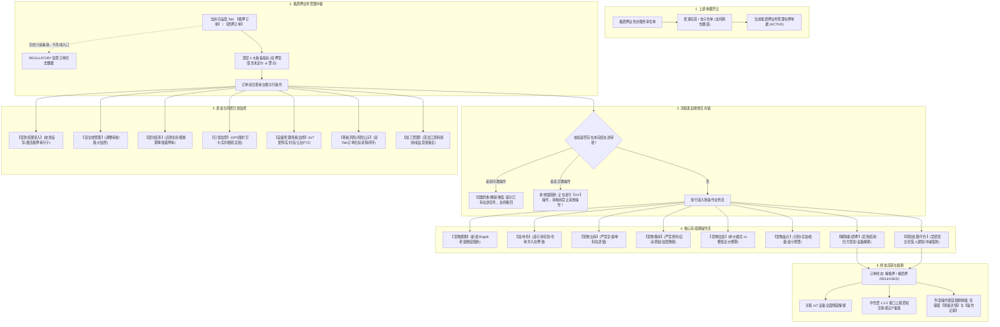

### 3.2 核心并发控制：单据级排他互斥锁
1. **同类任务防重与撤回**：若订单已有待审批的加/补仓申请，经办人再次点击【加/补仓】时，弹出提示并提供【查看详情】与【撤回申请】（仅原发起人或超级管理员可撤回）；
2. **异类任务排他强阻断**：若订单已有【移库】审批在途，经办人点击【货物出库】或【货物置换】等异类操作时，系统直接阻断弹出警告，提示必须等待当前在途审批完结或撤回；
3. **已结案终态熔断**：订单流转至终态（`解抵押` / `解质押`，含平仓结案）后，所有业务办理类按钮全部熔断隐藏，仅保留只读类功能（查看详情、操作记录）。

---

## 4. 页面功能说明 (PC端 & H5端)

### 4.1 PC 端列表与看板页规格
* **路径**：`融资监管 → 抵质押业务 → 抵质押业务管理`
* **顶层业务大类 Tab 与右上角操作**：
  - 【抵押订单】：默认激活高亮（橙黄色背景），展示该大类下固定抵押与浮动抵押单据；
  - 【质押订单】：展示静态质押与流动质押单据；
  - 【监管订单】：当前关闭，不形成 Tab、卡片或菜单入口；历史监管订单仅通过授权历史查询链路只读查看；
  - 右上角全局按钮：`[ 导出为Excel ]`（橙黄色操作按钮，导出当前筛选条件下的全量订单明细）。
* **四大统计看板卡片 (随 Tab 切换实时联动刷新)**：
  1. `全部单据`：当前选中业务 Tab 下受权限过滤的单据总笔数（如当前抵押订单下为 270，切换后实时联动更新）；
  2. `进行中单据数`：统计当前处于履约监管进行中的有效单据笔数（如当前抵押订单下为 141）。**文案动态映射**：在界面展示上随选中 Tab 自适应呈现（【抵押订单】Tab 下显示为“抵押中”，【质押订单】Tab 下显示为“质押中”）；历史监管订单不参与当前看板统计；
  3. `货物评估价值总额(万)`：当前选中业务 Tab 下所有有效订单的货物评估价值累计总和（单位：万元），数值右侧附黄色信息提示图标 `ℹ️`，Hover 提示价值核算与未定价说明；
  4. `存在风险`：当前选中业务 Tab 下存在未结案待处置风险预警的单据笔数（如当前抵押订单下为 10），点击卡片快捷联动下方筛选条件【风险预警 = 有风险】并执行查询。
* **组合查询筛选区 (两行)**：
  - 第一行：`抵押单号/质押单号`（输入框）、`货主名称/标识`（输入框）、`抵押状态/质押状态`（全部/抵押中/解抵押 下拉）、`抵押方式/质押方式`（全部/固定/浮动 下拉）、`风险预警`（全部/有风险/无风险 下拉）；
  - 第二行：`货品名称`（下拉框）、`流程相关机构`（输入框）、`抵押时间/质押时间`（开始日期 至 结束日期）、`[ 查询 ]`（橙黄色按钮）。
* **PC 表格 14 列展示规范**：
  1. `序号`：分页递增正整数；
  2. `抵押单号 / 质押单号`：纯文本业务主键，支持点击跳转详情；
  3. `货主名称/标识`：双行展示（企业全称/个人姓名 + 统一代码/脱敏手机号带眼睛图标 `👁️`）；
  4. `抵押物 / 质押物`：标准化三段式货品品名规格及在押数量，超出前 2 项展示【更多..】蓝色链接；
  5. `抵押时间 / 质押时间`：生单确权时间戳，列表默认按此时间倒序排列；
  6. `抵押状态 / 质押状态`：复合标签呈现，格式为 `业务状态 - 业务方式`（如 `抵押中-浮动抵押`、`解抵押-固定抵押`）；
  7. `贷款信息`：三行结构化排布（贷款金额:XX万元 \n 贷款期数:XX \n 贷款余额:XX万元），未放款展示 `--`；
  8. `货值安全线`：金额数值（万元），未设置展示 `--`；
  9. `行业参考价`：第三方基准市值，附橙色链接【行业参考价>】，未定价展示 `--`，异常附 `⚠️`；
  10. `货物评估价值`：最新公允评估总值，附橙色链接【货物评估价值>】，异常附 `⚠️`；
  11. `抵押率 ? / 质押率 ?`：动态计算百分比，表头带 `?` 提示公式 Tooltip，未放款展示 `--`；
  12. `关联总流程`：单据绑定的主流程模板名称；
  13. `流程相关机构`：参与单据流转的资方、仓储、评估方机构全称逗号拼接；
  14. `操作`：固定列，常驻外露 6 项（查看详情、操作记录、资料管理、部分结清、日常监管、监管报告）+ 第 3 行折叠【更多操作 ▾】。

### 4.2 PC 端【查看详情】全景页规格
点击【查看详情】进入，严格划分为五大区块：
1. **顶部 Header 与状态徽标**：
   - 标题：`抵押订单号: {单据编号}` + 复制图标 `📋`（点击一键复制）；
   - 右上角：`[ 返回 ]` 按钮（保留列表原有查询条件与分页）；
   - 右侧大圆印章徽标：**进行中**为绿色实心圆章（居中两行“抵押中 \n 浮动抵押”），**已解除**为深灰色实心圆章（居中两行“解抵押 \n 固定抵押”）。
2. **第一网格：基本信息 (5 行灰框网格)**：
   - 第1行：`发起人: {姓名(所属企业)}` | `抵押时间: YYYY-MM-DD HH:mm:ss`；
   - 第2行：`货主类型: 个人/企业` | `货主名称: {名称}` | `货主标识: {脱敏手机号/信用代码}`；
   - 第3行：`抵押方式: 浮动抵押/固定抵押` | `合同编号: {编号/--}`；
   - 第4行：`抵押权人类型: 个人/企业` | `抵押权人名称: {名称}` | `抵押权人证件号: {脱敏证件号}`；
   - 第5行：`备注: {内容/--}`。
3. **第二网格：授信与贷款信息 (2 行灰框网格)**：
   - 第1行：`授信金额: XX万元` | `授信期数: XX期` | `抵押率: XX.XX%` 附橙色链接【变动记录】（点击查看历次重算流水）；
   - 第2行：`贷款金额: XX万元` | `贷款期数: XX期` | `贷款余额: XX万元`。
4. **第三区：四大核心风控数值卡片 (一行 4 个独立白底卡片)**：
   - 卡片1：`货值安全线/控货线`（完整原文字段名，金额万元）；
   - 卡片2：`行业参考价` + 蓝色链接【查看历史】（点击弹窗查看大宗价格走势）；
   - 卡片3：`货物评估价值` + 蓝色链接【查看历史】（点击弹窗查看历次估值调整历史）；
   - 卡片4：`抵押率` + 蓝色链接【查看历史】+ 黄色问号 `?`。
5. **第四区：抵押物明细 (黄色高亮Tab · 双层折叠表格)**：
   - **普通存货模式（图2、图4）**：
     - 父表：序号（展开折叠箭头）、货物名称（三段式）、数量、总价；
     - 展开子表：序号、位置（仓库-库房-分区）、具体位置（货位/垛位）、入库时间、其他信息（保质期/车辆/生产日期）、存货条码（二维码图标 📱）、数量、单价、总价。
   - **仓单质押模式（图3、图5）**：
     - 父表：序号（展开箭头）、仓单编号（`CD...`）、存货人(货主)（双行企业+代码）、开立时间、仓库名称、开立数量；
     - 展开子表：序号、货物名称、其他信息、入库时间、位置、具体位置、存货条码（二维码图标 📱）、数量、单价、总价。

### 4.3 核心行操作业务办理说明 (含端到端 Mermaid 流程图与规则闭环)

#### 4.3.1 货物置换业务流程与规则 (Replacement Flow)

货物置换指在质押存续期内，借款人以同等或更高价值的合格新质物换出部分在押货物的履约操作。

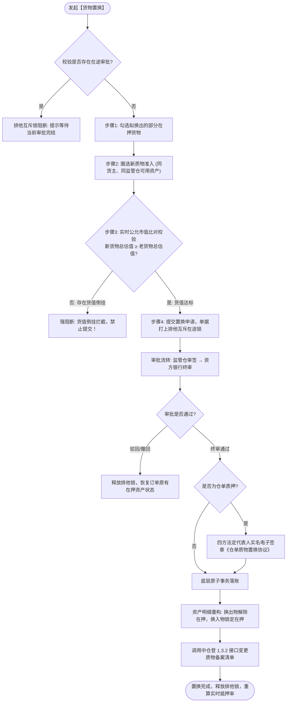

* **风控与前置规则**：
  1. **排他互斥锁 (DZY-R01)**：单据存在任何在途任务时禁止发起；
  2. **货值不倒挂红线 (DZY-R02)**：系统实时比对：$\sum (\text{换入物数量} \times \text{公允估值}) \ge \sum (\text{换出物数量} \times \text{在押估值})$，倒挂强校验拦截；
  3. **仓单四方签章**：仓单置换在审批通过后，触发资金方、监管方、仓储方、借款方四方法人实名签署，中仓登接口同步质物清单。

---

#### 4.3.2 加/补仓业务流程与规则 (Replenishment Flow)

当存货市值下跌或信贷敞口扩大时，借款人向在押资产池中追加存货或仓单，降低贷款抵押率。

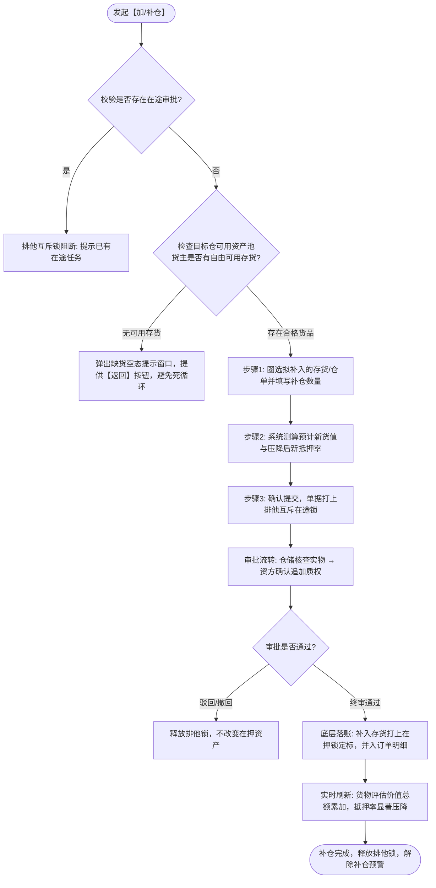

* **风控与前置规则**：
  1. **缺货友好保护**：若货主在当前承储仓无可用存货，系统弹出空态引导并支持返回，禁止出现空白页面；
  2. **动态压降抵押率**：补仓成功后，$\text{新抵押率} = \frac{\text{贷款余额}}{\text{老货值} + \text{补仓货值}} \times 100\%$，若此前已触发跌价/安全线预警且新货值回到安全线上方，自动消除风险红标。

---

#### 4.3.3 货物出库（原提货管理）业务流程与规则 (Outbound Flow)

货物出库指借款人在还清部分借款后，申请提取订单项下部分在押存货出库的履约流转。

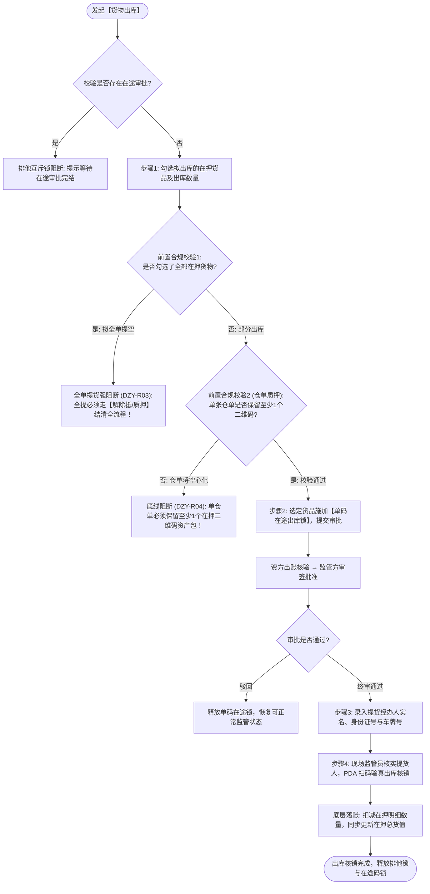

* **风控与前置规则**：
  1. **严禁全单提空 (DZY-R03)**：出库仅限部分出库，若经办人勾选全部在押存货，系统强行阻断并引导至解抵押模块；
  2. **仓单单码防空心化底线 (DZY-R04)**：对于电子仓单质押单据，出库后单张仓单在押资产不得为空，必须保留至少 1 个在押二维码物料包；
  3. **双重闭环核销**：线上审批通过仅代表出库许可，必须由现场监管员对提货人实名验核、车辆登记，并通过 PDA 物理扫码后方可落账核销。

---

#### 4.3.4 货物移库业务流程与规则 (Relocation Flow)

货物移库指存货在同一监管仓库内部进行货位、货架或垛位优化的物理位置变动。

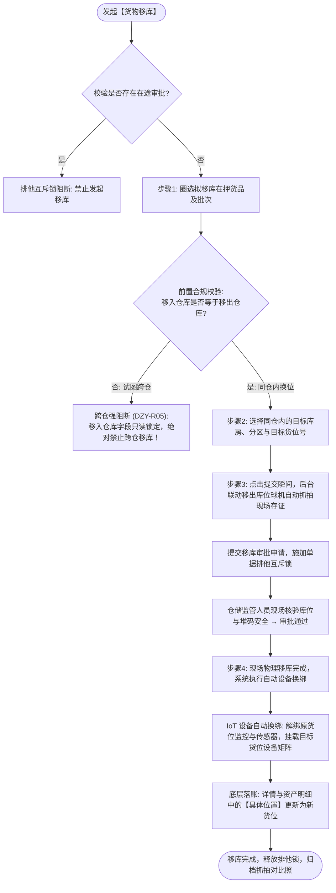

* **风控与前置规则**：
  1. **绝对禁止跨仓移库红线 (DZY-R05)**：移库界面中“移入仓库”直接锁定为原仓库只读，严禁任何跨物理仓库的移库操作（跨仓属于重新出入库，需办理新抵质押）；
  2. **移库前自动抓拍存证**：系统在经办人点击提交的同一毫秒，向物联平台下发抓拍指令，抓取移库前货物堆码视频快照，防范移库调包；
  3. **IoT 监控自动无缝换绑**：移库审批通过后，订单关联的视频设备矩阵自动更新为目标库位绑定的摄像头与温湿度传感器，保障物联监管不中断。

---

#### 4.3.5 解除抵押 / 解除质押业务流程与规则 (Release Flow)

解除抵押/质押是借款人履行还本付息义务后，质权人注销担保物权、释放在押监管存货的最终闭环操作。

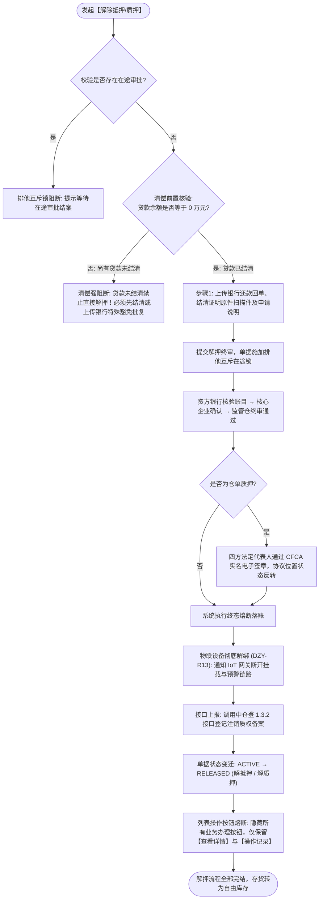

* **风控与前置规则**：
  1. **清偿前置强核验**：除资方特批资产置换免息豁免外，系统强校验 `贷款余额 == 0.00` 且无欠息，严禁带病解押；
  2. **四方法律电子签章**：针对仓单质押，各方法人证书全量签章，仓单状态反转为【解除质押】，并同步中仓登司法登记平台；
  3. **IoT 彻底解绑与功能熔断**：解押生效后彻底解除绑定设备，单据进入历史只读终态，行操作按钮全面收缩。

---

#### 4.3.6 风险处置与平仓业务流程与规则 (Liquidation Flow)

当借款人严重逾期违约、货值击穿平仓线且在宽限期内未履行补仓义务时，出资方依法对在押存货进行处置变现。

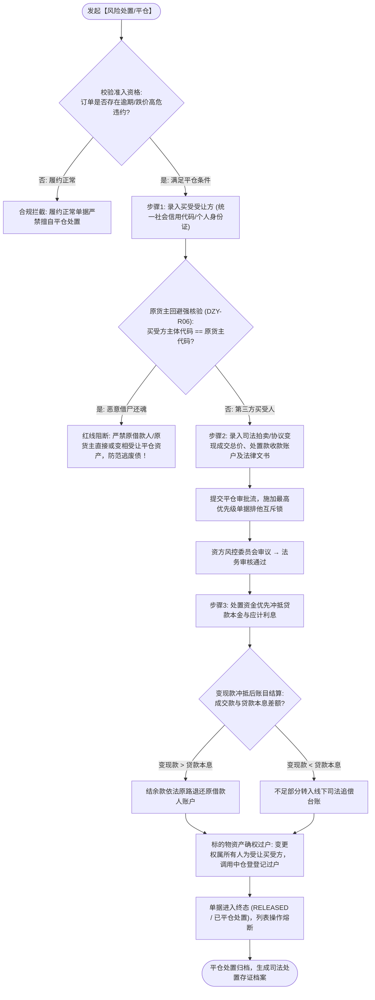

* **风控与前置规则**：
  1. **严禁原货主自处红线 (DZY-R06)**：通过统一信用代码与身份证号强校验，买受人绝不能等于原借款人或其实际控制人，彻底封死虚假平仓逃废债漏洞；
  2. **处置款偿还法定顺序**：变现资金必须严格按照“执行处置费用 $\rightarrow$ 贷款利息 $\rightarrow$ 贷款本金”的法定清偿顺序冲抵，严禁挪作他用。

---

#### 4.3.7 贷款结果录入与部分结清业务流程与规则 (Loan & Repayment Flow)

涵盖信贷出账确权反写与存续期偿还本金的资金业务协同流转。

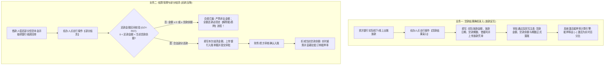

* **风控与前置规则**：
  1. **抵押率引擎激活准入**：未录入贷款结果前，列表与卡片抵押率统一展示为 `--`，贷款结果审批通过瞬间方可触发动态风控计算；
  2. **部分结清严格开区间 (DZY-R07)**：还款金额必须严格处于 $(0, \text{当前贷款余额})$，防止全额结清误走部分结清导致物权未注销漏洞。

---

#### 4.3.8 货值安全线管理与货物估值业务流程与规则 (Safety Line & Valuation Flow)

保障在押动产市值处于安全可控状态的动态监控与调整体系。

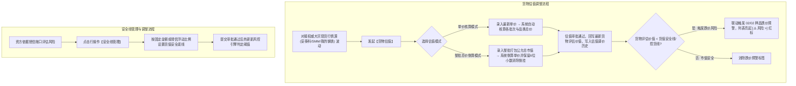

---

#### 4.3.9 货物盘点与日常监管业务流程与规则 (Audit & Supervision Flow)

监管员对现场动产实施物理在位核查与日常巡仓合规打卡。

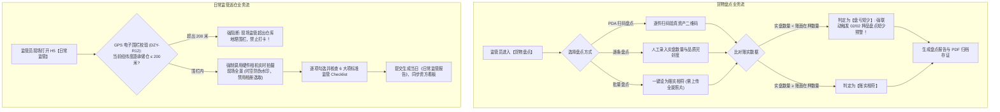

* **风控与前置规则**：
  1. **盘亏强联动预警**：实盘出现短少时，系统 100% 自动生成押品高危预警，必须由经办人核实补仓或报案核销方可解除；
  2. **GPS 电子围栏与防伪水印 (DZY-R12)**：日常监管强依赖手机底层 GPS 坐标，超出仓库电子围栏 200 米直接阻断提交；拍照必须附带时间、地理与水印防伪，彻底杜绝虚假巡仓。

### 4.4 H5 移动端页面功能说明 (完全对齐移动端真实截图)

#### 4.4.1 移动端列表卡片与 6 宫格面板
1. **卡片结构**：
   * **单号行**：`抵押编号 / 质押编号： {单据编号}`；
   * **货主主体行**：左侧黄色方标 `[抵]` 或 `[质]`；中间双行呈现企业名/个人名 + 统一代码/脱敏手机号；右上角浅黄底卡片大字展示 `XX.XX% 抵押率/质押率 >`（可点击穿透）；
   * **状态与风险行**：展示 `抵押中 · 固定抵押` 等；存在未处理风险时外露醒目的浅橙色药丸标签 **`[⚠️ 风险 >]`**（点击直接进入风险中心）；
   * **标的物行**：`货物名称 {规格数量摘要}`，右侧橙色文字链接 **`详细`** 呼出明细浮层；
   * **6 宫格资金与风控看板 (灰底单元格)**：
     - 上排：`贷款金额`、`贷款期数`、`贷款余额`；
     - 下排：`货物评估价值 >`、`行业参考价 > ℹ️`、`货值安全线/控货线`。
   * **卡片底部操作条**：
     - 橙色文字按钮：【查看详情】；
     - 橙色文字按钮：【操作记录】；
     - 橙黄色圆角胶囊按钮：【更多操作 ▾】。
2. **【更多操作 ▾】4 列网格全景抽屉**：
   点击呼出底部半屏抽屉，以 4 列 Grid 均分形式平铺展示所有已赋权的业务功能（图标 + 名称），包含：货物置换、抵/质押入库、货物补仓、货物出库、解抵/质押、货物估值、货物盘点、盘点报告、货物移库、设备管理、平仓、查看风险、查看监控、贷款结果录入、部分结清、监管报告、安全线管理、货物异动、日常监管、资料管理、风险公示、加工管理。

#### 4.4.2 移动端【订单详情页】交互规格
1. **常驻头部区**：
   * 顶部导航：`<` 返回 + 标题 `质押订单详情`（或抵押订单详情）；
   * 单号与复制：`质押编号 {单号} 📋`；右上角浅黄底大字质押率卡片；
   * 发起经办信息：`发起人:{姓名(机构)} YYYY-MM-DD HH:mm:ss`；
   * 货主信息白底小卡片：货主名称/标识、合同编号、备注信息。
2. **二级 Tab 切换**：【基础信息】与【货物明细】双 Tab。
3. **【基础信息】Tab**：
   * 垂直展示质押方式、质权人类型、质权人名称、质权人证件号、授信金额、授信期数、贷款金额、贷款期数、贷款余额、货值安全线；
   * 底部常驻双列浅灰卡片：左列展示 `货物评估价值 >`，右列展示 `行业参考价 >`。
4. **【货物明细】Tab**：
   * **普通存货模式**：顶部展示 `货品总数`（如 2 种）与 `总数量`（如 90.98）；下方按货物品类呈现卡片（品名、右侧橙色 `明细 ^/v` 折叠、质押数量）；展开后细分展示批次（入库时间、二维码图标 `📱`、橙底序号 `[1]`、数量、位置信息、入库收集信息折叠 `展开/收起`、单价与总价灰底条）；
   * **仓单质押模式**：外层按仓单卡片折叠展示（大字仓单号、右侧灰色徽标 `冻结`、开立时间、货主、仓储位置）；展开后展示该仓单项下包含的具体货品品名规格、数量、货位、二维码与单价总价。

---

## 5. 状态机与生命周期流转摘要

前台业务状态真实为两态（在押进行中 `ACTIVE` 与 解押终态 `RELEASED`）；当前可运营业务类型仅为抵押和质押，监管订单不进入当前状态机，仅保留历史兼容状态映射。存续期操作审批在途通过后端的【单据排他互斥锁】控制：

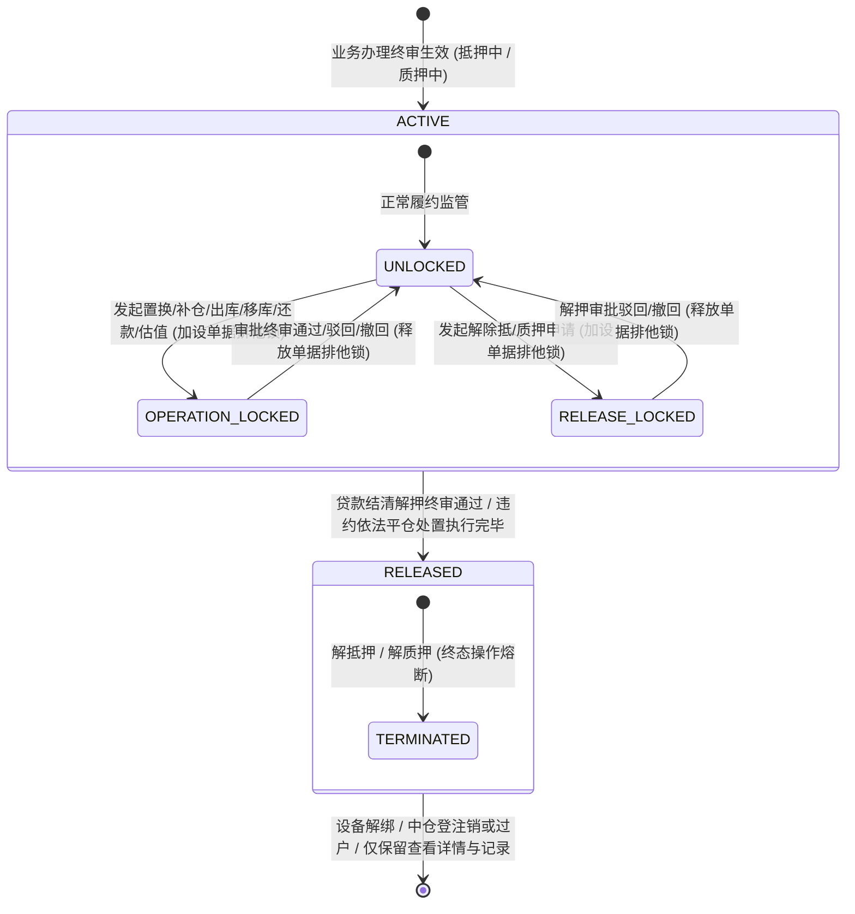

---

## 6. 核心业务规则摘要 (引用规则规格)

本模块各项风控红线与业务约束的唯一编号定义于《[抵质押业务管理业务规则规格](./抵质押业务管理业务规则规格.md)》：
- **DZY-R01【单据排他互斥锁】**：在途任务存在时阻断异类操作，同类操作支持撤回与防重；
- **DZY-R02【置换货值不倒挂】**：拟换入货物总估值必须 $\ge$ 拟换出货物总估值；
- **DZY-R03【出库严禁全额全提】**：货物出库仅支持部分出库，全提必须走解除抵/质押；
- **DZY-R04【单仓单二维码保留底线】**：电子仓单质押单据中，单张仓单项下至少保留 1 个在押二维码；
- **DZY-R05【绝对禁止跨仓移库】**：移库严格限定在同监管仓内调整货位，移入仓系统强制锁定只读；
- **DZY-R06【风险处置严禁原货主接收】**：受让买受方信用代码严禁等于原借款人信用代码；
- **DZY-R07【部分结清金额严格开区间】**：还款金额必须满足 $0 < \text{还款金额} < \text{贷款余额}$；
- **DZY-R08【盘亏联动押品预警】**：盘点出现账实亏损时自动向 02/02 押品预警投递流水并点亮订单红标；
- **DZY-R09【未定价公允价值告警】**：商品规格缺失第三方行情时标注 `未定价 ⚠️`，看板指标联动；
- **DZY-R10【安全线与抵押率公式】**：$\text{抵押率} = (\text{贷款余额} \div \text{总货值}) \times 100\%$，放款录入后激活；
- **DZY-R11【加工管理货值保全】**：产成品入库总值不得低于原领用原料抵押值，超期触发预警；
- **DZY-R12【日常监管三大防伪铁律】**：GPS 围栏防脱岗（200米）、强制系统原生相机（禁用相册）、时空防伪水印；
- **DZY-R13【终态熔断与设备解绑】**：订单解押或平仓后自动解绑物联监控，操作列熔断收缩仅保留详情与记录。

---

## 7. 权限与安全控制 (RBAC 矩阵)

| 角色标识 | 角色名称 | 核心页面与操作权限 | 仓库数据权限约束 |
| :--- | :--- | :--- | :--- |
| `R-ORDER-OPER` | 业务经办人 | 列表查询、查看详情、发起置换/加补仓/出库/移库/估值申请 | 受组织架构与借款主体授权隔离 |
| `R-WH-SUPERVISOR`| 现场监管员 | 日常监管打卡、现场盘点、出入库现场扫码核销、查看监控与PTZ | **强制校验**：必须分配订单所在实体监管仓数据权限 |
| `R-RISK-AUDIT` | 银行/资方风控员 | 审批中心审核各变更申请、调整安全线、审批风险处置 | 受出资金融机构数据范围隔离，**严格遵守自审禁止** |
| `R-FIN-SETTLE` | 财务结算专员 | 录入贷款结果、办理部分结清还款、对账流水导出 | 仅能维护已授权的资金结算账户与借据凭单 |
| `R-RISK-MGR` | 风险管理总监 | 审批平仓方案、对外发布风险公示、合规取消公示 | 全租户风险管理权限，取消公示强制录入理由 |
| `R-ORDER-ADMIN` | 系统超级管理员 | 异常流程撤销补偿、中仓登接口重发、全路径审计追溯 | 超级权限，所有敏感操作全程留存不可变快照 |

---

## 8. 验收标准与测试用例要点

1. **当前两 Tab 与看板联动**：
   - 仅展示并可切换【抵押订单】与【质押订单】，看板数值、列表列名（抵押方式/质押方式）与行操作文案（解除抵押/解除质押）实时准确切换；
   - 监管订单不展示 Tab、卡片或菜单入口；历史监管订单通过旧链接访问时仅可只读查询、审计和资料查看，所有写操作均被服务端拒绝；
   - 存在未定价商品时，看板货值旁正确渲染警告图标 `⚠️`，鼠标悬停展示规范文案。
2. **互斥锁与并发拦截**：
   - 当订单存在在途审批时，点击其他变更操作，必须 100% 弹出排他阻断提示框，禁止打开新申请；
   - 同类操作再次点击时，正确提供【查看审批】与【撤回申请】入口。
3. **风控红线硬拦截**：
   - 货物置换输入新货物总值小于换出货物时，提交按钮置灰或弹出倒挂拦截阻断；
   - 货物出库勾选全部在押存货时，拦截并弹出全额提货阻断弹窗，引导办理全面解押；
   - 货物移库表单中，移入仓库必须置灰禁用且等于移出仓库；
   - 风险处置买受人统一代码输入原货主统一代码时，系统必须强校验拦截；
   - 部分结清还款金额录入 0 元或大于等于当前贷款余额时，系统必须强校验拦截。
4. **终态收缩与设备解绑**：
   - 订单解押终审通过后，列表行操作立即收缩熔断，仅展示【查看详情】与【操作记录】；
   - 详情中 IoT 设备状态显示已解绑，中仓登登记系统显示已注销。

---

## 9. 核心行操作独立三件套规格索引 (24 大操作业务 100% 严丝合缝)

为确保供应链金融各类复杂资产操作的工程落地质量，避免主单据文档过度臃肿，系统严格按照真实行操作菜单项，将 **24 大核心行操作** 全面解耦，分别建立独立的**需求三件套**（主 PRD + 14 维标准字段清单 + 业务规则规格说明书）。各操作规格书完全继承并服从本主 PRD 定义的全局状态机与排他互斥锁框架。

👉 **全景导航入口**：[【操作业务全景导航 README.md】](./操作业务/README.md)

### 第一组（8 项）
1. **[01-货物置换](./操作业务/01-货物置换/货物置换主PRD.md)**：置换后货值不减校验、老货释放与新货在押原子替换、四方签署置换协议与中仓登登记变更。
2. **[02-货物补仓](./操作业务/02-货物补仓/货物补仓主PRD.md)**：可用存货/仓单追加准入、缺货友好空态引导、新增在押货值累加与抵押率压降、预警红标闭环消除。
3. **[03-货物出库](./操作业务/03-货物出库/货物出库主PRD.md)**：部分提货出库单、全额提货强阻断、剩余货值安全线单调性校验、提货码一单一码现场核销。
4. **[04-解抵质押](./操作业务/04-解抵质押/解抵质押主PRD.md)** *(解抵押 | 解质押 | 解监管)*：贷款本息全额结清凭据核验、在押物权全面解控释放、四方解押协议签署、中仓登注销与设备解绑。
5. **[05-货物估值](./操作业务/05-货物估值/货物估值主PRD.md)**：统一行业参考价口径与未定价 ⚠️ 风险警示、一口价总价估值 6 位小数倒算防倒挂、货值热重算。
6. **[06-货物盘点](./操作业务/06-货物盘点/货物盘点主PRD.md)**：监管仓库 RBAC 权限强校验、逐条/PDA/批量设为相符模式、盘亏自动联动 02/02 押品预警。
7. **[07-盘点报告](./操作业务/07-盘点报告/盘点报告主PRD.md)**：盘点结果动态编译生成标准 PDF 报告、内嵌时空防伪水印与验真二维码。
8. **[08-货物移库](./操作业务/08-货物移库/货物移库主PRD.md)**：仅限同仓移库（移入仓库禁用锁定）、目标货位可用性校验、在途物理监控强化与新货位回写。

### 第二组（8 项）
9. **[09-查看监控](./操作业务/09-查看监控/查看监控主PRD.md)**：无设备空态友好引导、WebRTC 低延迟视频拉流、云台 5 秒防并发冲突锁。
10. **[10-平仓](./操作业务/10-平仓/平仓主PRD.md)**：严禁原货主/借款人自收自处红线校验、受让人二元查重、变现款法定顺序清偿分配、司法过户存证。
11. **[11-查看风险](./操作业务/11-查看风险/查看风险主PRD.md)**：未处理/已处理双 Tab 集中视图、订单列表红标联动与归零消除、现场整改闭环处置。
12. **[12-设备管理](./操作业务/12-设备管理/设备管理主PRD.md)**：多品类物联设备卡片矩阵、单机独立预警布防 Switch 开关控制、离线异常告警。
13. **[13-操作记录](./操作业务/13-操作记录/操作记录主PRD.md)**：全生命周期 AOP 切面审计留痕、操作前后数据镜像版本快照比对与导出。
14. **[14-贷款结果录入](./操作业务/14-贷款结果录入/贷款结果录入主PRD.md)**：单笔业务放款录入排他唯一性、银行真实出账借据确权、激活抵押率动态计算引擎与预警接入。
15. **[15-查看详情](./操作业务/15-查看详情/查看详情主PRD.md)**：货-仓-金-物联-风控五维一体全景视图、普通存货与电子仓单双模式展开。
16. **[16-监管报告](./操作业务/16-监管报告/监管报告主PRD.md)**：商业银行标准 9+3 定期监管报告动态编译、CFCA 电子签章验真。

### 第三组（8 项）
17. **[17-部分结清](./操作业务/17-部分结清/部分结清主PRD.md)**：还款金额严格开区间 $(0, \text{贷款余额})$ 校验、全额还款引导解押、贷款余额动态扣减与抵押率压降。
18. **[18-安全线管理](./操作业务/18-安全线管理/安全线管理主PRD.md)**：安全线/预警线/平仓线阶梯阈值单调性强校验、固定/比例调整模式、资方高级风控审批与热刷新。
19. **[19-货物异动](./操作业务/19-货物异动/货物异动主PRD.md)**：大宗商品水分挥发/损耗/复磅公差申报、调减后抵押率超标黄色风控阻断。
20. **[20-抵质押入库](./操作业务/20-抵质押入库/抵质押入库主PRD.md)** *(货物入库)*：到仓实物验收入库、赋码防伪二维码标签并设立质权锁定。
21. **[21-日常监管](./操作业务/21-日常监管/日常监管主PRD.md)**：GPS 电子围栏半径 $\le 200$ 米防脱岗打卡、系统硬件原生相机拍摄、6 大项 Checklist 巡库履职。
22. **[22-资料管理](./操作业务/22-资料管理/资料管理主PRD.md)**：5 大类业务电子档案归档与预览、版本追加与只读保护、防泄密水印。
23. **[23-风险公示](./操作业务/23-风险公示/风险公示主PRD.md)**：仅已结案支持公示、取消公示限 R-RISK-MGR 审计留痕、对外司法合规披露。
24. **[24-加工管理](./操作业务/24-加工管理/加工管理主PRD.md)**：大宗原料领料深加工、加工在途倒计时监控、产成品入库【货值保全红线】强校验。

---

## 修订记录

| 日期 | 版本 | 变更内容 | 影响范围 |
| :--- | :--- :--- | :--- | :--- |
| 2026-09-10 | V1.0 | 梳理抵质押业务管理初始需求规格 | 全流程初始稿 |
| 2026-09-11 | V1.1 | 建立三 Tab 架构与行操作子清单初稿 | 操作子清单解耦 |
| 2026-09-11 | **V2.0** | **深度重构全面对齐 6.2 标杆 PRD 规范**：严格遵循 `5-2-2 台账流水类 PRD 模板`；对齐 8 大核心章节；深度规范三 Tab 看板指标、未定价 ⚠️ 告警、排他互斥锁与数据变更矩阵；细化 14 大核心行操作交互与风控红线；建立完整的 R01~R13 业务规则与 RBAC 矩阵映射 | 主 PRD 全文、页面功能说明、并发控制与验收标准 |
| 2026-09-11 | **V2.1** | **关闭监管订单当前运营链路**：当前仅保留抵押/质押两类 Tab 与写操作；监管订单降为历史只读兼容数据，补充 PC/H5 入口、服务端写入阻断和审计验收约束 | 当前业务范围、页面入口、状态机、验收标准 |
| 2026-09-11 | **V2.2** | **全面补齐各核心行操作子业务 Mermaid 流程图与规则闭环**：为货物置换、加/补仓、货物出库（部分提货）、货物移库、解除抵/质押、风险处置平仓、贷款录入/部分结清、货物估值/安全线、货物盘点/日常监管等 9 大子业务全部补充端到端 Mermaid 流程图，明确前置合规校验、在途锁控制、审批流转与落账规则 | §4.3 核心行操作业务办理说明全文 |
| 2026-09-11 | **V2.3** | **全面建成 14 大核心操作独立三件套体系**：解耦完成 14 个操作的主 PRD、14 维标准字段清单（列表/筛选/表单/详情 4 场景独立列）与业务规则规格说明书；主 PRD 新增 §9 建立全局超链接全景闭环 | 全局架构、操作业务三件套索引 |
| 2026-09-11 | **V2.4** | **目录合一重构**：将原【操作字段清单】与【操作业务三件套】正式合并为统一的【操作业务】，全面消除目录冗余，平滑归并详情/记录/资料/加工等扩展操作 | 目录结构、全局索引链接 |
| 2026-09-11 | **V2.5** | **100% 严丝合缝 24 大操作业务一对一三件套全面定稿**：根据系统真实操作功能菜单截图（3 组共 24 项），建立精确的 24 个独立子目录与 72 份独立交付文档（主 PRD + 14 维标准字段清单 + 业务规则规格说明书），并在主 PRD 与全局 README.md 建立双向严密索引 | §9 独立三件套规格索引、操作业务目录体系 |
