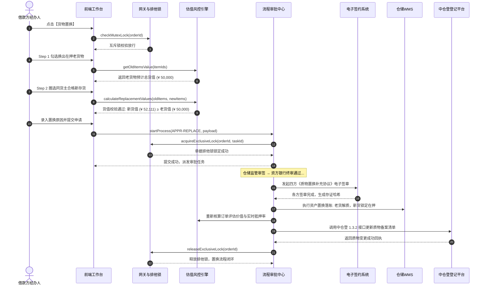

# 货物置换业务规则规格

> **版本**：V1.0 | 2026-09-11  
> **所属模块**：03-融资监管 / 07-抵质押业务-抵质押业务管理 / 货物置换  
> **配套文档**：[货物置换主PRD](./货物置换主PRD.md) · [货物置换字段清单](./货物置换字段清单.md) · [抵质押业务管理业务规则规格](../../抵质押业务管理业务规则规格.md)

---

## 1. 置换申请状态机与生命周期

### 1.1 状态定义
| 状态编码 | 中文名称 | 业务含义 | 允许的操作 |
| :--- | :--- | :--- | :--- |
| `DRAFT` | **草稿** | 经办人勾选并暂存置换草稿，尚未提交审批 | 编辑、删除草稿、提交申请 |
| `PENDING_AUDIT` | **审批中** | 申请已提交，主订单施加排他互斥在途锁 | 审批人审签、发起人撤回 |
| `APPROVED` | **已生效 (终态)** | 资方终审通过，底层原子落账并变更质物清单 | 查看详情、查看审计、中仓登备案查询 |
| `REJECTED` | **已驳回 (终态)** | 审批不通过，释放排他锁，在押清单无损还原 | 查看详情、查看驳回原因、重新发起 |
| `CANCELLED` | **已撤回 (终态)** | 发起人主动撤回申请，释放单据排他锁 | 查看详情、重新发起 |

### 1.2 状态流转表
| 当前状态 | 触发动作 / 事件 | 目标状态 | 前置校验条件 | 业务落账与副作用 |
| :--- | :--- | :--- | :--- | :--- |
| `DRAFT` | 提交审批 (`SUBMIT`) | `PENDING_AUDIT` | 货值不倒挂 (新货值 $\ge$ 老货值) 且通过仓库权限校验 | 主订单上排他互斥锁，老货与新货打在途锁 |
| `PENDING_AUDIT` | 资方终审通过 (`APPROVE`) | `APPROVED` | 各方法定代表人完成实名电子签章 | 老货转为解质可出库，新货转为在押锁定，刷新抵押率 |
| `PENDING_AUDIT` | 审批驳回 (`REJECT`) | `REJECTED` | 必填驳回原因 ($\le 200$ 字) | 释放主订单排他锁，释放物料在途锁 |
| `PENDING_AUDIT` | 发起人撤回 (`CANCEL`) | `CANCELLED` | 仅原发起人或超管可操作 | 释放主订单排他锁，释放物料在途锁 |

---

## 2. 核心业务规则 (R 规则)

### ZH-R01：单据级排他并发互斥规则
* **规则逻辑**：当订单 `mutex_lock_status == 'LOCKED_IN_PROCESS'` 时，系统强行阻断发起货物置换；
* **错误提示**：弹窗提示 `“该订单正在进行【{active_task_type}】操作（单号：{active_task_no}），在审核完成前禁止发起货物置换！”`。

### ZH-R02：新旧公允市值不倒挂底线规则 (核心风控红线)
* **计算公式**：
  $$\sum_{i=1}^{n} (\text{换入物数量}_i \times \text{公允单价}_i) \ge \sum_{j=1}^{m} (\text{换出物数量}_j \times \text{在押单价}_j)$$
* **行情单价取值**：取自当前订单关联总流程绑定的指定定价机构（如上海有色网 SMM、我的钢铁网等）最新发布有效行情；
* **倒挂拦截 (Modal 弹窗)**：
  - 若新货值 $<$ 老货值，系统**绝对禁止提交**；
  - 弹出系统提示 Modal：`“当前选取的新抵/质押物总价值低于老抵/质押总价值，无法进行抵/质押置换！”`，仅提供【我知道了】按钮。

### ZH-R03：新质物准入四要素校验
换入的新存货必须同时满足以下条件，否则系统在备选池中自动过滤剔除：
1. **权属同一性**：新货品法定所有权人必须与当前订单货主统一信用代码/身份证号完全一致；
2. **同仓性**：新货品存放的物理仓库必须与当前订单在押货物为同一承储仓库；
3. **物理状态**：新货品在 WMS 资产状态必须为【已入库】或【部分出库】；
4. **质押状态**：新货品必须为【未抵押】、【未质押】且【未绑定电子仓单】的自由可用资产。

### ZH-R04：经办人仓库数据权限隔离校验
* 在 Step 1 勾选老货物点击【下一步】时，系统逐条校验经办人账号的数据权限；
* 若包含未授权仓库货品，弹出 Toast 拦截：`“您的账号暂无该货物（{品名}/{仓库}）仓库权限，请开启权限后再操作”`。

### ZH-R05：电子仓单置换多方实名签署规则
* 若当前订单为电子仓单质押，审批终审前必须触发 CFCA 线上签约；
* 货主法定代表人、资方银行负责人、承储仓库签署人均须通过手机验证码或电子盾完成《仓单质物置换多方补充协议》实名签署，固化存证防篡改哈希。

### ZH-R06：底层原子落账与数据联动
审批终审通过瞬时，系统在同一数据库本地事务内完成：
1. 换出老存货解除质押锁定标记，WMS 状态变迁为【解质押可出库】；
2. 换入新存货施加在押锁定标记，并入订单在押物料明细，物理状态变更为【在押锁定】；
3. 重新核算订单货物评估价值总额与实时抵押率；
4. 释放主订单排他互斥锁，订单状态还原为空闲。

### ZH-R07：中仓登 1.3.2 接口联动备案规则
* 若标的物属于中仓登登记准入仓库的电子仓单，落账完成后系统异步调用中仓登 1.3.2 接口，上报换出老质物与换入新质物条码清单，完成法定动产登记系统质物变更。

---

## 3. 并发与权限规则 (C / P 规则)

### ZH-C01：物料行级乐观锁控制
* 拟换入的新存货在提交审批瞬间被打上 `REPLACEMENT_IN_PROCESS` 在途标记；
* 在审批流转期间，该批自由存货禁止被其他融资申请、提货申请或转让交易重复圈选。

### ZH-P01：自审禁止规则
* 置换申请经办人若拥有资方或监管方审批权限，在工作台待办中对本人发起的置换申请**禁止审批**；
* 详情页仅展示申请只读信息，不提供【同意】或【驳回】按钮。

---

## 4. 端到端业务时序图

