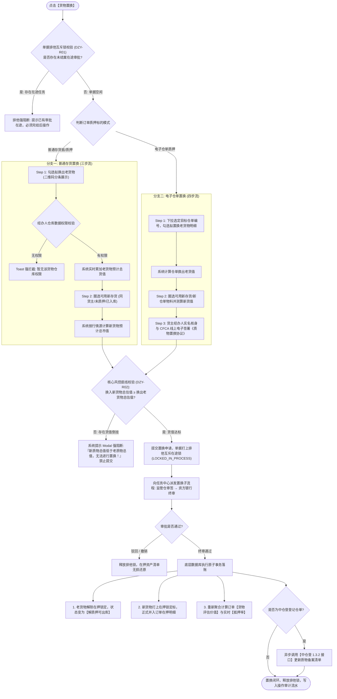

# 货物置换主PRD

> **版本**：V1.0 | 2026-09-11  
> **所属模块**：03-融资监管 / 07-抵质押业务-抵质押业务管理 / 货物置换  
> **入口路径**：  
> • PC 端：`融资监管 → 抵质押业务 → 抵质押业务管理 → 行操作【更多操作 ▾】→ 【货物置换】`  
> • H5 移动端：`抵押/质押列表卡片 → 【更多操作】抽屉 → 【货物置换】`  
> **配套文档**：[货物置换字段清单](./货物置换字段清单.md) · [货物置换业务规则规格](./货物置换业务规则规格.md) · [抵质押业务管理主PRD](../../抵质押业务管理主PRD.md)

---

## 1. 业务背景与功能定位

在动产质押与供应链金融监管存续期内，出质人（货主企业）常因下游订单交付或原料周转需要，申请提取特定批次或规格的在押货物。为保障资金方（商业银行/保理机构）的债权担保安全，出质人必须提供**同等或更高公允价值**的自由合格存货或仓单资产作为替换质物。

**【货物置换】** 模块提供了标准化的质物置换线上流转闭环，支持**普通存货置换**与**电子仓单置换**双业务分支，贯穿“拟换出老质物勾选 $\rightarrow$ 拟换入新质物准入圈选 $\rightarrow$ 实时公允市值比对校验 $\rightarrow$ 单据排他互斥在途锁 $\rightarrow$ 资方与监管多方联审 $\rightarrow$ CFCA 实名电子签约 $\rightarrow$ 底层原子落账切换 $\rightarrow$ 中仓登 1.3.2 质物清单备案”，彻底杜绝私自抽逃质物与货值倒挂风险。

---

## 2. 业务全景流转架构

---

## 3. PC 端页面与交互规格

### 3.1 入口与前置拦截
* **入口**：在抵质押业务管理列表行操作点击【更多操作 ▾】$\rightarrow$【货物置换】；
* **排他并发阻断**：若订单 `mutex_lock_status == 'LOCKED_IN_PROCESS'`，直接弹出阻断提示框：`“该订单正在进行【{active_task_type}】操作（单号：{active_task_no}），在审核完成前禁止发起货物置换！”`。

---

### 3.2 分支一：普通存货置换交互（三步向导）

#### Step 1：选取待解质老货物 (`/置换抵质押物-选择老货物`)
1. **页面 Header**：返回按钮、主标题 `置换抵/质押物`、当前订单编号及货主名称；
2. **在押存货列表**：系统拉取该订单项下所有在押锁定存货（按存货条码分条排布）：
   - 列定义：`复选框`、`存货条码`（附二维码图标 📱）、`货物名称`（标准化大宗品类-品名-规格）、`在押数量`、`单位`、`仓储位置`（仓库-库房-具体货位）、`评估单价`、`总价`；
   - 资产详情抽屉：点击条码旁的 📱 图标，右侧滑出抽屉展示生产批次、保质期、进场车牌与检验报告；
3. **动态货值显示条 (常驻底部)**：
   - 随复选框勾选实时累加：`当前勾选拟换出的在押货物总估值：¥ 50,000.00 元`；
4. **下一步按钮与仓库权限校验**：
   - 未勾选任何货物时【下一步】按钮置灰禁用；
   - 点击【下一步】时，系统逐条校验经办人对所选货物所在承储仓的权限。若无权限，阻断并弹出 Toast：`“您的账号暂无该货物（{品名}/{仓库}）的数据权限，请开启权限后再操作”`。

#### Step 2：选取置换新货物 (`/置换抵质押物-选择新货物`)
1. **可用存货准入池规则**：
   - 必须属于当前订单的**同一货主**；
   - 必须处于**同承储仓库**；
   - 存货物理状态必须为 **【已入库】** 或 **【部分出库】**；
   - 担保状态必须为 **【未抵质押】** 且 **【未绑定电子仓单】**；
2. **列表与搜索**：支持按货品名称下拉筛选、输入条码搜索；
3. **动态比对面板 (核心风控交互)**：
   - 左侧：`换出老质物总估值：¥ 50,000.00 元`；
   - 右侧：`当前勾选新质物总估值：¥ 52,111.00 元`；
   - 差额提示：`货值差额：+ ¥ 2,111.00 元 (符合置换条件)`；
4. **倒挂阻断提交**：若新货值 $<$ 老货值，差额红字提示 `货值不足：- ¥ 3,000.00 元`，点击【提交申请】弹出强阻断 Modal 弹窗：  
   `“当前选取的新抵/质押物总价值低于老抵/质押总价值，无法进行抵/质押置换！”`（仅提供【我知道了】按钮，禁止提交）。

#### Step 3：提交结果页
* 提交成功后展示成功状态页，提示：`“抵/质押物置换申请已提交，审批单号：SQ202608280001”`；
* 提供按钮：`[ 查看审批详情 ]`（跳转工作流中心）、`[ 返回列表 ]`。

---

### 3.3 分支二：电子仓单质押置换交互（四步流）

1. **Step 1 选择仓单与老货物**：顶部提供下拉框 `请选择仓单编号 [CD202608260001 ▾]`，加载仓单项下物料二维码列表，复选待换出老物料；
2. **Step 2 圈选新质物**：选择同货主在同仓内的合格物料；
3. **Step 3 线上电子签署《质物置换协议》**：
   - 展示根据模板动态生成的《电子仓单质押标的物置换多方补充协议》；
   - 货主法定代表人通过手机短信验证码或 CFCA 移动证书完成签署；
4. **Step 4 派发审批与中仓登同步**：审批终审通过后，自动调用中仓登接口变更仓单备案。

---

## 4. H5 移动端交互规格

* **入口**：移动端订单卡片点击【更多操作】抽屉 $\rightarrow$ 4 列网格第 1 项【货物置换】；
* **移动端两步向导**：
  - 第 1 页：手风琴卡片列表勾选老货物，底部悬浮展示 `换出估值: ¥XX万`，点击【下一步】；
  - 第 2 页：平铺可用新货物，顶部悬浮展示 `新旧货值对比进度条`（绿条达标，红条不足）；
  - 倒挂时底部提交按钮禁用，并提示 `还需追加 ¥XX 元存货`。

---

## 5. 验收标准与测试用例要点

1. **货值倒挂 100% 阻断**：
   - 当新货值小于老货值时（即使只少 0.01 元），系统严禁提交，必须弹出系统提示阻断 Modal；
2. **排他互斥生效**：
   - 置换申请提交后，返回列表刷新，单据状态变为锁定，点击【货物出库】、【货物移库】等必须弹出排他提示框；
3. **落账与中仓登备案**：
   - 终审通过后，详情页【抵押物明细】中老货物移入历史，新货物正式展示；
   - 检查中仓登 1.3.2 接口调用报文，确认换出与换入条码清单准确无误。
