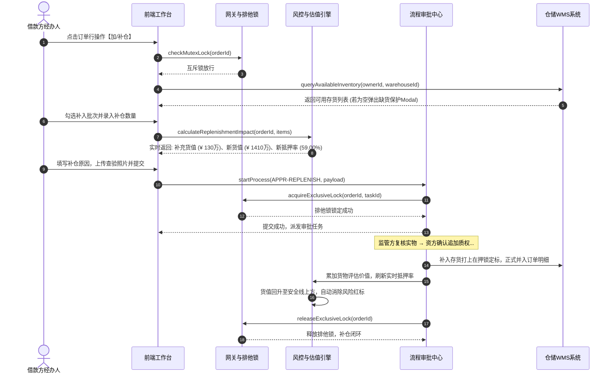

# 加补仓业务规则规格

> **版本**：V1.0 | 2026-09-11  
> **所属模块**：03-融资监管 / 07-抵质押业务-抵质押业务管理 / 加补仓  
> **配套文档**：[加补仓主PRD](./加补仓主PRD.md) · [加补仓字段清单](./加补仓字段清单.md) · [抵质押业务管理业务规则规格](../../抵质押业务管理业务规则规格.md)

---

## 1. 补仓申请状态机与生命周期

### 1.1 状态定义
| 状态编码 | 中文名称 | 业务含义 | 允许的操作 |
| :--- | :--- | :--- | :--- |
| `DRAFT` | **草稿** | 经办人保存补仓选货草稿，未提交审批 | 编辑、删除草稿、提交申请 |
| `PENDING_AUDIT` | **审批中** | 补仓申请已提交，主订单打上排他在途锁 | 审批人审签、发起人撤回 |
| `APPROVED` | **已生效 (终态)** | 资方终审通过，补入质物正式并入在押池 | 查看详情、查看审计流水 |
| `REJECTED` | **已驳回 (终态)** | 审批不通过，释放排他锁，在押池保持不变 | 查看详情、查看驳回原因 |

---

## 2. 核心业务规则 (R 规则)

### BC-R01：缺货空态保护规则
* 当经办人点击【加/补仓】时，系统首先检索当前借款企业在目标承储仓内的自由可用存货总数；
* 若可用货物笔数 $= 0$，阻断进入表单，直接弹出友好提示 Modal：`“当前货主在【{仓库名称}】内暂无可补入的自由在库存货！”`，仅提供【返回】按钮。

### BC-R02：补入质物合规准入四要素
拟补入存货必须同时满足：
1. **权属同一性**：存货货主统一社会信用代码/个人身份证号与原订单完全一致；
2. **物理同仓性**：存货存放物理仓库必须等于原订单在押货物所在仓库；
3. **资产状态**：WMS 状态为【已入库】或【部分出库】；
4. **质押状态**：必须处于【未质押】、【未抵押】且【未绑定电子仓单】状态。

### BC-R03：抵押率动态压降校验规则
* 系统实时校验补仓后的预计新抵押率：
  $$\text{新抵押率} = \frac{\text{当前贷款余额}}{\text{原货物总估值} + \text{本次补充总货值}} \times 100\% < \text{原抵押率}$$
* 若未录入补仓数量或补仓数量导致货值未增加，提交按钮置灰禁用。

### BC-R04：跌价/补仓预警联动消除闭环
* 若原订单当前存在未结案的【02/02 押品跌价预警】或【货值跌破安全线预警】；
* 当补仓终审通过、最新货物评估价值回升至安全线以上时，风控引擎自动联动将对应风险流水状态回写为【已解除·有效】，列表单号旁的 `[⚠️ 风险 >]` 红标自动消除。

### BC-R05：底层原子事务落账规则
审批通过瞬时，系统在同一数据库本地事务内完成：
1. 补入存货在 WMS 资产状态变迁为【在押锁定】；
2. 订单在押货物明细新增补入批次记录；
3. 订单主表货物评估价值累加本次补充货值，重算抵押率；
4. 释放主订单排他互斥锁。

---

## 3. 并发与权限规则 (C / P 规则)

### BC-C01：自由存货在途码锁
* 拟补入的自由存货在提交审批瞬间打上 `REPLENISHMENT_IN_PROCESS` 在途标记；
* 审批期间，该批存货禁止被其他提货、出库或置换操作重复圈选。

### BC-P01：自审禁止规则
* 补仓申请人若同时拥有资方或仓储审批权限，待办中禁止审批本人提交的补仓单，仅提供【详情】只读视图。

---

## 4. 端到端业务时序图

