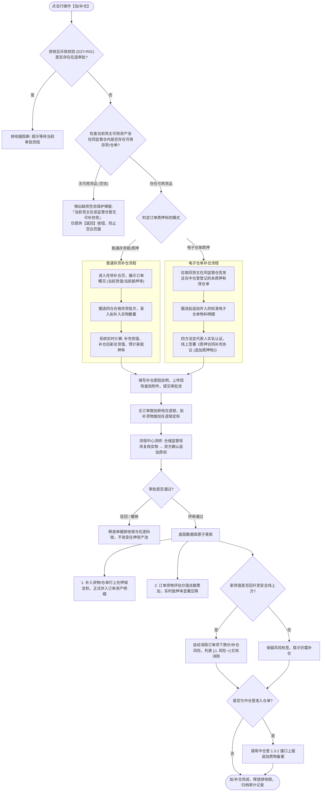

# 加补仓主PRD

> **版本**：V1.0 | 2026-09-11  
> **所属模块**：03-融资监管 / 07-抵质押业务-抵质押业务管理 / 加补仓  
> **入口路径**：  
> • PC 端：`融资监管 → 抵质押业务 → 抵质押业务管理 → 行操作【更多操作 ▾】→ 【加/补仓】`  
> • H5 移动端：`抵押/质押列表卡片 → 【更多操作】抽屉 → 【加/补仓】`  
> **配套文档**：[加补仓字段清单](./加补仓字段清单.md) · [加补仓业务规则规格](./加补仓业务规则规格.md) · [抵质押业务管理主PRD](../../抵质押业务管理主PRD.md)

---

## 1. 业务背景与功能定位

在动产融资与质押监管业务中，若因市场行情波动导致在押货物总估值跌破**货值安全线/控货线**，或因借款人申请追加融资额度，出质人须向在押资产池中追加自由合格存货或标准电子仓单，以维持充足的担保敞口安全垫，消除穿仓违约风险。

**【加/补仓】** 模块提供了标准化的动产追加质押操作闭环，支持**普通存货补仓**与**电子仓单补仓**，具备“缺货空态友好引导 $\rightarrow$ 同仓可用质物圈选 $\rightarrow$ 补仓效果与抵押率动态压降预演 $\rightarrow$ 线上补充质押协议签章 $\rightarrow$ 仓储与资方审批流转 $\rightarrow$ 资产落账与在押锁施加 $\rightarrow$ 风险预警红标消除”，保障信贷资产安全。

---

## 2. 业务全景流转架构



---

## 3. PC 端页面与交互规格

### 3.1 缺货空态保护弹窗 (Empty Inventory Guard Modal)
* **触发场景**：经办人点击【加/补仓】后，系统后台异步查询当前货主在同监管仓内的自由可用存货。若可用存货数量为 0，不进入复杂表单，直接弹出友好提示弹窗：
  ```
  ┌─────────────────────────────────────────────────────────────┐
  │  提示                                                   [X] │
  ├─────────────────────────────────────────────────────────────┤
  │                                                             │
  │  ⚠️ 当前货主【{货主名称}】在【{承储仓库全称}】内              │
  │     暂无可用于加/补仓的自由在库合格存货！                   │
  │                                                             │
  │  请先指导货主办理货物验收入库或解押其他货物后再行发起补仓。 │
  │                                                             │
  ├─────────────────────────────────────────────────────────────┤
  │                                                  [ 返 回 ]  │
  └─────────────────────────────────────────────────────────────┘
  ```

---

### 3.2 存货加/补仓表单与动态测算交互

#### 页面三大核心分区：
1. **当前订单概况面板 (顶栏灰底卡片)**：
   - 展示：借款人企业名称、承储监管仓名称、当前贷款余额、当前货物评估总值、当前实时抵押率、当前货值安全线；
2. **选择拟补入存货列表 (中层勾选表格)**：
   - 准入规则：仅展示同货主、同监管仓、已入库且未质押未冻结的存货；
   - 列定义：`复选框`、`存货条码`（附 📱 图标）、`品名/规格`、`具体货位`、`可用数量/重量`、`评估单价`、`拟补入数量`（输入框，支持整批或拆零录入）；
3. **补仓效果动态测算面板 (底层核心交互)**：
   - 随勾选与录入数量实时测算：
     - `本次补充货值：¥ 1,300,000.00 元`
     - `补仓后预计总货值：¥ 14,100,000.00 元`
     - `预计新抵押率：59.00% (↓ 6.00%)`；
   - 必填项：
     - 补仓原因说明（多行文本框，$\le 200$ 字）；
     - 现场查验附件（支持上传现场实拍、质检单或磅单，格式支持 PDF/JPG/PNG）。

---

## 4. 核心业务规则与风控底线

1. **同货主同仓约束 (BC-R01)**：补入质物必须与原订单属于同一借款企业，且存放在同一实体监管仓库内；
2. **抵押率压降校验 (BC-R02)**：补仓后的预计新抵押率必须呈严格下降趋势：
   $$\text{新抵押率} = \frac{\text{当前贷款余额}}{\text{老货物总值} + \text{本次补充总货值}} \times 100\% < \text{原抵押率}$$
3. **预警消除闭环联动 (BC-R03)**：若原订单已触发跌价/安全线预警，在补入新货值生效后，只要最新总估值回到安全线上方，系统自动将订单预警流转为【已解除】，列表红标自动消除。

---

## 5. 验收标准

1. **缺货保护**：当货主在目标仓无可用自由存货时，100% 弹出空态弹窗，点击【返回】安全退出；
2. **数值动态测算**：修改补入数量时，补充货值与新抵押率毫秒级无感知刷新，计算精度无误差；
3. **闭环落账**：终审通过后，订单在押明细中新增补仓批次，主表货物评估价值总额累加，抵押率下降。
