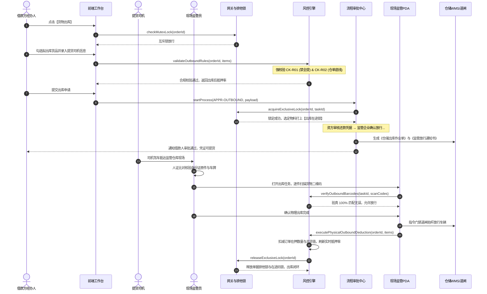

# 货物出库业务规则规格

> **版本**：V1.0 | 2026-09-11  
> **所属模块**：03-融资监管 / 07-抵质押业务-抵质押业务管理 / 货物出库  
> **配套文档**：[货物出库主PRD](./货物出库主PRD.md) · [货物出库字段清单](./货物出库字段清单.md) · [抵质押业务管理业务规则规格](../../抵质押业务管理业务规则规格.md)

---

## 1. 货物出库状态机与生命周期

### 1.1 状态定义
| 状态编码 | 中文名称 | 业务含义 | 允许的操作 |
| :--- | :--- | :--- | :--- |
| `DRAFT` | **草稿** | 保存出库申请草稿，未提交审批 | 编辑、删除草稿、提交申请 |
| `PENDING_AUDIT` | **审批中** | 申请已提交，订单与货物打上在途锁 | 资方/监管审签、发起人撤回 |
| `APPROVED_WAITING_OUTBOUND` | **待物理核销** | 线上审批通过，生成放行单，等待现场提货扫码 | 现场监管员核身、PDA扫码验真 |
| `VERIFIED_OUTBOUND` | **已出库核销 (终态)** | 现场扫码完成，库存正式扣减，物权解控 | 查看详情、查看出库审计、中仓登流水 |
| `REJECTED` | **已驳回 (终态)** | 审批不通过，释放排他锁与在途码锁 | 查看详情、重新发起 |

---

## 2. 核心业务规则 (R 规则)

### CK-R01：全单提货强阻断规则 (DZY-R03)
* **规则逻辑**：出库仅限部分出库。若本次勾选出库的货物数量累加等于订单当前在押总数量（或出库后剩余货值等于 0），系统直接阻断提交；
* **错误提示 (Modal)**：弹出提示窗口：  
  `“货物出库仅支持部分提取！若本次需提取订单项下的全部在押货物，请通过【解除抵/质押】功能办理贷款结清与全面解质手续。”`，提供【我知道了】与【去办理解除抵/质押】按钮。

### CK-R02：仓单防空心化单码底线规则 (DZY-R04)
* **规则逻辑**：对于电子仓单质押订单，单张仓单内必须至少保留 1 个在押有效二维码物料包；
* **拦截机制**：若某张仓单下所有二维码资产均被勾选拟出库，系统禁止提交，强校验阻断报错，杜绝“零实物空头仓单”。

### CK-R03：出库后抵押率风控告警规则
* 系统实时计算出库后的预期抵押率：
  $$\text{出库后抵押率} = \frac{\text{当前贷款余额}}{\text{出库后剩余在押货值}} \times 100\%$$
* 若出库后抵押率高于合同约定平仓线或警戒线，界面醒目展示黄色风险警示条，审批流自动升级为资方风控部高级别审批。

### CK-R04：单码在途出库排他锁规则
* 审批通过后，纳入出库作业单的货物打上 `OUTBOUND_IN_TRANSIT` 锁；
* 在现场监管员 PDA 扫码核销完成之前，该批货物绝对禁止参与【移库】、【置换】、【补仓】或【平仓处置】。

### CK-R05：现场监管员实物扫码验真核销规则
* 提货司机抵达监管仓后，现场监管员核对身份证与车牌号；
* 监管员登录手持 PDA，逐件扫描实物二维码标签。PDA 将条码上传服务端比对，当且仅当条码、件数与出库单 100% 吻合时，方可触发物理核销落账；
* 核销通过后，系统向仓库道闸系统下发自动开闸放行指令，同时在押明细数量正式扣减。

---

## 3. 端到端业务时序图

