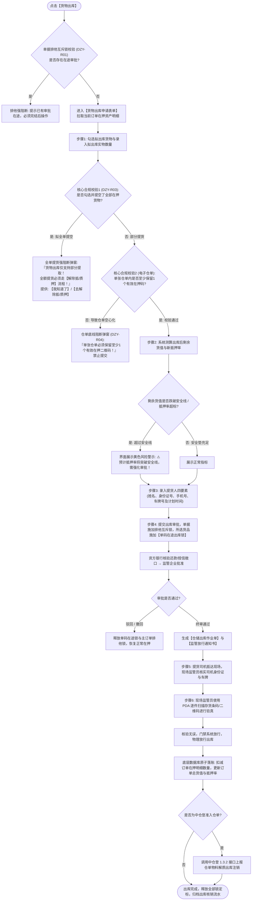

# 货物出库主PRD

> **版本**：V1.0 | 2026-09-11  
> **所属模块**：03-融资监管 / 07-抵质押业务-抵质押业务管理 / 货物出库 (原提货管理)  
> **入口路径**：  
> • PC 端：`融资监管 → 抵质押业务 → 抵质押业务管理 → 行操作【更多操作 ▾】→ 【货物出库】`  
> • H5 移动端：`抵押/质押列表卡片 → 【更多操作】抽屉 → 【货物出库】`  
> **配套文档**：[货物出库字段清单](./货物出库字段清单.md) · [货物出库业务规则规格](./货物出库业务规则规格.md) · [抵质押业务管理主PRD](../../抵质押业务管理主PRD.md)

---

## 1. 业务背景与功能定位

在动产融资与质押监管存续期内，借款企业在偿还部分信贷本息或在安全授信额度内，通常需申请提取部分在押原料或商品以保障正常的生产经营周转。

**【货物出库】** 模块支持借款人在线发起部分存货或电子仓单物料的提取申请。系统内置了“全单提空强阻断 $\rightarrow$ 仓单防空心化单码底线校验 $\rightarrow$ 剩余货值与抵押率动态风控核算 $\rightarrow$ 提货人四要素录入 $\rightarrow$ 单码在途锁挂载 $\rightarrow$ 资方与监管审批 $\rightarrow$ 现场监管员 PDA 实物扫码核销”的端到端严密闭环，防止非法脱管或资产穿仓风险。

---

## 2. 业务全景流转架构



---

## 3. PC 端页面与交互规格

### 3.1 核心风控前置阻断弹窗

#### 1. 全单提货强阻断弹窗 (DZY-R03)
* **业务法理**：全单提货在物权法上等同于主债权担保关系消灭，出质人必须完成贷款清偿并办理正式的质权注销，严禁通过常规出库手段“提空”质押物逃避结清监管。
* **交互原型**：
  ```
  ┌─────────────────────────────────────────────────────────────┐
  │  提示                                                   [X] │
  ├─────────────────────────────────────────────────────────────┤
  │                                                             │
  │  ⚠️ 货物出库功能仅支持部分提取货物！                        │
  │     若本次需提取订单项下的全部在押货物，请通过【解除抵/质押】 │
  │     功能办理贷款本息结清与全面解质手续。                    │
  │                                                             │
  ├─────────────────────────────────────────────────────────────┤
  │             [ 我知道了 ]    [ 去办理解除抵/质押 ]           │
  └─────────────────────────────────────────────────────────────┘
  ```

#### 2. 仓单防空心化单码底线阻断 (DZY-R04)
* **业务法理**：标准电子仓单的物权背书必须有实体物料对应。一张仓单若项下所有二维码资产包全被出库，将产生“零资产仓单”挂在质押池中的重大法律合规漏洞。
* **交互阻断**：单张仓单勾选拟出库数量达到 100% 时，系统直接弹出拦截弹窗，强制出质人至少保留 1 个在押二维码包，或走整单仓单注销解押。

---

### 3.2 货物出库表单界面布局

1. **订单概况信息区 (顶栏卡片)**：
   - 借款主体、当前订单总货值、贷款余额、当前实时抵押率、货值安全线、当前监控状态；
2. **选择拟出库货物列表 (中层操作区)**：
   - 列定义：`复选框`、`存货条码`（附 📱 图标）、`品名/规格`、`所在货位`、`在押数量/重量`、`评估单价`、`拟出库数量`（普通存货支持分拆录入，仓单质押模式为整包勾选）；
3. **出库货值与风控测算面板 (联动区)**：
   - 随录入数量实时测算展示：
     - `本次拟出库货值：¥ 1,280,000.00 元`
     - `出库后剩余货值：¥ 11,520,000.00 元`
     - `出库后预计抵押率：43.40% (安全垫充足，未突破 70.00% 安全线)`；
   - 若出库后预计抵押率突破安全线，高亮提示：`⚠️ 预计抵押率将突破安全线，审核将升级至资方风控部终审，建议先部分还款或追加保证金！`；
4. **提货人信息录入网格 (底层必填区)**：
   - 提货人姓名（必填，$\le 20$ 字符）；
   - 提货人身份证号（必填，18位强校验）；
   - 提货人联系电话（必填，11位手机号）；
   - 提货运输车辆车牌号（必填，标准车牌格式校验）；
   - 计划提货时间（必填，日期时间选择器，默认当天）；
   - 出库提货用途说明（选填，$\le 200$ 字符）。

---

## 4. 现场监管员 PDA 物理出库核销流

线上审批通过仅代表出资方同意放行，并不直接扣减库存，必须由仓库现场监管员执行严格的实物交接：
1. **司机身份核实**：现场核对提货司机身份证原件与车辆车牌，与线上申报信息一致后方可进场；
2. **PDA 实物扫码**：现场监管员使用手持 PDA 逐件扫描出库货位上的存货二维码标签，核实品名、规格、件数与批次；
3. **扫码验真核销**：PDA 将扫描结果上传服务端，系统核验条码清单与出库单完全匹配后，指令门禁道闸放行，并同时扣减线上系统在押明细。

---

## 5. 验收标准

1. **全提阻断**：勾选全部货物时，100% 弹出阻断 Modal，点击【去解除抵/质押】可正确跳转；
2. **仓单底线保护**：单张仓单内试图提取全部二维码物料时强校验拦截；
3. **在途码锁排他**：出库审批在途期间，对应货物条码禁止参与移库、置换与二次出库；
4. **核销闭环**：PDA 扫码核销完成前，订单货值保持不变；核销完成后，货值与在押数量立即扣减。
