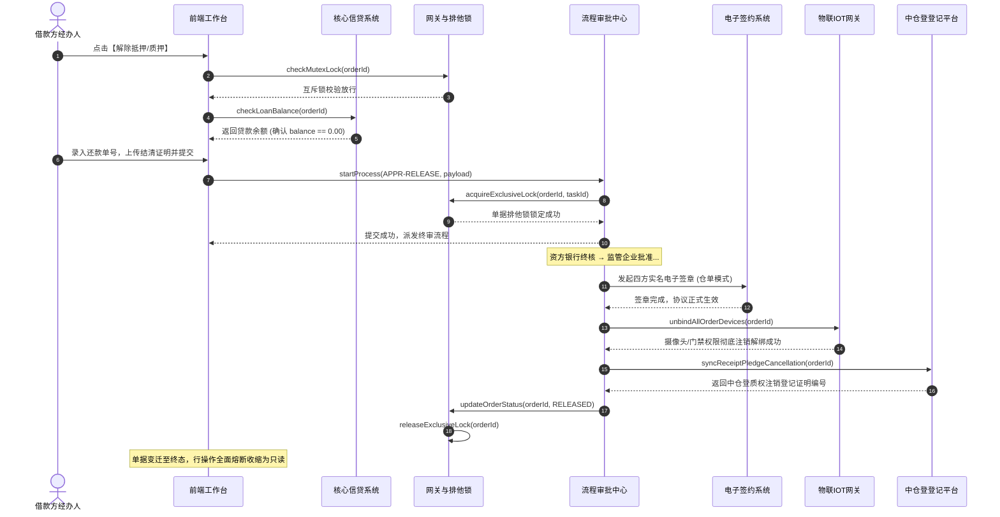

# 解除抵质押业务规则规格

> **版本**：V1.0 | 2026-09-11  
> **所属模块**：03-融资监管 / 07-抵质押业务-抵质押业务管理 / 解除抵质押  
> **配套文档**：[解除抵质押主PRD](./解除抵质押主PRD.md) · [解除抵质押字段清单](./解除抵质押字段清单.md) · [抵质押业务管理业务规则规格](../../抵质押业务管理业务规则规格.md)

---

## 1. 解除抵质押状态流转与终态定义

### 1.1 状态定义
| 状态编码 | 中文名称 | 业务含义 | 允许的操作 |
| :--- | :--- | :--- | :--- |
| `PENDING_AUDIT` | **解押审批中** | 解除申请已提交，主订单打上排他在途锁 | 审批人审签、发起人撤回 |
| `RELEASED` | **已解除 (绝对终态)** | 审批终审通过，质权注销，物联解绑，行操作熔断 | 查看详情、查看操作记录、查看存证资料 |
| `REJECTED` | **已驳回 (终态)** | 审批不通过，释放排他锁，恢复正常在押监管 | 查看详情、重新发起 |

---

## 2. 核心业务规则 (R 规则)

### JC-R01：贷款本息清偿强核验规则
* **规则逻辑**：除资方出具特殊置换豁免公函外，系统强校验 `登记贷款余额 === 0.00` 且无欠息流水；
* **非零拦截**：若贷款余额 $> 0$，系统弹出错误拦截：`“该订单项下尚有未结清借款余额（¥ {balance} 元），禁止直接办理解押！请先办理贷款结清或走【部分结清】还款流程。”`。

### JC-R02：仓单质押四方全量签章规则
* 若订单为电子仓单质押，解押终审前必须触发电子签约流；
* 资金方、借款方、监管方、承储仓四方法人证书通过 CFCA 全量签署《仓单质押解除协议书》，仓单状态位反转为【正常】，动作记录变更为【解除质押】。

### JC-R03：物联设备与门禁权限彻底解绑规则 (DZY-R13)
* 终审生效瞬间，物联中台执行自动化解绑与清理指令：
  1. 彻底断开该订单与原货位所有摄像头、温湿度、门禁设备的订阅关联；
  2. 清空该订单关联的智能门锁开锁授权与临时密码生成权限；
  3. 归档移出设备台账。

### JC-R04：中仓登 1.3.2 质权法定注销规则
* 落账完成后，系统自动调用中仓登 1.3.2 质权注销接口；
* 成功注销后，接收并存储中仓登下发的《全国性电子仓单质权注销登记证明》编号与 PDF 证据，司法存证永久归档。

### JC-R05：全生命周期行操作熔断收缩规则
* 订单状态变迁至 `RELEASED` 瞬间，列表行操作中的所有办理类功能（置换、补仓、出库、移库、安全线、估值、结清、盘点等）全部**熔断隐藏**；
* 列表与详情仅保留三个只读入口：`查看详情`、`操作记录`、`资料管理`。

---

## 3. 端到端业务时序图

