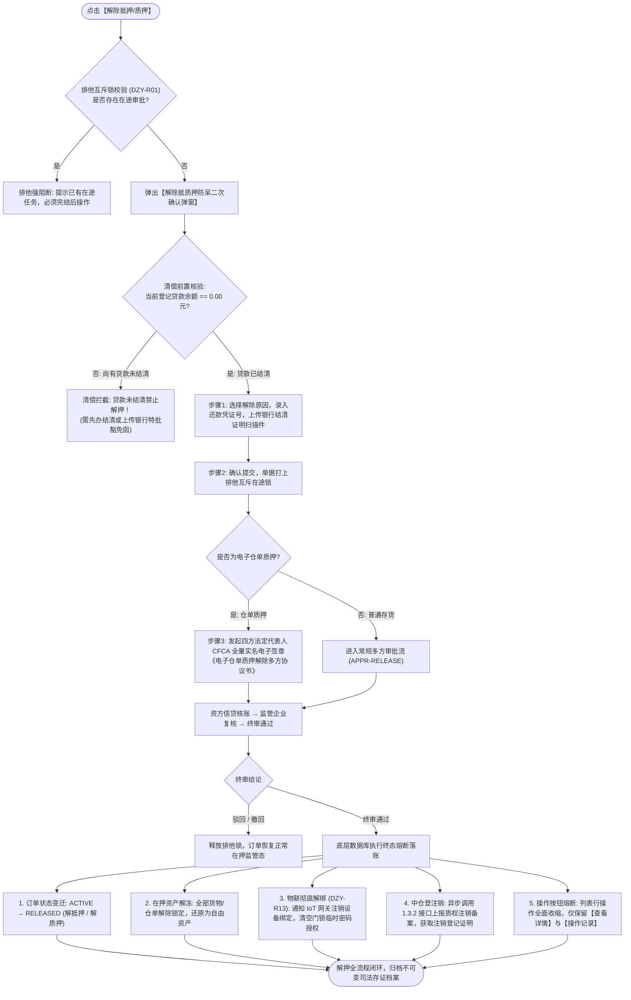

# 解除抵质押主PRD

> **版本**：V1.0 | 2026-09-11  
> **所属模块**：03-融资监管 / 07-抵质押业务-抵质押业务管理 / 解除抵押与解除质押  
> **入口路径**：  
> • PC 端：`融资监管 → 抵质押业务 → 抵质押业务管理 → 行操作【更多操作 ▾】→ 【解除抵押】/【解除质押】`  
> • H5 移动端：`抵押/质押列表卡片 → 【更多操作】抽屉 → 【解除抵押】/【解除质押】`  
> **配套文档**：[解除抵质押字段清单](./解除抵质押字段清单.md) · [解除抵质押业务规则规格](./解除抵质押业务规则规格.md) · [抵质押业务管理主PRD](../../抵质押业务管理主PRD.md)

---

## 1. 业务背景与功能定位

当出质借款主体全部结清借款合同项下的贷款本息，或因资方准许置换免息豁免、监管期满时，双方担保债权债务关系消灭。出资方与监管方须对在押单据办理解除风控监管手续，将标的资产的完整处置权与物权彻底归还借款企业，并在法定的中国仓单登记平台办理质权注销登记。

**【解除抵押 / 解除质押】** 模块是订单生命周期的最终清偿解控闭环。系统通过“借款清偿强核验 $\rightarrow$ 结清凭据与回单上传 $\rightarrow$ 仓单多方法人 CFCA 电子签章 $\rightarrow$ 资方与监管多级审签 $\rightarrow$ IoT 监控与门禁权限彻底解绑 $\rightarrow$ 中仓登 1.3.2 质权注销 $\rightarrow$ 列表操作按钮熔断收缩”，保障担保物权消灭的司法合规性与系统安全性。

---

## 2. 业务全景流转架构



---

## 3. 动态文案映射与 PC 端交互规格

### 3.1 动态文案映射
* 在 **【抵押订单】** Tab 下，行操作文案严格展示为：**【解除抵押】**；
* 在 **【质押订单】** Tab 下，行操作文案严格展示为：**【解除质押】**；
* 注：【监管订单】处于规划闭环中，当前关闭，不提供线上写操作入口。

---

### 3.2 解除抵/质押确认弹窗原型 (PC 交互)

```
┌────────────────────────────────────────────────────────────────────────────────────┐
│  解除质押确认 - 订单号：ZY-20260818-0021                                       [X] │
├────────────────────────────────────────────────────────────────────────────────────┤
│                                                                                    │
│  ⚠️ 警告：办理解除质押后，该订单项下所有在押货物将彻底解控并归还货主！             │
│     订单将流转至终结状态，后续不可再对该订单发起任何加补仓、置换或提货操作！       │
│                                                                                    │
│  【当前结清状态核验】                                                              │
│  借款主体：江苏大宗物资有限公司                                                    │
│  登记贷款余额：¥ 0.00 元 (已结清 ✔️)                                               │
│  当前在押货值：¥ 12,800,000.00 元    在押货物总量：200.000 吨                      │
│                                                                                    │
│  解除原因 (必选)：[ 贷款全额到期正常还本结清 ▾ ]                                   │
│  还款凭证编号 (必填)：[ HK-20260910-8899201           ]                            │
│  结清证明文件 (必填)：[ + 上传银行还款结清证明原件 (支持 PDF/JPG/PNG) ]           │
│                                                                                    │
│  情况说明 (选填，<=200字)：                                                        │
│  [借款企业已结清最后一笔银行贷款本息，质权人出具解质函，申请全面解押。___________] │
│                                                                                    │
├────────────────────────────────────────────────────────────────────────────────────┤
│                                                  [ 取 消 ]    [ 确 认 解 除 质 押 ]│
└────────────────────────────────────────────────────────────────────────────────────┘
```

---

## 4. 终态熔断与系统安全约束

1. **操作权限熔断收缩**：
   - 订单变迁至 `RELEASED` 终态后，列表行操作中的【货物置换】、【加/补仓】、【货物出库】、【货物移库】、【货物估值】、【安全线管理】等 12 项业务办理功能全部**熔断隐藏**；
   - 仅保留只读类操作：`查看详情`、`操作记录`、`资料管理`；
2. **IoT 物联监控彻底解绑 (DZY-R13)**：
   - 系统自动通知物联网网关，解除该订单绑定的所有枪机、球机与传感器设备关联关系；
   - 撤销该订单关联的智能门锁临时开锁权限，阻断后续开锁申请；
3. **中仓登法定注销登记**：
   - 系统自动调用中仓登 1.3.2 接口发送仓单解质注销报文，固化中仓登返回的《全国性电子仓单质权注销登记证明》。

---

## 5. 验收标准

1. **清偿拦截**：贷款余额 $> 0$ 时点击解除，系统强行阻断并提示先办结清；
2. **凭据必填**：还款凭证编号与结清证明文件未上传时，确认按钮禁用；
3. **熔断验证**：解押终审通过后，列表行操作立即收缩为 3 项只读按钮；
4. **物联与注销**：确认物联平台设备解绑日志与中仓登注销凭证号均已持久化归档。
