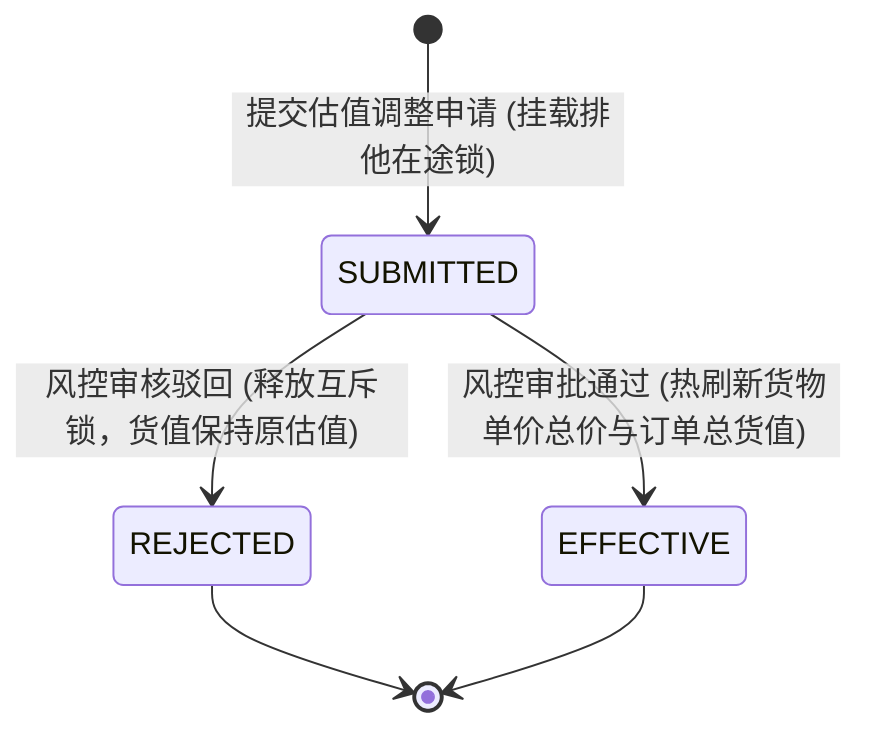
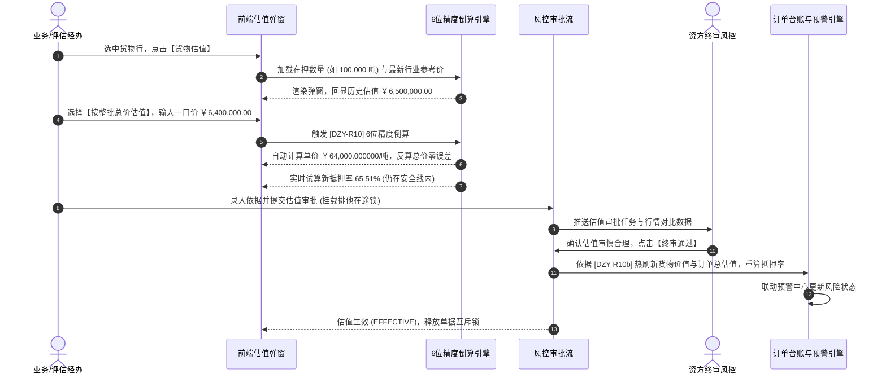

# 行业参考价与货物估值业务规则规格

> **适用功能**：抵质押业务管理 · 行业参考价与货物估值  
> **核心使命**：规范大宗行情统一命名与拉取机制，落实一口价估值 6 位小数倒算精度红线，消除未定价估值盲区，驱动订单货值与抵押率热重算。  
> **版本**：V1.0 定稿版 | **更新时间**：2026-09-11 | **责任人**：风控与资产评估团队

---

## 1. 状态机模型与流转表

### 1.1 货物估值调整生命周期状态机

### 1.2 状态流转与权限矩阵

| 起始状态 | 触发动作 | 目标状态 | 操作角色 | 前置条件与拦截校验 | 系统核心动作与副作用 |
| :--- | :--- | :--- | :--- | :--- | :--- |
| **生效在押** | 发起估值调整 | `SUBMITTED` | 资方/评估经办 | 订单无其他在途任务；估值金额 $> 0$ | 挂载单据排他在途锁，冻结解押、置换等操作 |
| `SUBMITTED` | 风控审核驳回 | `REJECTED` | 资方风控主管 | 必填 $\ge 10$ 字驳回理由（如估值依据不充分、严重偏离行情） | 释放单据互斥锁，货值与抵押率保持不变 |
| `SUBMITTED` | 风控终审通过 | `EFFECTIVE` | 资方风控终审 | 评估报告或行情凭据齐全真实 | 触发落账事务：热刷新该批货物单价总价，更新订单总货值，重算抵押率，释放互斥锁 |

---

## 2. 核心业务规则 (Business Rules)

### 2.1 [DZY-R10] 6 位小数倒算引擎与精度无损防倒挂 (6-Decimal Lossless Engine)
* **业务红线**：在整批总价估值（一口价）模式下，严禁因单价保留 2 位小数四舍五入导致“单价 $\times$ 数量 $\neq$ 录入总价”的分钱精度倒挂问题。
* **计算算法规约**：
  1. 用户录入【整批评估总价值】$V_{\text{total}}$；
  2. 系统根据有效数量 $Q$ 计算倒算单价 $P_{\text{calc}}$：
     $$P_{\text{calc}} = \frac{V_{\text{total}}}{Q}$$
  3. 系统强制将 $P_{\text{calc}}$ 固化保留 **6 位小数**（如 $64,000.123456$ 元/吨）；
  4. 系统验证反算总值：
     $$V_{\text{verify}} = \text{ROUND}(P_{\text{calc}} \times Q, 2)$$
  5. 确保校验公式 $V_{\text{verify}} \equiv V_{\text{total}}$ 绝对成立，彻底杜绝财务与台账对账偏差。

### 2.2 [DZY-R10a] 行业参考价统一口径与未定价 ⚠️ 风险警示 (Unpriced Alert)
* **命名红线**：全系统各端（PC/H5/报表）一律强制使用【行业参考价】，杜绝使用市价、行情价等非标词表；
* **未定价处理**：
  若某商品品名规格未能在行业参考价格库中匹配到有效报价，系统触发以下保护动作：
  1. 列表与明细中该货物单价字段渲染琥珀色徽标 `未定价 ⚠️`；
  2. 列表顶部指标看板【未定价订单】计数加 1；
  3. 提示经办人核验行情或手动发起估值调整，防止因报价缺失导致风险盲区。

### 2.3 [DZY-R10b] 估值热生效与风控预警重测模型 (Valuation Hot Refresh & Re-scan)
* 估值审核通过生效后，系统自动触发：
  $$\text{新订单总货值} = \sum \text{各有效货物整批评估总价值}$$
  $$\text{新实时抵押率} = \frac{\text{当前贷款余额}}{\text{新订单总货值}} \times 100\%$$
* 自动比对当前生效的【安全线】与【预警线】：
  * 若跌破预警线/平仓线：即刻生成 02/02 押品跌价预警流水并亮红标；
  * 若市值回升脱离风险区间：自动解除既有跌价告警。

---

## 3. 行业参考价与货物估值交互时序图

---

## 4. 审计与不可变存证要求

1. **估值依据链条存证**：每次人工调整估值，必须保存调价当时的行业参考价快照、调价理由文本、评估附件与审批人电子签名；
2. **精度可复算性**：数据库单价字段物理定义为 `DECIMAL(18, 6)`，确保任何历史审计追溯时，重新复算乘积均能精确还原账面总价。
