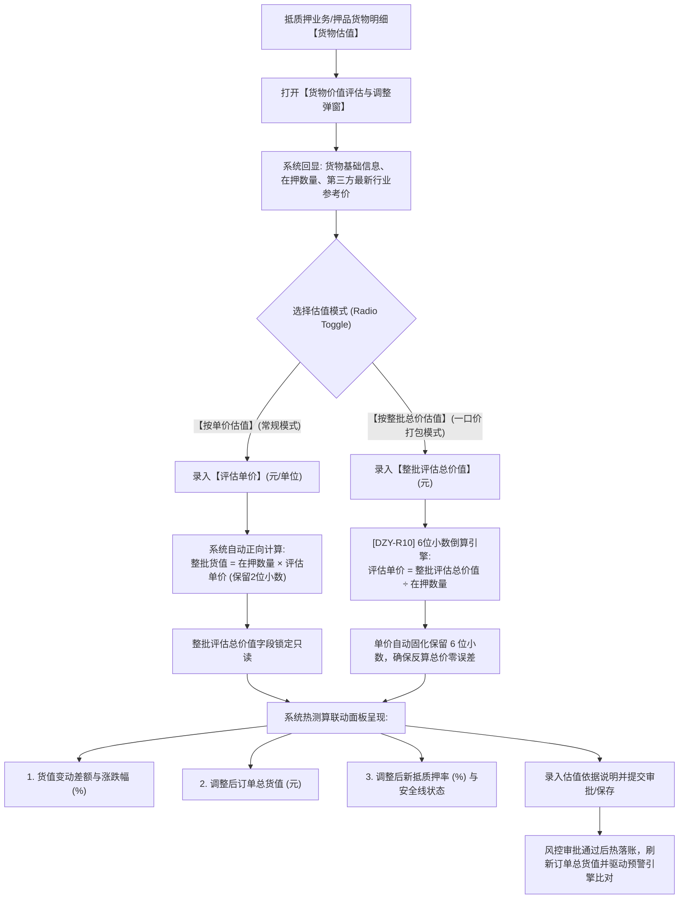

# 行业参考价与货物估值主PRD

> **文档层级**：核心主 PRD（SSOT 真源）  
> **所属模块**：03-融资监管 / 07-抵质押业务-抵质押业务管理  
> **功能定位**：大宗公允参考价接入规范 · 未定价风险警示 · 货物估值组件（单价/总价双轨切换与6位倒算精度）  
> **版本**：V1.0 定稿版 | **更新时间**：2026-09-11 | **责任人**：产品团队

---

## 1. 业务背景与业务目标

### 1.1 业务背景
动产质押融资的核心风控底座在于质押物公允市值的准确度量。大宗商品价格受国内外宏观经济、现货期货基差等多重因素影响频繁剧烈波动。若存货定价失真，抵质押率将失去风险预警效力。过去系统仅支持经办人录入单价，遇到整批资产一口价评估或司法打包受让时，经办人手动倒除单价极易因循环小数产生“分钱精度倒挂”引发账实不符。同时，若当日未获取到有效报价，系统需具备未定价风险警示能力。

### 1.2 业务目标
1. **行情权威接入与术语统一**：全系统统一命名为**【行业参考价】**，接入 SMM、Mysteel、生意社等权威数据源，工作日定时拉取基准指导价；
2. **未定价 ⚠️ 风险闭环**：对无报价货物高亮展示琥珀色 `未定价 ⚠️` 徽标，并在看板统计，杜绝估值真空；
3. **估值组件双模式无损自由切换**：支持【按单价估值】与【按整批总价估值】双轨模式，总价倒算单价时保留 6 位小数，确保四舍五入反算总价无分钱误差；
4. **实时热测算与安全线比对**：调整估值时，前端实时试算订单总货值、新抵押率、变动差额，并与安全线实时比对。

---

## 2. 总体架构与业务流转图

---

## 3. 页面功能说明与界面骨架

### 3.1 未定价 ⚠️ 警示与行情走势
1. **未定价高亮呈现**：
   * 货物明细行【行业参考价】为空时，展示琥珀色告警徽标 `未定价 ⚠️`；
   * Hover 提示：`该规格暂未匹配到第三方行业参考价，当前抵押率可能失真，请补充报价或手动重新估值`。
2. **7天/30天走势折线图**：
   * 点击【查看走势图】，弹出轻量级 Chart Modal，展示近 7 天与近 30 天的第三方均价曲线与区间振幅。

### 3.2 货物估值弹窗 (Modal)
1. **顶部货物现状（只读）**：
   * 货物编号、品名规格、货位、在押数量/净重、最新行业参考价；
2. **模式切换与估值表单**：
   * 单选：`( ) 按单价估值` 与 `(●) 按整批总价估值 (支持一口价打包)`；
   * **按单价估值时**：单价可输入，总价只读自动算；
   * **按总价估值时**：总价可输入，单价只读倒算并保留 6 位小数；
3. **试算效果看板**：
   * 原评估价值、本次调整差额（红跌绿涨）、调整后订单总货值、调整后预计抵押率（对比安全线）；
4. **估值依据与附件**：
   * 估值依据说明（必填，$\le 200$ 字符）；
   * 估值凭证/询价函原件（选填附件）。

---

## 4. 关联三件套索引

* **字段清单**：[行业参考价与货物估值字段清单.md](./行业参考价与货物估值字段清单.md)
* **业务规则规格**：[行业参考价与货物估值业务规则规格.md](./行业参考价与货物估值业务规则规格.md)
