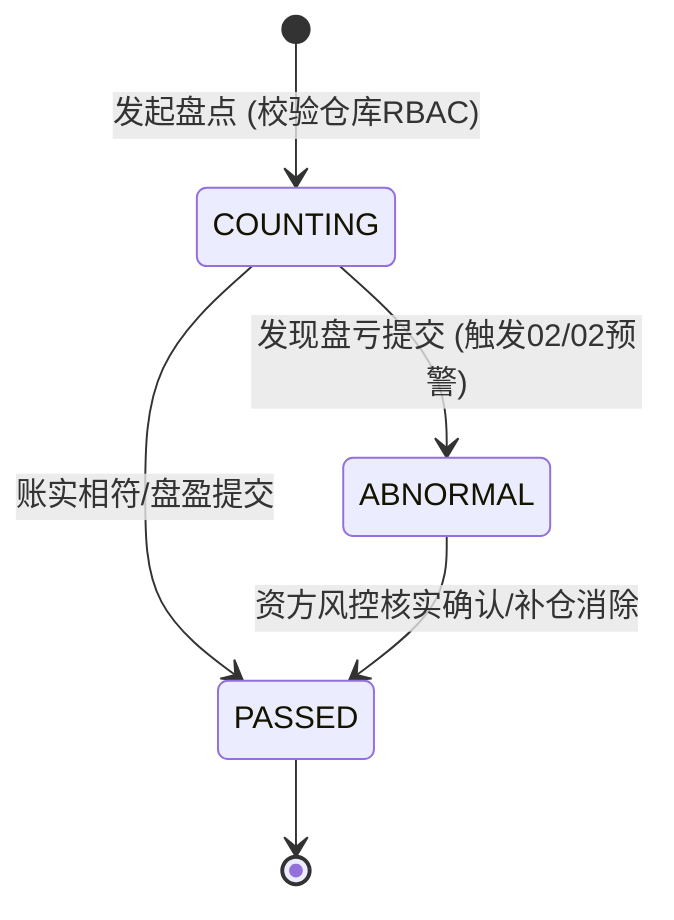
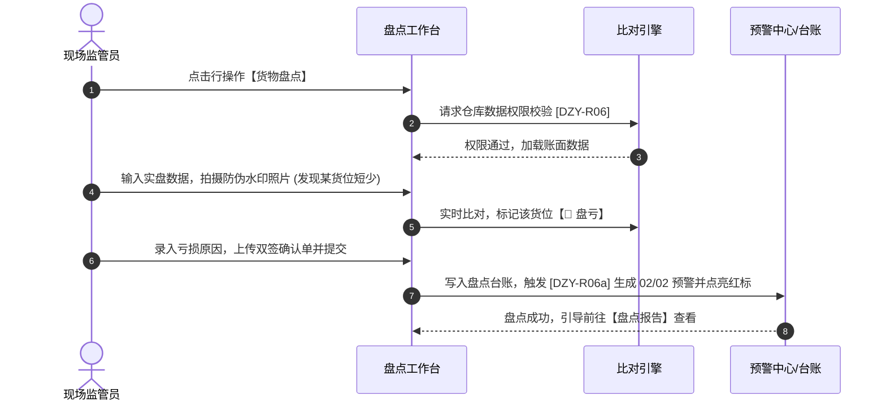

# 货物盘点业务规则规格

> **适用功能**：抵质押业务管理 · 06-货物盘点  
> **版本**：V1.0 定稿版 | **更新时间**：2026-09-11 | **责任人**：现场风控团队

---

## 1. 状态机模型与流转表

### 1.2 状态流转表

| 起始状态 | 触发动作 | 目标状态 | 操作角色 | 校验与核心规则 | 系统核心副作用 |
| :--- | :--- | :--- | :--- | :--- | :--- |
| **生效在押** | 发起盘点 | `COUNTING` | 现场监管员 | 用户必须拥有订单所在实体仓库权限（DZY-R06） | 锁定账面数量基准 |
| `COUNTING` | 提交相符盘点 | `PASSED` | 现场监管员 | 实盘 $\ge$ 账面，防伪水印实照齐全 | 盘点记录归档，供【盘点报告】调用 |
| `COUNTING` | 提交盘亏盘点 | `ABNORMAL` | 现场监管员 | 必须录入亏损原因，必须上传双签底稿原件 | 触发 [DZY-R06a]，生成 02/02 押品短少预警，订单点亮红标 |

---

## 2. 核心业务规则 (Business Rules)

### 2.1 [DZY-R06] 仓库数据权限强隔离 (Warehouse RBAC Guard)
用户必须拥有订单存货所在物理仓库的授权，否则强阻断进入盘点工作台，杜绝异地脱岗虚假盘点。

### 2.2 [DZY-R06a] 盘亏异常联动 02/02 押品预警 (Inventory Shortage Alert)
只要任意货位出现实盘小于账面（$\Delta Q < 0$）：
1. 强制综合结论为【存在盘亏异常】；
2. 强制录入 $\ge 10$ 字原因，上传监管与仓管手写双签确认单；
3. 后台立即向 02/02 预警中心写入一条严重短少预警，主订单列表点亮红标。

---

## 3. 货物盘点交互时序图

