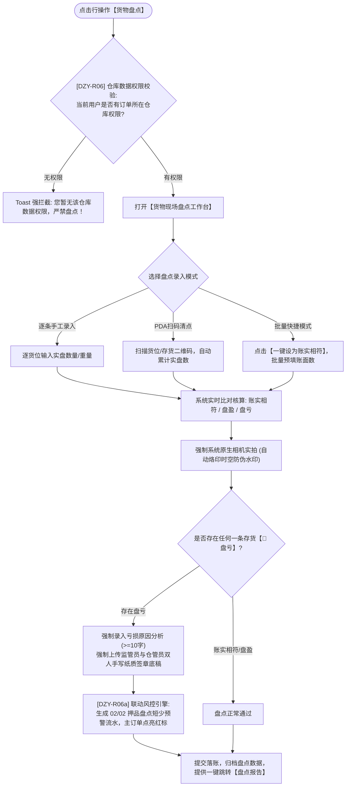

# 货物盘点主PRD

> **版本**：V1.0 | 2026-09-11  
> **所属模块**：03-融资监管 / 07-抵质押业务-抵质押业务管理 / 06-货物盘点  
> **入口路径**：  
> • PC 端：`融资监管 → 抵质押业务 → 抵质押业务管理 → 行操作【更多操作 ▾】→ 【货物盘点】`  
> • H5 移动端：`抵押/质押列表卡片 → 【更多操作】抽屉 → 【货物盘点】`  
> **配套文档**：[货物盘点字段清单](./货物盘点字段清单.md) · [货物盘点业务规则规格](./货物盘点业务规则规格.md)

---

## 1. 业务背景与功能定位

动产质押融资的核心操作风险在于“账实不符、虚报短少、空仓偷运”。金融机构与监管企业必须定期或动态执行现场实物盘点。**【货物盘点】**功能为现场监管人员提供标准化的清点核验工作台，支持逐条盘点、PDA 扫码与批量一键设为账实相符，强制调用原生硬件相机拍摄带有防伪时空水印的现场照片，并在发现盘亏异常时强制双人手写签字并触发押品短少预警。

---

## 2. 业务全景流转架构

---

## 3. 页面功能说明与界面骨架

### 3.1 盘点工作台骨架
1. **任务抬头**：关联订单号、借款主体、监管仓库、盘点人、执行时间；
2. **快捷操作**：`[ 一键设为账实相符 ]`、`[ 导出盘点表格 ]`；
3. **明细清单**：存货编码、品名规格、货位、账面数、实盘数（必填）、差异判定（绿色相符/蓝色盘盈/红色加粗盘亏）、实拍照片（每货位必传）；
4. **结论与签字**：综合盘点结论、原因陈述、双签底稿原件扫描件。
