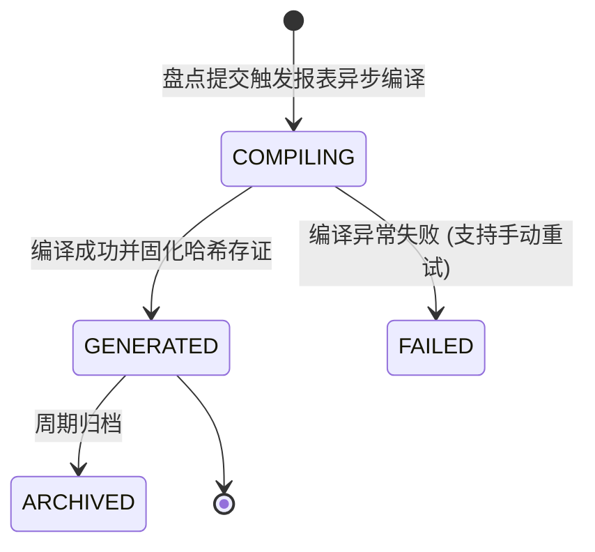
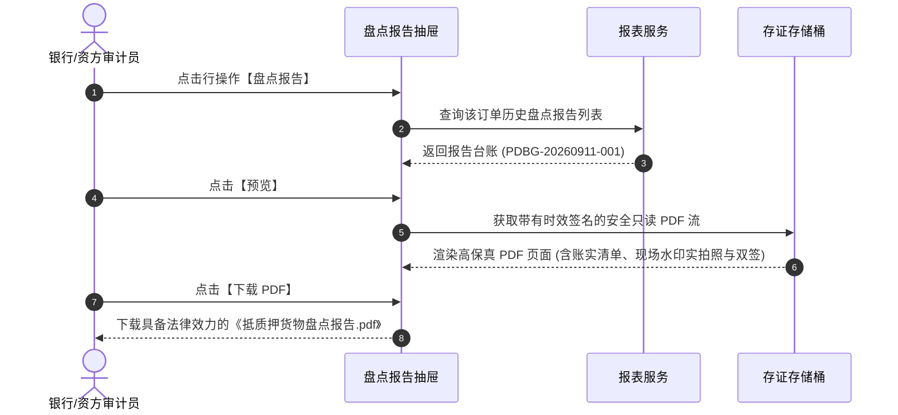

# 盘点报告业务规则规格

> **适用功能**：抵质押业务管理 · 07-盘点报告  
> **版本**：V1.0 定稿版 | **更新时间**：2026-09-11 | **责任人**：合规与报告技术团队

---

## 1. 状态机模型与流转表

### 1.2 规则与状态表

| 起始状态 | 触发动作 | 目标状态 | 操作角色 | 核心规则 |
| :--- | :--- | :--- | :--- | :--- |
| `COMPILING` | 异步编译完成 | `GENERATED` | 报表引擎 | 自动提取盘点流水、货位防伪水印原图与监管双签印章，合成防伪二维码与公章 |
| `GENERATED` | 在线预览/下载 | `GENERATED` | 资方/监管员 | 校验当前用户订单数据权限，下载时记录审计日志 |

---

## 2. 核心业务规则 (Business Rules)

### 2.1 [DZY-R07] 报告防篡改存证与扫码验真 (Anti-Tamper Audit)
* 生成的 PDF 报告在文件底层计算 SHA-256 哈希；
* 报告首页面内嵌动态防伪验真二维码，资方审计人员使用手机扫描二维码，可直接打开系统存证存根页面比对哈希值。

---

## 3. 盘点报告交互时序图

