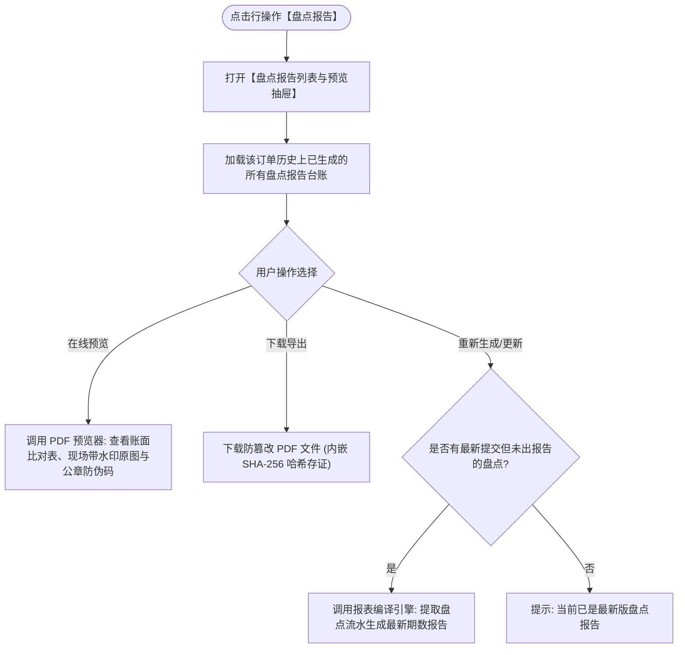

# 盘点报告主PRD

> **版本**：V1.0 | 2026-09-11  
> **所属模块**：03-融资监管 / 07-抵质押业务-抵质押业务管理 / 07-盘点报告  
> **入口路径**：  
> • PC 端：`融资监管 → 抵质押业务 → 抵质押业务管理 → 行操作【更多操作 ▾】→ 【盘点报告】`  
> • H5 移动端：`抵押/质押列表卡片 → 【更多操作】抽屉 → 【盘点报告】`  
> **配套文档**：[盘点报告字段清单](./盘点报告字段清单.md) · [盘点报告业务规则规格](./盘点报告业务规则规格.md)

---

## 1. 业务背景与功能定位

**【盘点报告】**功能是现场实物盘点成果的法定呈现与审计中枢。系统在现场盘点完成时，自动聚合账面数据、实盘数量、差异比对、带时空防伪水印的现场货位实拍照、监管员与仓管员双人电子/手写签字，动态编译生成具备司法效力与防伪二维码的标准 PDF 报告，支持在线预览、验真、批量下载与历史报告版本对比。

---

## 2. 业务全景流转架构

---

## 3. 页面功能说明与界面骨架

### 3.1 盘点报告抽屉骨架
1. **历史报告清单**：报告编号（如 `PDBG-20260911-001`）、盘点日期、执行监管员、盘点结论（账实相符/存在盘亏）、生成时间、操作项（`[预览]`、`[下载]`）；
2. **PDF 预览区**：高保真呈现封面、项目概况、账实差异清单表、现场防伪影像画册、双签签章页。
