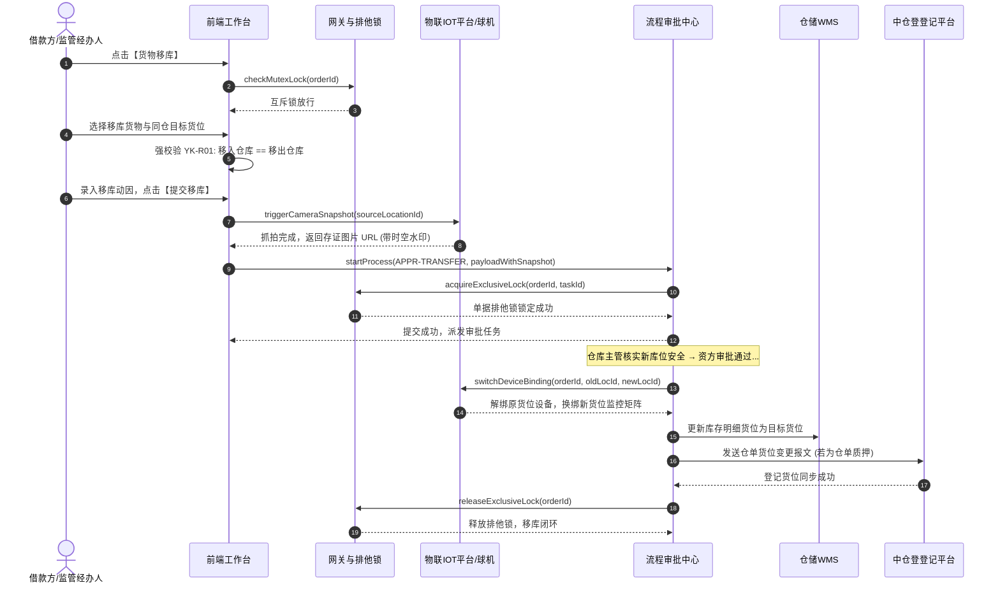

# 货物移库业务规则规格

> **版本**：V1.0 | 2026-09-11  
> **所属模块**：03-融资监管 / 07-抵质押业务-抵质押业务管理 / 货物移库  
> **配套文档**：[货物移库主PRD](./货物移库主PRD.md) · [货物移库字段清单](./货物移库字段清单.md) · [抵质押业务管理业务规则规格](../../抵质押业务管理业务规则规格.md)

---

## 1. 货物移库状态机与生命周期

### 1.1 状态定义
| 状态编码 | 中文名称 | 业务含义 | 允许的操作 |
| :--- | :--- | :--- | :--- |
| `DRAFT` | **草稿** | 保存移库表单草稿，未触发自动抓拍与提交 | 编辑、删除草稿、提交移库 |
| `PENDING_AUDIT` | **审批中** | 申请已提交，球机已抓拍存证，单据施加排他互斥锁 | 资方/监管审签、发起人撤回 |
| `APPROVED` | **已生效 (终态)** | 终审通过，自动解绑旧设备并换绑新设备，货位变更落账 | 查看详情、查看审计、中仓登流水 |
| `REJECTED` | **已驳回 (终态)** | 审批不通过，释放排他锁与在途标记，原货位不变 | 查看详情、重新发起 |

---

## 2. 核心业务规则 (R 规则)

### YK-R01：绝对禁止跨物理仓移库规则 (DZY-R05)
* **业务红线**：货物移库仅允许在同一物理仓库内部换排、换架、换垛；
* **强控制机制**：
  - 前端界面上“移入仓库”强制锁定只读，严格显示与“移出仓库”完全一致的文本；
  - 后端接口强校验：`target_warehouse_id === source_warehouse_id`，若不一致直接抛出 400 业务异常强阻断。

### YK-R02：点击提交毫秒级球机自动抓拍规则
* 经办人点击【提交移库】瞬间，网关拦截请求并异步向负责监控移出货位的智能云台球机下发拍照命令；
* 球机自动转至预置位抓拍高清实况，打上带有服务器授时的时间戳和货位防伪水印，写入司法存证快照库；
* 抓拍图片自动依附至审批流表单，作为审批人核验货物物理在库且完好的第一证据。

### YK-R03：目标货位可用性与非同位校验
* 目标货位不能等于当前货位；
* 目标货位必须处于同仓库内，且经 WMS 校验处于空闲或承重/容积允许堆码的状态。

### YK-R04：终审后 IoT 智能监控设备自动无缝换绑规则
* 移库终审生效瞬间，物联中台自动执行设备拓扑重构：
  1. 解除当前在押订单对原移出货位所有球机、枪机、温湿度传感器的设备绑定；
  2. 自动检索目标新货位已部署的智能设备矩阵，将目标货位的摄像头实时流与传感器自动挂载至该订单；
  3. 确保风控人员进入【查看监控】时，实时视频画面无缝切换至新库位。

### YK-R05：中仓登 1.3.2 货位变更自动备案规则
* 若订单为电子仓单质押，移库审批通过后系统自动组装 `RECEIPT_LOCATION_UPDATE` 报文，调用中仓登 1.3.2 接口更新质物登记货位，保障司法登记信息与实物完全一致。

---

## 3. 端到端业务时序图

