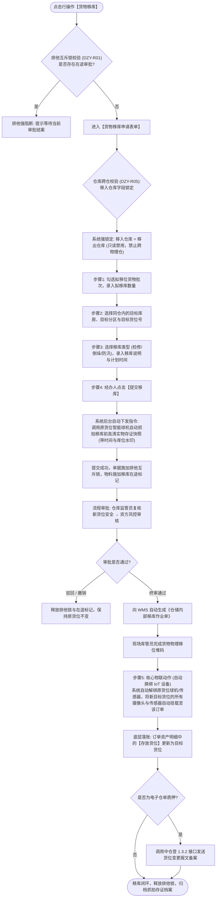

# 货物移库主PRD

> **版本**：V1.0 | 2026-09-11  
> **所属模块**：03-融资监管 / 07-抵质押业务-抵质押业务管理 / 货物移库  
> **入口路径**：  
> • PC 端：`融资监管 → 抵质押业务 → 抵质押业务管理 → 行操作【更多操作 ▾】→ 【移库】/【货物移库】`  
> • H5 移动端：`抵押/质押列表卡片 → 【更多操作】抽屉 → 【货物移库】`  
> **配套文档**：[货物移库字段清单](./货物移库字段清单.md) · [货物移库业务规则规格](./货物移库业务规则规格.md) · [抵质押业务管理主PRD](../../抵质押业务管理主PRD.md)

---

## 1. 业务背景与功能定位

在质押存续期内，因承储监管仓库内部的库房维护、消防管道检修、防潮防汛倒垛或库位空间优化，需将在押动产在**同一物理监管仓库内部**从原货位转移至新货位。

**【货物移库】** 模块规范了在押货物的库内移动流转，设立了“绝对禁止跨仓移库硬红线 $\rightarrow$ 移入目标货位精确圈选 $\rightarrow$ 点击提交自动联动球机抓拍现场存证 $\rightarrow$ 仓管员与资方协同审批 $\rightarrow$ 物理移位确认 $\rightarrow$ IoT 智能监控设备自动无缝换绑 $\rightarrow$ 中仓登 1.3.2 货位变更备案”的完整闭环，确保在押货物全程不脱管、监控不断链。

---

## 2. 业务全景流转架构

---

## 3. PC 端页面与核心交互规格

### 3.1 核心风控红线与前置锁定

#### 1. 绝对禁止跨仓移库 (DZY-R05)
* **业务法理**：跨仓库移动涉及社会道路运输、无物联监控盲区、承储责任主体移转及在途货权脱管等重大信贷风险；
* **界面实现**：表单顶栏“移出仓库”与“移入仓库”展示同一仓库全称，“移入仓库”字段**强制置灰锁定，绝不允许下拉切换**。后端接口若接收到 `target_warehouse_id != source_warehouse_id` 强行抛错拦截。

#### 2. 毫秒级摄像头自动抓拍取证机制
* 经办人在点击【提交移库】按钮瞬间，前端无需弹出上传照片组件；
* 服务端接收请求后，自动向部署在原货位上方的安防云台球机下发 PTZ 预置位拍照指令，抓拍货物当前堆码高清快照，作为司法存证附件自动关联至该审批单。

---

### 3.2 移库申请表单界面布局

1. **移库基础信息 (顶栏锁定区)**：
   - 移出仓库：`无锡众捷物流园 1 号监管仓 (只读)`；
   - 移入仓库：`无锡众捷物流园 1 号监管仓 (系统强锁定，不可更改)`；
2. **选择拟移库货物与目标货位 (中层表格)**：
   - 列定义：`复选框`、`存货条码`（附 📱 图标）、`品名/规格`、`当前货位`、`在押数量`、`拟移库数量`、`目标货位 (必选下拉框)`；
   - 目标货位下拉框仅加载同仓库内空闲或可用容量充足的合格货位；
3. **移库原因与计划安排 (底层填报区)**：
   - 移库类型下拉框：`库位维修/保养`、`防汛防潮倒垛`、`库区空间优化`、`消防整改`；
   - 移库原因详细说明（必填，$\le 200$ 字符）；
   - 计划移库起止时间（必填，日期时间选择器）；
   - 自动抓拍联动提示：`📷 提交时系统将自动联动原货位智能监控球机抓拍现场实况，无需手动上传`。

---

## 4. 终审后 IoT 设备自动无缝换绑机制

1. **自动解绑原库位**：审批终审通过时，系统自动取消当前订单对原货位温湿度传感器、红外对射及摄像头视频流的订阅；
2. **自动挂载新库位**：系统自动将目标新货位安装的所有球机、枪机及 IoT 传感器挂载至该订单项下；
3. **闭环效应**：保证资方与风控人员在【查看监控】时，视频画面始终紧盯货物实际物理所在货位，杜绝移库后“镜头看空”重大漏洞。

---

## 5. 验收标准

1. **跨仓强阻断**：移入仓库前端锁定只读，后端若传入异地仓库 ID 强行报错；
2. **自动抓拍留痕**：提交后在审批详情中可立即查阅系统自动抓拍的原货位高清现场照片；
3. **监控自动换绑**：移库终审通过后，进入【查看监控】验证视频流与设备列表已自动更新为新货位绑定的设备；
4. **明细货位刷新**：订单详情【抵押物明细】中该货物的存放货位正确变更为目标货位。
