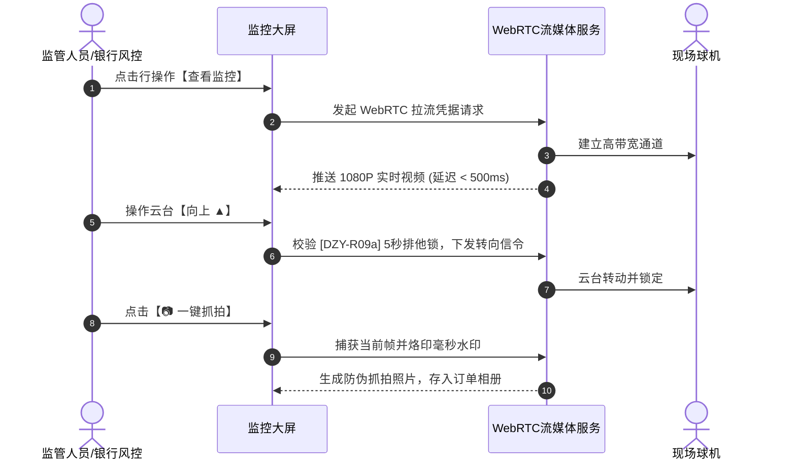

# 查看监控业务规则规格

> **适用功能**：抵质押业务管理 · 09-查看监控  
> **版本**：V1.0 定稿版 | **更新时间**：2026-09-11 | **责任人**：音视频与物联架构团队

---

## 1. 业务规则 (Business Rules)

### 1.1 [DZY-R09] 无设备空态保护机制 (Empty State Guard)
若订单尚未在任何货位绑定摄像头硬件，用户点击【查看监控】时强阻断弹出错误或黑屏，而是渲染友好的空态引导页，提供【立即去绑定设备】按钮，唤起设备绑定弹窗。

### 1.2 [DZY-R09a] 云台 PTZ 控制信令 5 秒排他锁 (PTZ Concurrency Lock)
用户在对摄像头进行旋转、变焦控制时，系统下发 5 秒排他锁；并发用户尝试操作时提示：`当前已有其他监管员正在操控云台，请稍候再试`，防范机械冲突。

### 1.3 [DZY-R09b] 一键抓拍毫秒水印存证 (Snapshot Legal Proof)
截屏抓拍瞬间由流媒体服务器在底层像素固化精确到毫秒的时间戳与货位编号，生成 SHA-256 存证哈希并永久归档至相册。

---

## 2. 查看监控交互时序图

