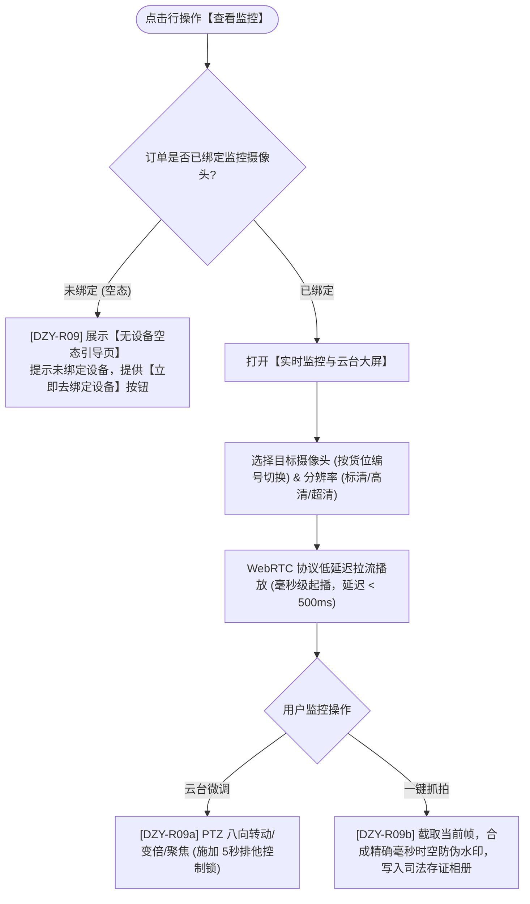

# 查看监控主PRD

> **版本**：V1.0 | 2026-09-11  
> **所属模块**：03-融资监管 / 07-抵质押业务-抵质押业务管理 / 09-查看监控  
> **入口路径**：  
> • PC 端：`融资监管 → 抵质押业务 → 抵质押业务管理 → 行操作【更多操作 ▾】→ 【查看监控】`  
> • H5 移动端：`抵押/质押列表卡片 → 【更多操作】抽屉 → 【查看监控】`  
> **配套文档**：[查看监控字段清单](./查看监控字段清单.md) · [查看监控业务规则规格](./查看监控业务规则规格.md)

---

## 1. 业务背景与功能定位

动产质押融资的核心风控特色在于“看得见存货、穿透监管”。**【查看监控】**功能为金融机构、核心企业与监管方提供远程低延迟实时视频直播流查看、摄像头多路切换、云台 PTZ 远程控制与一键防伪抓拍存证能力，彻底消除盲区。当订单尚未绑定任何硬件设备时，提供友好空态引导。

---

## 2. 业务全景流转架构

---

## 3. 页面功能说明与界面骨架

### 3.1 监控大屏骨架
1. **顶部控制栏**：当前摄像头下拉切换（直视货位 A-01-01）、清晰度切换（480P/720P/1080P）、实时下行码率；
2. **视频播放画廊**：画面中央低延迟视频流，右下角内嵌当前秒级系统时钟防伪水印；
3. **右侧 PTZ 控制面板**：八向方向按键、变倍 Zoom In/Out、步长滑块（1~8档）、预置位巡航；
4. **一键抓拍按钮**：点击即时抓拍，生成相册快照并支持下载。
