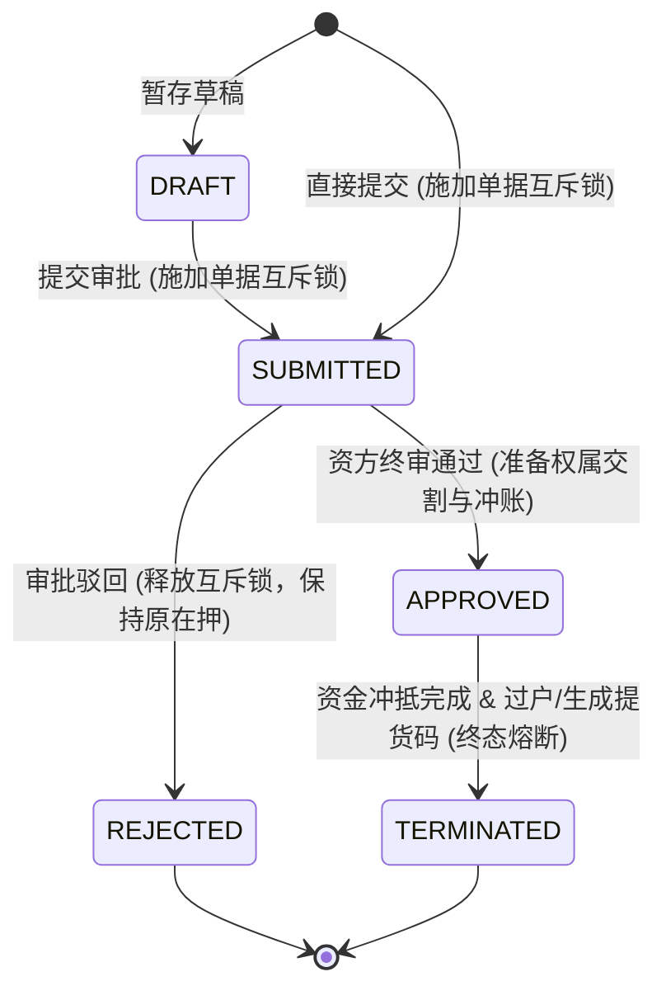
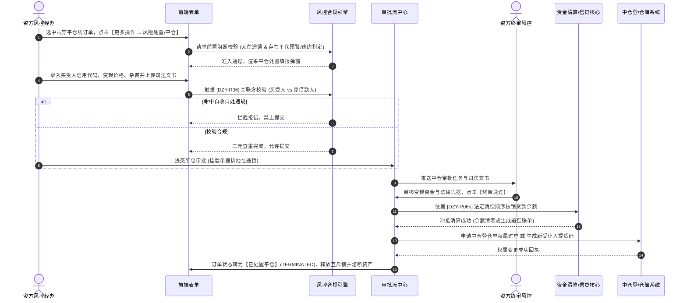

# 风险处置与平仓业务规则规格

> **适用功能**：抵质押业务管理 · 风险处置与平仓  
> **核心使命**：对已击穿平仓线且补仓失败，或发生借款人实质违约的质押资产，依法依规强制实施资产变现、债权折价清偿或权属过户，落实法定义务与合规存证。  
> **版本**：V1.0 定稿版 | **更新时间**：2026-09-11 | **责任人**：风控与产品团队

---

## 1. 状态机模型与流转表

### 1.1 处置申请单生命周期状态机

### 1.2 状态流转与权限矩阵

| 起始状态 | 触发动作 | 目标状态 | 操作角色 | 前置条件与拦截校验 | 系统核心动作与副作用 |
| :--- | :--- | :--- | :--- | :--- | :--- |
| **生效在押** | 提交处置申请 | `SUBMITTED` | 资方风控经办 | 订单无其他在途任务；已触发严重平仓预警或判定实质性违约 | 挂载单据排他在途锁，冻结解押、移库、出库操作 |
| `SUBMITTED` | 资方终审驳回 | `REJECTED` | 资方风控主管 | 必填 $\ge 10$ 字驳回原因 | 释放单据互斥锁，主订单恢复正常在押与预警监控状态 |
| `SUBMITTED` | 资方终审通过 | `APPROVED` | 资方风控终审人 | 关联方排查通过、司法文书已验真、对价款已到账 | 锁定订单资产不可回滚；触发资金分配与权属变更 |
| `APPROVED` | 交割与清算落账 | `TERMINATED` | 系统自动/资金清算 | 资金冲账成功、中仓登过户成功或提货码生成 | 订单主状态变更为【已处置平仓】；固化司法快照，解除物联监控 |

---

## 2. 核心业务规则 (Business Rules)

### 2.1 [DZY-R06] 禁止原借款人/原货主自收自处强阻断红线 (Self-Disposal Ban)
* **业务红线**：为严防借款人恶意利用虚构关联交易自导自演低价平仓、侵吞质押物并逃废金融机构债务，受让买受方严禁为原在押主体或其关联方。
* **判定算法与强阻断规则**：
  1. 系统在前端与后端双向校验买受方证件代码：
     $$\text{受让方证件代码} \neq \text{原借款企业统一社会信用代码} \quad \land \quad \text{受让方证件代码} \neq \text{原存货货主信用代码}$$
  2. 机构买受方的法定代表人姓名、自然人买受方身份证号，若与原借款企业法定代表人或实际控制人一致，系统触发一票否决；
  3. 命中违规规则时，系统强行阻断提交，弹窗报错：`【合规严重拦截】受让人与原借款人/货主存在自收自处关联风险，严禁实施受让平仓！`。

### 2.2 [DZY-R06a] 买受人二元查重与资质自动建档机制 (Dual Deduplication)
* **查重主键**：
  * 机构买受方：以【统一社会信用代码】为全局唯一索引；
  * 个人买受方：以【身份证号码 + 手机号码】为全局唯一索引；
* **业务行为**：
  * 若查重命中已有合格买受人库，自动带出企业资质等级、历史受让记录与开票信息；
  * 若查重未命中，在资方终审批准平仓时，系统自动在【合格受让方档案库】新建档案，固化资质并标注首笔业务订单号。

### 2.3 [DZY-R06b] 变现资金冲抵贷款本息法定分配顺序 (Proceeds Allocation)
* 处置变现款入账后，系统严格遵循金融担保法定清偿顺序进行自动化分账核销：
  $$\text{处置净变现额} = \text{变现成交总价} - \text{处置相关税费与监管杂费}$$
  $$\text{冲抵贷款本息} = \min(\text{处置净变现额}, \text{贷款余额})$$
* **差额处理分支**：
  * **盈余分支**（$\text{处置净变现额} > \text{贷款余额}$）：
    $$\text{退还原借款人结余额} = \text{处置净变现额} - \text{贷款余额}$$
    系统生成退款流水，通知资方将超额变现资金退还至借款企业指定监管账户；
  * **差额追偿分支**（$\text{处置净变现额} < \text{贷款余额}$）：
    $$\text{尚欠清算差额} = \text{贷款余额} - \text{处置净变现额}$$
    贷款余额被扣减至差额数值，系统自动生成【法务债权追偿单】，转入资方不良资产催收台账，保留追索权。

### 2.4 [DZY-R06c] 资产形态交割分支规约 (Asset Delivery Branching)
* **分支 A：普通现货存货**
  * 资方审批通过后，系统自动冻结原借款人的所有提货与盘点权限；
  * 自动在仓储系统中为新买受方生成【风险受让提货凭证（加密条码）】，买受方凭凭证前往仓库提货。
* **分支 B：电子仓单质权**
  * 资方审批通过后，触发调用中仓登 1.3.2 接口，上报《仓单质权实现与权属过户申请》；
  * 中仓登返回成功并生成过户注销编号后，系统自动将仓单权属人变更为主买受方。

---

## 3. 风险处置与平仓交互时序图

---

## 4. 数据一致性与不可变存证要求

1. **强事务原子性**：资金冲减、贷款余额扣减、中仓登过户与提货码生成必须纳入同一分布式事务；任何一步失败必须触发整体回滚，严防资产已过户但债务未冲抵的不对等风险。
2. **司法级证据快照**：司法裁定书原件、拍卖成交确认书、资金清算银行回执、买受人法人资质证明在审批通过瞬间生成不可篡改 SHA-256 哈希存证，永久作为应对借款人诉讼纠纷的抗辩法定凭据。
