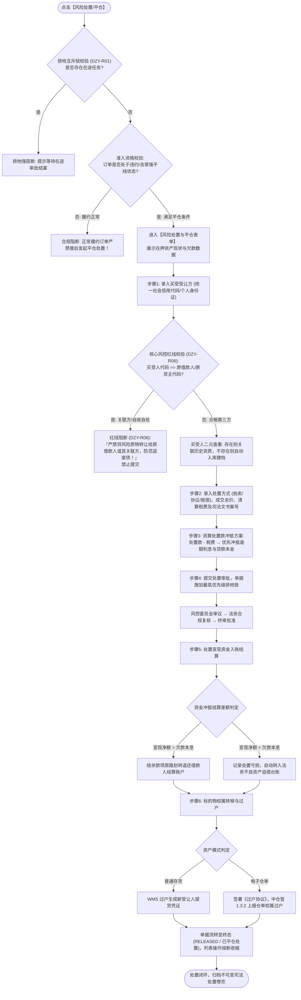

# 风险处置与平仓主PRD

> **版本**：V1.0 | 2026-09-11  
> **所属模块**：03-融资监管 / 07-抵质押业务-抵质押业务管理 / 风险处置与平仓  
> **入口路径**：  
> • PC 端：`融资监管 → 抵质押业务 → 抵质押业务管理 → 行操作【更多操作 ▾】→ 【风险处置】/【平仓】`  
> • H5 移动端：`抵押/质押列表卡片 → 【更多操作】抽屉 → 【风险处置】`  
> **配套文档**：[风险处置与平仓字段清单](./风险处置与平仓字段清单.md) · [风险处置与平仓业务规则规格](./风险处置与平仓业务规则规格.md) · [抵质押业务管理主PRD](../../抵质押业务管理主PRD.md)

---

## 1. 业务背景与功能定位

当借款企业发生实质性信贷违约（如贷款严重逾期、拒不履行补仓义务或在押货值击穿强平线且宽限期届满）时，出资金融机构为保全债权本息，依据《中华人民共和国民法典》担保物权篇及质押借款合同约定，依法行使动产质权，对在押质物启动强制拍卖、折价变卖或司法裁定过户。

**【风险处置与平仓】** 模块提供了标准合规的资产处置与债务核销流程。系统内置了“严重违约平仓准入校验 $\rightarrow$ 买受人原货主回避强红线拦截 $\rightarrow$ 买受人二元查重自动建档 $\rightarrow$ 司法文书与变现对价录入 $\rightarrow$ 处置款法定顺序清偿冲抵 $\rightarrow$ 标的物权属过户 $\rightarrow$ 中仓登过户备案 $\rightarrow$ 订单终结闭环”，彻底杜绝借款人自导自演“假平仓逃废债”与处置资金脱管漏洞。

---

## 2. 业务全景流转架构

---

## 3. 核心风控红线与 PC 表单规格

### 3.1 禁止原借款人/原货主自收自处红线 (DZY-R06)
* **业务法理**：在信贷实践中，部分违约企业通过壳公司或亲属以超低处置价受让质押资产，既低价赎回了货物，又将银行贷款打入不良烂账，属于典型的虚假平仓逃废债犯罪行为；
* **强校验拦截**：系统在录入买受人统一社会信用代码、企业名称、法定代表人身份证时，强校验 `buyer_credit_code !== borrower_credit_code`。命中直接拦截报错并记录合规预警日志。

---

### 3.2 风险处置与平仓办理表单界面布局

1. **在押资产现状与违约事实 (顶栏警告区)**：
   - 借款人全称、在押货物总货值、当前待清偿贷款本息余额、预警状态（`🔴 严重平仓预警`）；
2. **买受受让方信息 (中层填报区)**：
   - 买受主体类型：单选按钮 `(●) 机构买受方    ( ) 个人买受方`；
   - 机构买受方全称（必填，$\le 100$ 字符）；
   - 统一社会信用代码（必填，18位代码；输入后右侧即时展示 `[✔️ 系统核验通过: 非关联方]`）；
   - 受让法定代表人姓名与经办人联系电话；
3. **处置方案与资金对价录入 (风控核算区)**：
   - 处置方式下拉框：`司法拍卖成交`、`第三方协议变卖`、`以物抵债折价抵偿`；
   - 变现成交总价（必填，金额万元，保留 2 位小数）；
   - 处置税费与保管费（必填，金额万元）；
   - 冲抵贷款本息金额（系统自动计算并展示：冲抵后贷款余额是否已清零或尚欠差额）；
4. **法律依据与司法文书 (底层司法存证区)**：
   - 司法文书类型下拉框：`法院执行裁定书`、`拍卖成交确认书`、`变卖处置协议书`；
   - 执行案号 / 文书编号（必填，如 `(2026)苏02执恢88号`）；
   - 文书原件扫描件（必填，支持上传包含法院公章的 PDF 扫描件，单个 $\le 30\text{MB}$）。

---

## 4. 处置变现资金法定分配与闭环规则

变现款项必须严格按照《民法典》担保物权法定的清偿顺序进行入账冲抵：
1. **第一顺序**：支付司法拍卖佣金、过户契税与监管仓储保管费用；
2. **第二顺序**：冲抵借款合同约定的逾期罚息与应计利息；
3. **第三顺序**：冲抵借款合同项下的未还贷款本金（冲抵后贷款余额正式归零）；
4. **结余与亏损清算**：
   - **结余退还**：处置款冲抵后仍有剩余资金的，结余款依法原路划转退还借款人指定账户；
   - **差额追偿**：若处置款不足以清偿本息，不足部分生成追偿债权流水，订单虽结案但借款人仍承担无限连带保证责任。

---

## 5. 验收标准

1. **原货主回避 100% 拦截**：录入原货主统一社会信用代码时，系统强阻断并给出明确合规提示；
2. **二元查重入库**：首次录入买受人成功后，档案中心自动新增买受人资质档案；
3. **资金冲抵逻辑闭环**：变现款严格按费用 $\rightarrow$ 利息 $\rightarrow$ 本金顺序冲减，差额计算准确无误；
4. **中仓登过户与熔断**：终审通过后，中仓登接口正确同步权属过户凭证，订单进入已处置终态。
