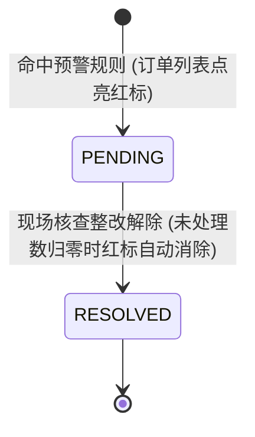
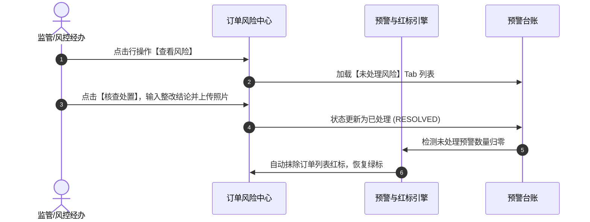

# 查看风险业务规则规格

> **适用功能**：抵质押业务管理 · 11-查看风险  
> **版本**：V1.0 定稿版 | **更新时间**：2026-09-11 | **责任人**：风控处置团队

---

## 1. 状态机模型与流转表

---

## 2. 核心业务规则 (Business Rules)

### 2.1 [DZY-R11] 订单列表红标联动与消除规则 (Red Badge Closed-Loop)
* **点亮机制**：只要订单存在 $\ge 1$ 条处于 `PENDING`（未处理）状态的预警流水，列表订单号右侧点亮 `🔴 存在未处理风险`；
* **消除机制**：经办人完成核查处置并提交结案后，预警转为 `RESOLVED`；当且仅当未结案预警数严格等于 0 时，系统自动抹除列表红标。

---

## 3. 查看风险交互时序图

