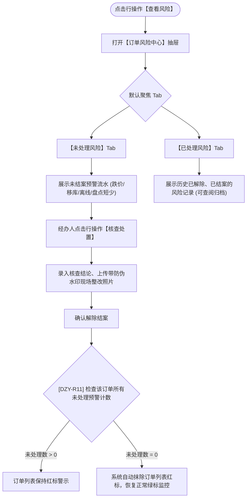

# 查看风险主PRD

> **版本**：V1.0 | 2026-09-11  
> **所属模块**：03-融资监管 / 07-抵质押业务-抵质押业务管理 / 11-查看风险  
> **入口路径**：  
> • PC 端：`融资监管 → 抵质押业务 → 抵质押业务管理 → 行操作【更多操作 ▾】→ 【查看风险】`  
> • H5 移动端：`抵押/质押列表卡片 → 【更多操作】抽屉 → 【查看风险】`  
> **配套文档**：[查看风险字段清单](./查看风险字段清单.md) · [查看风险业务规则规格](./查看风险业务规则规格.md)

---

## 1. 业务背景与功能定位

动产抵质押监管存续期内，押品可能遭遇市场跌价、设备掉线、异常移库、现场盘亏等多种风险。**【查看风险】**（原查看预警）提供订单级的集中风险看板，采用【未处理风险】与【已处理风险】双 Tab 架构，实现预警穿透查看、现场核查处置解除，并驱动订单列表红标的点亮与清零自动消除。

---

## 2. 业务全景流转架构

---

## 3. 页面功能说明与界面骨架

### 3.1 订单风险中心抽屉
1. **双 Tab 导航**：`[ 未处理风险 ( 1 ) ]`（红色角标高亮）、`[ 已处理风险 ( 3 ) ]`；
2. **未处理风险列表**：预警编号、分类、等级（严重/中度/轻微）、触发时间、原因分析、行操作 `[ 核查处置 ]`；
3. **核查处置弹窗**：展示触发时详情快照、核查整改结论输入框（必填 $\ge 10$ 字）、现场整改防伪照片上传。
