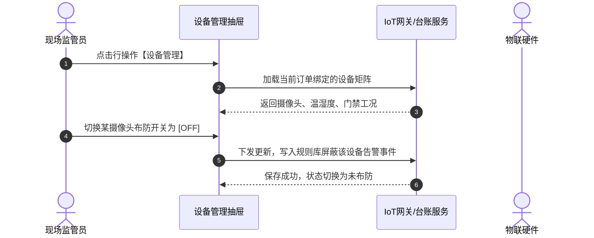

# 设备管理业务规则规格

> **适用功能**：抵质押业务管理 · 12-设备管理  
> **版本**：V1.0 定稿版 | **更新时间**：2026-09-11 | **责任人**：物联网架构团队

---

## 1. 业务规则 (Business Rules)

### 1.1 [DZY-R12] 独立预警布防开关规约 (Independent Arming Switch)
抽屉内每台设备具备独立的 Switch 布防开关：
- **Switch=ON**：设备心跳丢失、画面异常移库、超温超湿实时触发 03/02 规则并穿透生成 02/02 押品预警；
- **Switch=OFF**：设备仅维持正常拉流与只读数值显示，系统完全屏蔽告警事件生成，避免现场调试检修引发误报。

### 1.2 [DZY-R12a] 设备解绑敏感期阻断
当订单处于移库在途、部分出库审批中时，禁止解绑与该货位关联的摄像头设备，保障敏感流转期监管不断档。

---

## 2. 设备管理交互时序图

