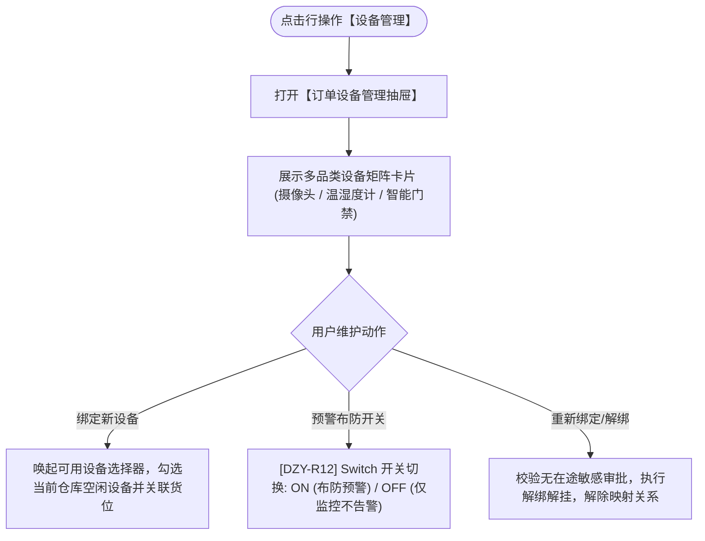

# 设备管理主PRD

> **版本**：V1.0 | 2026-09-11  
> **所属模块**：03-融资监管 / 07-抵质押业务-抵质押业务管理 / 12-设备管理  
> **入口路径**：  
> • PC 端：`融资监管 → 抵质押业务 → 抵质押业务管理 → 行操作【更多操作 ▾】→ 【设备管理】`  
> • H5 移动端：`抵押/质押列表卡片 → 【更多操作】抽屉 → 【设备管理】`  
> **配套文档**：[设备管理字段清单](./设备管理字段清单.md) · [设备管理业务规则规格](./设备管理业务规则规格.md)

---

## 1. 业务背景与功能定位

**【设备管理】**功能为质押监管订单项下的全部物联网硬件资产提供集中式生命周期管控抽屉。支持查看已绑定设备的运行工况（在线/离线/通信延迟）、货位映射关系、重新绑定/解绑操作，并提供单台设备的【预警布防独立开关】，便于现场检修期间临时停用告警，防止虚警风暴。

---

## 2. 业务全景流转架构

---

## 3. 页面功能说明与界面骨架

### 3.1 设备管理抽屉骨架
1. **顶部卡片统计**：已绑定总数、在线设备数、离线异常数；右上角 `[ + 绑定新设备 ]`；
2. **设备卡片矩阵**：
   * **摄像头**：编码、型号、直视货位、通信状态（延迟ms）、预警布防 Switch、操作（`[查看实时流]`、`[解绑]`）；
   * **温湿度计**：编码、实测温湿度、电量、预警 Switch、操作（`[历史曲线]`、`[解绑]`）；
   * **智能门禁**：编码、通行人次、预警 Switch、操作（`[临时密码]`、`[出入流水]`、`[解绑]`）。
