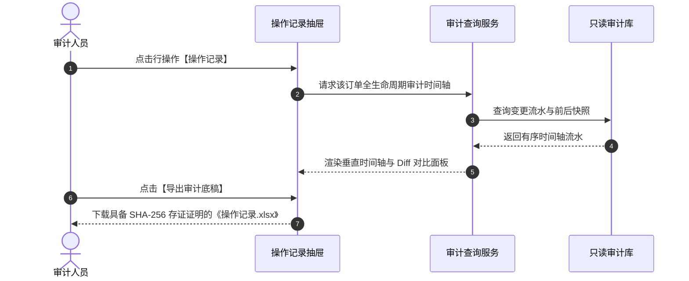

# 操作记录业务规则规格

> **适用功能**：抵质押业务管理 · 13-操作记录  
> **版本**：V1.0 定稿版 | **更新时间**：2026-09-11 | **责任人**：架构与合规团队

---

## 1. 业务规则 (Business Rules)

### 1.1 [DZY-R13] 全生命周期全自动切面拦截留痕 (AOP Audit Logging)
系统内针对抵质押订单的任何写操作（增删改、状态跃迁、审批流转），一律通过底层 AOP 切面强行捕获前后数据快照并落库，业务代码严禁绕过审计层。

### 1.2 [DZY-R13a] 日志物理只读与防篡改 (WORM - Write Once, Read Many)
操作记录表在数据库层面仅开放 `INSERT` 和 `SELECT` 权限，撤销任何角色的 `UPDATE` 和 `DELETE` 权限，实现终身只读、司法可信。

---

## 2. 操作记录交互时序图

