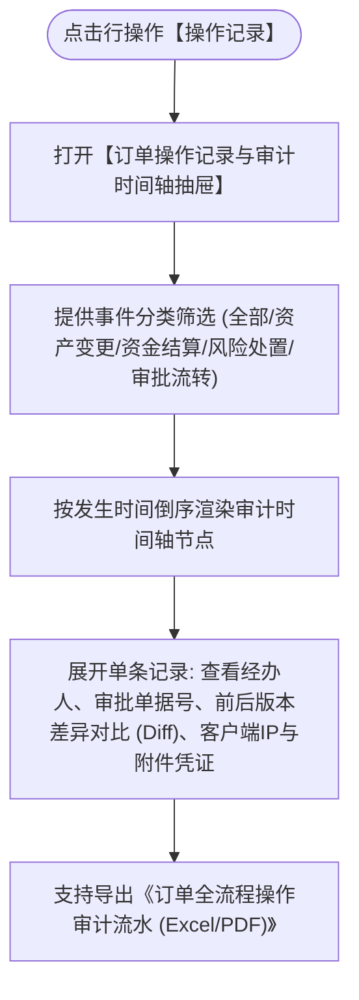

# 操作记录主PRD

> **版本**：V1.0 | 2026-09-11  
> **所属模块**：03-融资监管 / 07-抵质押业务-抵质押业务管理 / 13-操作记录  
> **入口路径**：  
> • PC 端：`融资监管 → 抵质押业务 → 抵质押业务管理 → 行操作【操作记录】`  
> • H5 移动端：`抵押/质押列表卡片 → 【操作记录】`  
> **配套文档**：[操作记录字段清单](./操作记录字段清单.md) · [操作记录业务规则规格](./操作记录业务规则规格.md)

---

## 1. 业务背景与功能定位

**【操作记录】**功能是抵质押订单在押全生命周期内不可篡改的审计时间轴与溯源底座。完整记录每笔订单从创建开立、放款确权、资产置换、加补仓、部分出库、移库、部分结清、安全线调整、估值重算到最终解抵押或平仓处置的所有敏感事件，记录操作人、精确时间戳、IP、前后数据版本镜像及关联单号，满足金融司法审计与合规倒查要求。

---

## 2. 业务全景流转架构

---

## 3. 页面功能说明与界面骨架

### 3.1 审计抽屉骨架
1. **订单基本信息顶栏**：订单编号、借款主体、当前状态、累计操作事件数；
2. **多维筛选栏**：操作类型下拉、操作人搜索、日期范围选择；
3. **垂直时间轴**：
   - 节点图标按操作性质区分颜色（资金绿、资产蓝、风险红、审批紫）；
   - 时间戳精确到秒；
   - 展示操作行为摘要、经办工号姓名、操作终端类型；
   - 点击【查看详情】展开抽屉右侧数据镜像对比（变更前值 vs 变更后值）。
