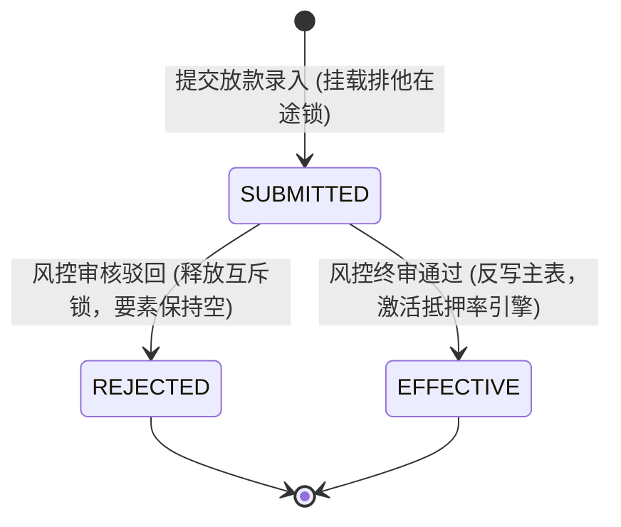
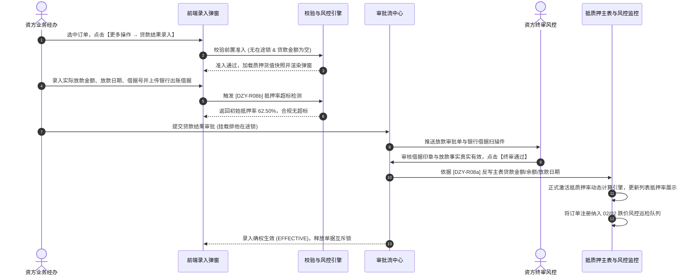

# 贷款结果录入业务规则规格

> **适用功能**：抵质押业务管理 · 贷款结果录入  
> **核心使命**：规范银行放款出账数据确权核验，落实放款唯一性风控约束，触发反写主订单信贷要素并正式激活抵质押率动态预警引擎。  
> **版本**：V1.0 定稿版 | **更新时间**：2026-09-11 | **责任人**：信贷与风控团队

---

## 1. 状态机模型与流转表

### 1.1 贷款录入申请生命周期状态机

### 1.2 状态流转与权限矩阵

| 起始状态 | 触发动作 | 目标状态 | 操作角色 | 前置条件与拦截校验 | 系统核心动作与副作用 |
| :--- | :--- | :--- | :--- | :--- | :--- |
| **已质押待放款** | 提交贷款结果 | `SUBMITTED` | 资方/平台经办 | 订单无在途锁；主表【贷款金额】为空或 0（DZY-R08 校验） | 挂载单据排他在途锁，冻结解押、出库、置换操作 |
| `SUBMITTED` | 风控审核驳回 | `REJECTED` | 资方风控主管 | 必填 $\ge 10$ 字驳回原因（如借据与合同不符、金额有误） | 释放单据互斥锁，主表信贷要素保持空态 |
| `SUBMITTED` | 风控终审通过 | `EFFECTIVE` | 资方终审风控 | 银行借据已验真，信贷要素齐全 | 触发落账事务：反写贷款金额/余额/日期，激活抵押率引擎，释放互斥锁 |

---

## 2. 核心业务规则 (Business Rules)

### 2.1 [DZY-R08] 单笔业务放款录入唯一性强阻断 (Single Disbursal Constraint)
* **业务红线**：一笔抵质押订单对应一笔核心授信放款，严禁通过此入口进行多次重复放款录入。
* **判定与拦截**：
  若主订单已有生效的【贷款金额】（$\text{贷款金额} > 0$），用户点击行操作【贷款结果录入】时，系统强行阻断并弹窗提示：
  `【操作拦截】该订单已完成放款确权（借据号：X，放款金额：￥Y）。若有借款本金归还，请前往【结算管理】录入；若需追加授信，请走新增订单流程！`。

### 2.2 [DZY-R08a] 抵质押率动态计算引擎激活与展示切换机制 (LTV Engine Activation)
* **未录入阶段（占位符）**：
  主订单未录入放款结果时，由于分子（贷款余额）缺失，列表与详情页的【抵质押率】字段一律展示置灰中划线 `--`，且不参与 02/02 跌价预警与超期预警扫描；
* **确权生效瞬间（引擎激活）**：
  审批通过落账后，系统触发以下自动化原子事务：
  1. 反写：$\text{主表贷款金额} = \text{实际放款金额}$，$\text{主表贷款余额} = \text{实际放款金额}$；
  2. 反写：$\text{主表放款日期} = \text{实际放款日期}$，$\text{主表到期日期} = \text{贷款到期日期}$；
  3. 激活抵质押率计算引擎：
     $$\text{实时抵质押率} = \frac{\text{主表贷款余额}}{\text{在押货物公允评估总值}} \times 100\%$$
  4. 列表与详情的【抵质押率】由 `--` 实时刷新为计算得出的具体百分比数值（如 `62.50%`），并立即接入定时风控巡检引擎。

### 2.3 [DZY-R08b] 初始放款抵押率超标软阻断提示 (LTV Cap Soft Guard)
* 在录入实际放款金额时，系统前端根据公式实时测算 $\text{初始抵押率}$；
* 若测算抵押率超过该订单约定的【授信最高抵押率】：
  前端展示黄色警告横幅：`⚠️ 当前放款金额对应抵押率（X%）已高于该业务约定的最高质押率（Y%），提交后需资方高级风控审批方可生效！`。

---

## 3. 贷款结果录入交互时序图

---

## 4. 审计与不可变存证要求

1. **借据快照终身留痕**：银行加盖公章的出账借据扫描件、借款合同号、放款经办与复核人员签章永久固化至存证中心，不可删除或篡改；
2. **状态变迁审计**：主表贷款金额从空态到有值的跃迁，全路径写入审计流水，明确记录触发时间戳与经办 IP。
