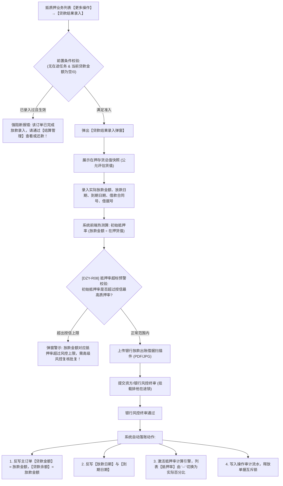

# 贷款结果录入主PRD

> **文档层级**：核心主 PRD（SSOT 真源）  
> **所属模块**：03-融资监管 / 07-抵质押业务-抵质押业务管理  
> **功能定位**：银行放款出账确权 · 贷款金额与借据号反写主表 · 激活抵质押率实时风控引擎  
> **版本**：V1.0 定稿版 | **更新时间**：2026-09-11 | **责任人**：产品团队

---

## 1. 业务背景与业务目标

### 1.1 业务背景
在供应链金融动产质押实际业务场景中，普遍遵循“先锁定控货/办押、后放款出账”的风控原则。借款企业在完成存货入仓质押确权、取得中仓登质权登记证书后，出资银行或保理公司才根据授信审批发放贷款。在银行实际出账前，订单处于“已质押待放款”阶段，贷款金额与借据号为空，列表【抵押率】展示占位符 `--`。经办人员在银行出款后，需通过【贷款结果录入】补齐放款真实信息。

### 1.2 业务目标
1. **放款真实性司法闭环**：录入真实借款合同编号、银行放款借据号、放款金额、起止日期，并强制上传银行出账借据盖章扫描件，杜绝虚假放款；
2. **激活抵押率风控计算引擎**：审核通过后反写主表【贷款金额】、【贷款余额】与【放款日期】，主表【抵质押率】由占位符 `--` 切换为真实动态百分比，正式接入 02/02 跌价与超期预警监控；
3. **单笔放款唯一性约束**：同一抵质押订单仅允许生效一次初始贷款结果录入（DZY-R08），后续还款由【结算管理】承接。

---

## 2. 总体架构与业务流转图

---

## 3. 页面功能说明与界面骨架

### 3.1 贷款结果录入弹窗 (Modal)
1. **订单基本信息（只读展示）**：
   * 抵质押业务单号、借款企业名称、当前质押资产总值（评估总货值）。
2. **银行实际放款表单**：
   * **实际放款金额**（必填金额，输入后实时试算初始抵押率）；
   * **实际放款日期**（必填日期）；
   * **贷款到期日期**（必填日期，校验必须晩于放款日期）；
   * **借款合同编号**（必填文本，$\le 50$ 字符）；
   * **放款借据单号**（必填文本，$\le 50$ 字符，银行核心系统唯一索引）；
   * **放款银行机构**（必填下拉/文本，记录出资分行）；
   * **银行放款借据凭证**（必传附件，PDF/JPG/PNG，单个 $\le 20\text{MB}$）；
   * **经办业务备注**（选填文本，$\le 200$ 字符）。

---

## 4. 关联三件套索引

* **字段清单**：[贷款结果录入字段清单.md](./贷款结果录入字段清单.md)
* **业务规则规格**：[贷款结果录入业务规则规格.md](./贷款结果录入业务规则规格.md)
