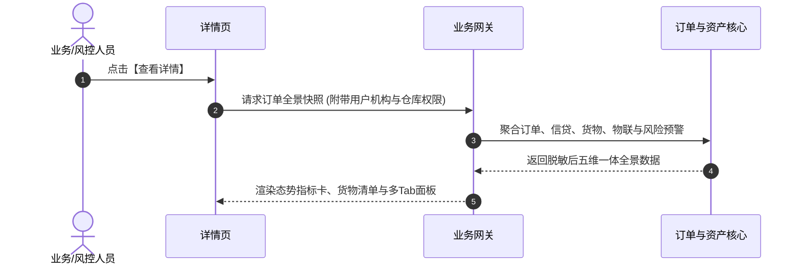

# 查看详情业务规则规格

> **适用功能**：抵质押业务管理 · 15-查看详情  
> **版本**：V1.0 定稿版 | **更新时间**：2026-09-11 | **责任人**：架构团队

---

## 1. 业务规则 (Business Rules)

### 1.1 [DZY-R15] 多端动态模式适配规约 (Multi-Mode Adaptation)
- **普通存货模式**：货物清单平铺展示各批次货物条码、货位、净重与估值；
- **电子仓单模式**：按树形结构展示父级仓单信息（开立时间/仓库/存货人），展开子项呈现具体货物规格明细；
- **脱敏规则**：借款人法人身份证、银行账户、企业手机号按金融合规标准进行掩码脱敏（如前3后4）。

---

## 2. 查看详情交互时序图

