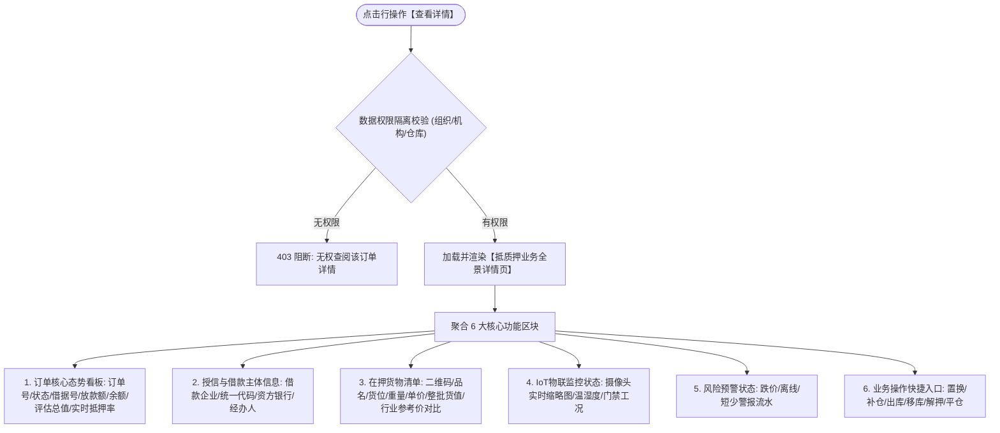

# 查看详情主PRD

> **版本**：V1.0 | 2026-09-11  
> **所属模块**：03-融资监管 / 07-抵质押业务-抵质押业务管理 / 15-查看详情  
> **入口路径**：  
> • PC 端：`融资监管 → 抵质押业务 → 抵质押业务管理 → 行操作【查看详情】`  
> • H5 移动端：`抵押/质押列表卡片 → 点击卡片进入【详情页】`  
> **配套文档**：[查看详情字段清单](./查看详情字段清单.md) · [查看详情业务规则规格](./查看详情业务规则规格.md)

---

## 1. 业务背景与功能定位

**【查看详情】**功能是抵质押订单的全息业务总览中枢。为商业银行、货主企业与监管方呈现“货-仓-金-物联-风控”五维一体的全景画像。页面分为：订单主单基本信息、授信借据资金状况、在押货物资产明细与二维码、IoT 物联设备在线监控矩阵、在押风险预警快照与业务流转合同资料归档，支持在押明细导出与资产状态穿透查验。

---

## 2. 业务全景流转架构

---

## 3. 页面功能说明与界面骨架

### 3.1 详情页 PC 端全屏骨架
1. **页面顶栏**：返回按钮、订单编号、业务类型 Tag（动产抵押/动产质押）、当前业务状态 Tag（在押中/已解押/已处置）；
2. **核心指标卡**：贷款金额、贷款余额、累计已还、货物评估总值、实时抵押率（彩色风险条）、安全线水位；
3. **分栏折叠面板/Tab**：
   - 【在押货物资产】：支持大宗普通存货分垛列表与电子仓单树形结构切换；
   - 【信贷放款与还款】：借据流水、历史还款冲抵记录；
   - 【物联监控设备】：在线摄像头流、温湿度仪表盘；
   - 【资料与合同】：借款合同扫描件、抵质押协议、中仓登登记证书。
