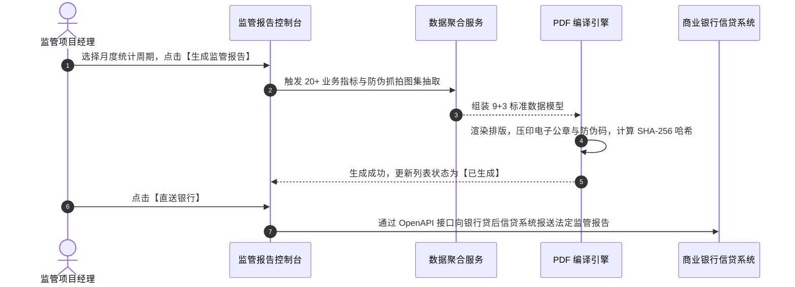

# 监管报告业务规则规格

> **适用功能**：抵质押业务管理 · 16-监管报告  
> **版本**：V1.0 定稿版 | **更新时间**：2026-09-11 | **责任人**：合规与金融服务团队

---

## 1. 业务规则 (Business Rules)

### 1.1 [DZY-R16] 商业银行 9+3 标准报告架构规约
生成的贷后报告严格包含 9 大正文章节（项目基本情况、监管方主体、在押资产评估现状、IoT设备工况、流转记录、日常巡库、风险事件、综合评价、签章）与 3 大司法存证附件（资产清单、巡检汇总、抓拍存证集），严禁缺漏章节。

### 1.2 [DZY-R16a] 报告不可篡改与数字印章防伪
PDF 文件自动合成监管企业 CFCA 电子公章，并生成唯一二维码。扫描后可连线官方后台检验原稿真伪。

---

## 2. 监管报告交互时序图

