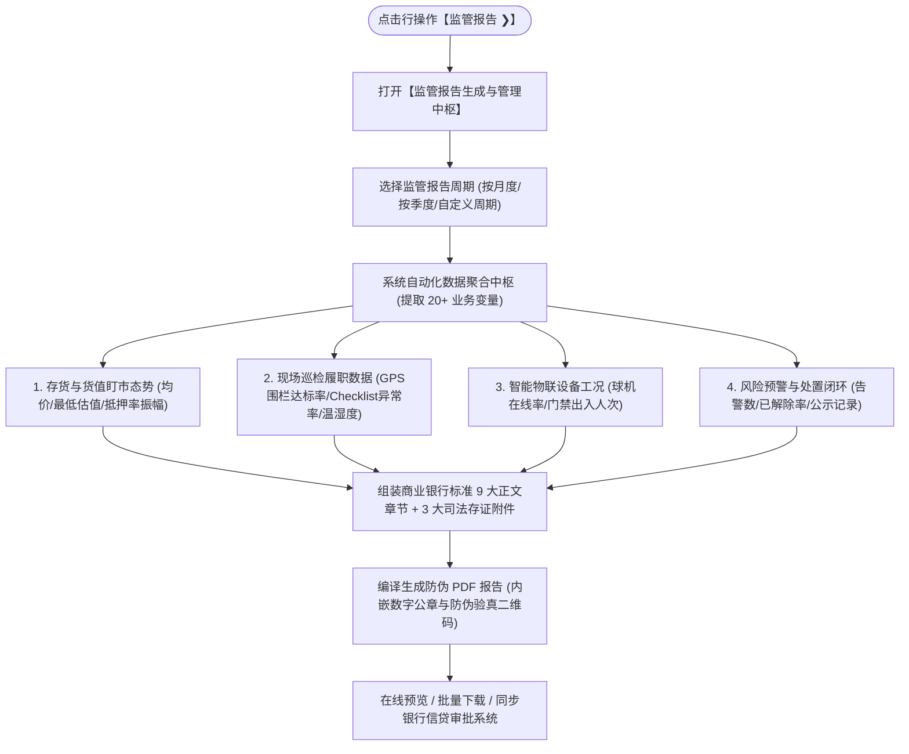

# 监管报告主PRD

> **版本**：V1.0 | 2026-09-11  
> **所属模块**：03-融资监管 / 07-抵质押业务-抵质押业务管理 / 16-监管报告  
> **入口路径**：  
> • PC 端：`融资监管 → 抵质押业务 → 抵质押业务管理 → 行操作【更多操作 ▾】→ 【监管报告 ❯】`  
> • H5 移动端：`抵押/质押列表卡片 → 【更多操作】抽屉 → 【监管报告】`  
> **配套文档**：[监管报告字段清单](./监管报告字段清单.md) · [监管报告业务规则规格](./监管报告业务规则规格.md)

---

## 1. 业务背景与功能定位

**【监管报告】**功能是供应链金融动产质押业务面向出资商业银行、监管主管机构出具的法定贷后监管报告生成中枢。系统自动聚合监管周期（周/月/季）内的现场巡库记录、6 大项 Checklist 达标率、存货价值波动、IoT 设备在线率与风险处置流水，套用商业银行合规审计标准的 **9 大正文章节与 3 大司法存证附件**，自动编译生成带公章水印与 CFCA 电子防伪签名的《质押监管业务贷后定期报告 (PDF)》。

---

## 2. 业务全景流转架构

---

## 3. 页面功能说明与界面骨架

### 3.1 监管报告中枢骨架
1. **生成任务面板**：选择报告类型（月报/季报/专项报告）、统计起止日期、一键生成按钮 `[ 生成本期监管报告 ]`；
2. **历史报告列表**：报告编号、周期类型、起止时间、评估结论（正常维持/重点关注）、报告状态（已生成/编译中）、操作项（`[ 在线预览 ]`、`[ 下载 PDF ]`）；
3. **9+3 报告内容大纲**：项目概况、监管主体、在押价值、IoT运行、资产流转、巡库结论、风险记录、风控建议、盖章区，以及附件（明细表/巡检汇总/全景抓拍图集）。
