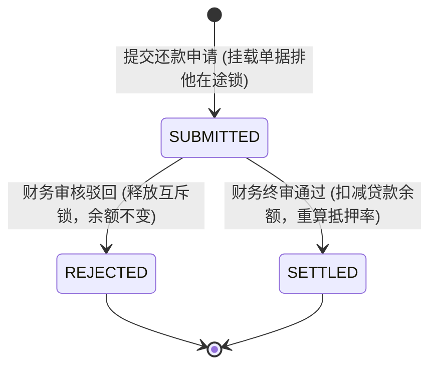
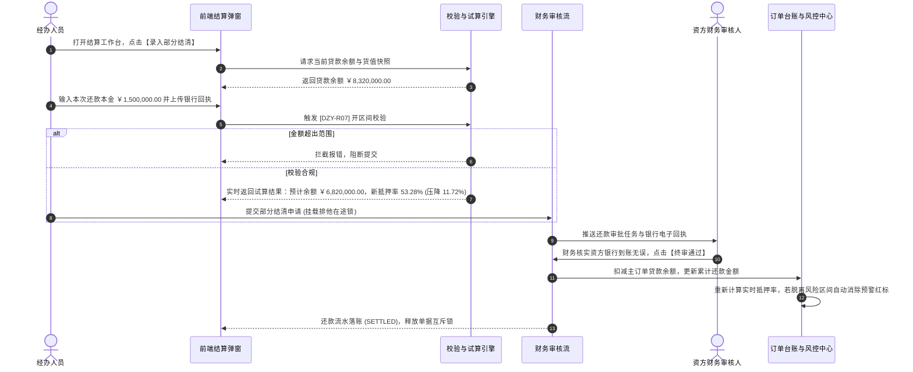

# 结算管理与部分结清业务规则规格

> **适用功能**：抵质押业务管理 · 结算管理与部分结清  
> **核心使命**：规范企业分期还款资金流水审核录入，落实开区间还款红线，实现主订单贷款余额动态扣减与抵质押率风险压降。  
> **版本**：V1.0 定稿版 | **更新时间**：2026-09-11 | **责任人**：风控与财务团队

---

## 1. 状态机模型与流转表

### 1.1 还款申请生命周期状态机

### 1.2 状态流转与权限矩阵

| 起始状态 | 触发动作 | 目标状态 | 操作角色 | 前置条件与拦截校验 | 系统核心动作与副作用 |
| :--- | :--- | :--- | :--- | :--- | :--- |
| **生效在押** | 提交部分结清申请 | `SUBMITTED` | 借款经办/风控经办 | 订单无其他在途审批；还款金额严格满足开区间 $(0, \text{贷款余额})$ | 挂载单据排他在途锁，冻结解押、置换操作 |
| `SUBMITTED` | 财务审核驳回 | `REJECTED` | 银行/资方财务 | 必填 $\ge 10$ 字驳回原因（如回单凭据模糊、资金未到账） | 释放单据互斥锁，贷款余额不发生任何变动 |
| `SUBMITTED` | 财务终审通过 | `SETTLED` | 银行/资方财务终审 | 确认银行资金到账真实性 | 触发落账事务：扣减主订单贷款余额，动态压降抵质押率，释放互斥锁 |

---

## 2. 核心业务规则 (Business Rules)

### 2.1 [DZY-R07] 部分结清金额严格开区间强阻断红线 (Open Interval Guard)
* **业务红线**：部分结清必须保留剩余存续贷款，录入金额 $A_{\text{repay}}$ 必须严格满足：
  $$0 < A_{\text{repay}} < A_{\text{balance}}$$
* **拦截判定机制**：
  1. 若 $A_{\text{repay}} \le 0$：直接拦截，弹窗提示：`【校验错误】还款金额必须大于 0.00 元！`；
  2. 若 $A_{\text{repay}} \ge A_{\text{balance}}$：系统强行阻断提交，弹窗警示：`【全额结清拦截】本次还款金额（￥X）已覆盖全部贷款余额（￥Y）。若企业已全额结清贷款本息，请走【解除抵/质押】通道，以办理全套资产解控与权属注销！`。

### 2.2 [DZY-R07a] 抵押率动态重算与压降模型 (LTV Dynamic Re-calculation)
* **计算逻辑**：
  还款审核通过瞬间，系统触发抵质押率动态重算：
  $$\text{更新后贷款余额} = \text{原贷款余额} - A_{\text{repay}}$$
  $$\text{新抵押率} = \frac{\text{更新后贷款余额}}{\text{当前在押存货公允评估货值}} \times 100\%$$
* **联动效果**：
  若新抵押率回落至平仓线与预警线以下，系统自动解除当前订单挂牌的【02/02 跌价预警】，红标自动消除，资产恢复绿色安全状态。

---

## 3. 结算管理与部分结清交互时序图

---

## 4. 审计与不可变存证要求

1. **流水不可修改性**：一旦财务终审通过落账，该笔还款流水状态永久锁定为 `SETTLED`，严禁二次编辑、撤回或删除；
2. **凭证快照永久存证**：银行转账电子回单与复核财务员工号、时间戳生成司法存证快照，永久保存于专有证据链中供外部审计核验。
