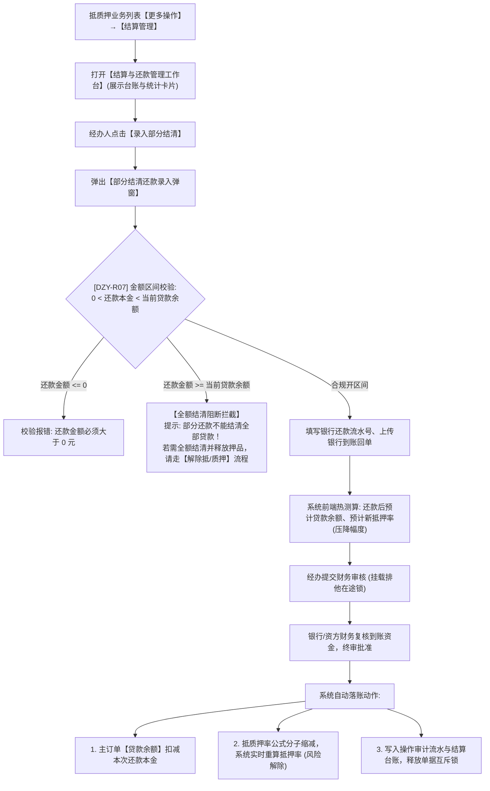

# 结算管理与部分结清主PRD

> **文档层级**：核心主 PRD（SSOT 真源）  
> **所属模块**：03-融资监管 / 07-抵质押业务-抵质押业务管理  
> **功能定位**：订单级还款结算工作台 · 分期还款与部分结清录入 · 贷款余额动态扣减与抵押率压降引擎  
> **版本**：V1.0 定稿版 | **更新时间**：2026-09-11 | **责任人**：产品团队

---

## 1. 业务背景与业务目标

### 1.1 业务背景
在存货抵质押融资业务中，借款企业通常采用“一次授信、分期还款”或“随借随还”的流动资金周转模式。在贷款存续期间，企业通过下游销售回款归还部分借款本金，系统需要实时记录资金还款流水，扣减贷款本金余额，并动态重算风险抵押率，从而降低在押风险、释放预警压力。

### 1.2 业务目标
1. **资金流水全流程闭环**：提供订单维度的结算工作台，完整展示放款、还本、付息、罚息等历史台账；
2. **风控红线自动拦截**：严格限制部分结清金额必须在 $(0, \text{当前贷款余额})$ 严格开区间内，全额结清强行引导至解押通道，杜绝业务流程串味；
3. **指标热联动与风险缓释**：还款审批落账后，实时扣减主订单贷款余额，自动重算抵押率并拉低风险水位，自动解除跌价预警。

---

## 2. 总体架构与业务流转图

---

## 3. 页面功能说明与界面骨架

### 3.1 结算管理工作台 (台账与看板视图)
1. **顶部指标看板**：
   * 初始放款总额、累计已还本金、当前贷款余额（高亮）；
   * 当前在押货物总估值、当前实时抵质押率。
2. **操作按钮区**：
   * `[ + 录入部分结清还款 ]`：弹出录入弹窗；
   * `[ 导出还款对账单 (Excel) ]`：导出当前订单的完整还款流水。
3. **还款结算历史列表**：
   * 列出该订单下发生的所有部分还款流水（单号、还款日期、还款类型、还款金额、冲减后余额、银行流水号、凭证附件、审批状态）。

### 3.2 录入部分结清弹窗 (Modal)
* 借款人名称、当前贷款余额（系统只读带出）；
* **本次还款本金**（必填数字，输入时实时触发 DZY-R07 开区间强校验）；
* **试算看板**：还款后预计贷款余额、预计新抵质押率（展示较原抵押率下降的差值点数）；
* 还款到账日期、银行转账流水号、银行还款回单上传（必传，PDF/JPG/PNG）；
* 经办情况备注（选填，$\le 200$ 字符）。

---

## 4. 关联三件套索引

* **字段清单**：[结算管理与部分结清字段清单.md](./结算管理与部分结清字段清单.md)
* **业务规则规格**：[结算管理与部分结清业务规则规格.md](./结算管理与部分结清业务规则规格.md)
