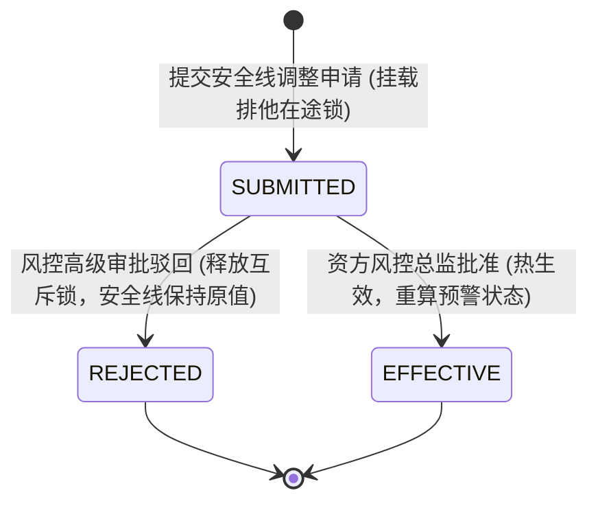
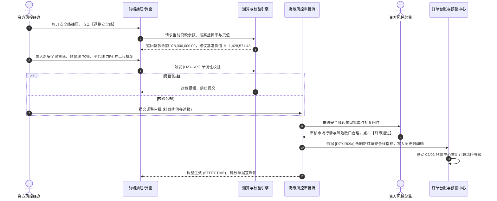

# 安全线管理业务规则规格

> **适用功能**：抵质押业务管理 · 安全线管理  
> **核心使命**：确立风险红线底线控制，规范安全线调整申请审核流转，落实阶梯阈值单调性校验，实现预警引擎参数热刷新。  
> **版本**：V1.0 定稿版 | **更新时间**：2026-09-11 | **责任人**：风控策略团队

---

## 1. 状态机模型与流转表

### 1.1 安全线调整申请生命周期状态机

### 1.2 状态流转与权限矩阵

| 起始状态 | 触发动作 | 目标状态 | 操作角色 | 前置条件与拦截校验 | 系统核心动作与副作用 |
| :--- | :--- | :--- | :--- | :--- | :--- |
| **生效在押** | 提交调整申请 | `SUBMITTED` | 资方风控经办 | 订单无其他在途任务；阶梯阈值满足单调性校验（DZY-R09） | 挂载单据排他在途锁，冻结解押、置换等敏感操作 |
| `SUBMITTED` | 风控审批驳回 | `REJECTED` | 资方风控总监 | 必填 $\ge 10$ 字驳回理由 | 释放单据互斥锁，当前生效安全线保持不变 |
| `SUBMITTED` | 风控终审通过 | `EFFECTIVE` | 资方风控总监 | 批复扫描件齐全真实 | 触发落账事务：热刷新主表安全线阈值，触发预警中心重新扫描，释放互斥锁 |

---

## 2. 核心业务规则 (Business Rules)

### 2.1 [DZY-R09] 多级阶梯阈值单调性强阻断校验 (Monotonicity Guard)
* **业务红线**：平仓线代表质权处置的最后红线，其风险严苛程度必须严格高于预警线，严禁发生参数倒挂。
* **判定公式**：
  $$\text{调整后平仓线质押率 (\%)} > \text{调整后预警线质押率 (\%)} \ge \text{授信最高质押率 (\%)} > \text{初始抵押率}$$
  或者以货值金额表达时：
  $$\text{安全线货值 (元)} > \text{预警线货值 (元)} > \text{平仓线货值 (元)}$$
* **拦截逻辑**：
  若操作人录入的平仓线抵押率 $\le$ 预警线抵押率，前端与后端同时触发强阻断拦截，弹窗报错：
  `【参数倒挂拦截】平仓线抵押率（X%）必须严格大于预警线抵押率（Y%），请检查后重新输入！`。

### 2.2 [DZY-R09a] 安全线热刷新与预警中心联动触发机制 (Hot Refresh & Re-scan)
* **热刷新机制**：
  审批通过生效瞬间，系统直接覆盖主订单记录的当前安全线字段，无需重启服务或批处理作业；
* **预警扫描联动**：
  新安全线落账后，系统触发事件 `EVENT_SAFETY_LINE_UPDATED`，02/02 预警引擎立即以当前存货市值重新进行区间比对：
  * 若市值已回升至新预警线以上：自动消除跌价预警红标；
  * 若新安全线提高导致市值跌入预警区间：立即生成新的 02/02 跌价预警并推送催告通知。

---

## 3. 安全线管理交互时序图

---

## 4. 审计与不可变存证要求

1. **历史时间轴永久保留**：安全线调整记录严禁物理删除或覆盖历史，抽屉内时间轴必须呈现所有历次变更的完整快照（变更前值、变更后值、批复文书、经办与审批人工号）；
2. **司法取证抗辩**：平仓预警与处置时的阈值判定，严格以告警触发当时系统生效的安全线快照为准，杜绝事后改动阈值带来的法律责任。
